# Introduction

-   [chainlink](https://chain.link)
-   [chainlink discourd](https://discord.com/invite/chainlink)
-   [Ethereum Stack Exchange](https://ethereum.stackexchange.com/)

## Major Chainlink Services

-   Chainlink Data and Price Feeds
-   Chainlink Automation
-   Chainlink CCIP
-   Chainlink Functions
-   Chainlink VRF
-   Chainlink Data Feeds
-   Chainlink Proof of Reserve

# Smart Contract and Solidity Fundammentals

## Solidity Programming: A Guide for Blockchain Enthusiasts

[Solidity](https://soliditylang.org) is a high-level, object-oriented programming language for writing smart contracts. It is a curly-bracket language similar to C++, Python, and JavaScript. Solidity is specifically built to run on the Ethereum Virtual Machine (EVM), making it the primary language for developing decentralized applications (dApps) and blockchain-based protocols.

Solidity provides features such as:

-   **Static typing**: Variable types must be defined in advance and are checked at compile time, reducing errors.
-   **Inheritance**: Contracts can inherit from other contracts, promoting code reuse and modularity.
-   **Complex user-defined types**: You can create custom data structures using structs, mappings, and enums.
-   **Library support**: Reusable code modules can be imported to extend functionality.
-   **Smart contract interaction**: Contracts can easily communicate with other contracts on the blockchain.
-   **Low-level EVM access**: Advanced developers can use inline assembly for optimized performance.

### Key Features of Solidity

Solidity is designed specifically for EVM-based blockchains and offers several powerful features:

-   **Static typing**: Variable types must be defined in advance and are checked at compile time, reducing errors.
-   **Inheritance**: Contracts can inherit from other contracts, promoting code reuse and modularity.
-   **User-defined types**: You can create custom data structures using structs, mappings, and enums. More on this shortly!
-   **Library support**: Reusable code modules can be imported to extend functionality.
-   **Smart contract interaction**: Contracts can easily communicate with other contracts on the blockchain.
-   **Low-level EVM access**: Advanced developers can use inline assembly for optimized performance.

### Solidity Code Structure

-   **License Identifier** : specify how others can use your code with an SPDX license identifier:
    ```solidity
    // SPDX-License-Identifier: MIT
    ```
-   **Version Pragma** : declare which version of Solidity your code is compatible with using that `pragma` directive:
    ```solidity
    pragma solidity ^0.8.19;
    ```
-   **Contract Declaration** : The main code is contained within a contract declaration:
    ```solidity
    contract MyContract {
        // Contract code goes here
    }
    ```

### Programming Fundamentals for Solidity

#### Variables: Storing Information

Variables are named containers that hold data values. In Solidity, each variable must have a specific type that defines what kind of data it can store, and its location (storage, memory, or calldata) determines where the data is stored.

**State Variables** : These are permanently stored on the blockchain in storage:

```solidity
contract StorageExample {
    uint256 public myNumber = 42;    // A number
    string public myText = "Hello";  // Text
    bool public isActive = true;     // A true/false value
    address public owner;            // An Ethereum address
    uint256 private secretNumber;    // A private number
}
```

When you see a variable defined at the contract level like this, it's a state variable that will be stored on the blockchain permenantly. Sometimes, for clarity, we label variables as stored in storage using the `s_` prefix e.g. `s_balance` or `s_owner`.

State Variable Visibility :

-   **public**: Anyone can read this variable, and Solidity automatically creates a getter function.

    ```solidity
    uint256 public counter = 0; // Creates a counter() function that returns the value
    ```

-   **private**: Only accessible within the current contract (not truly private on the blockchain since they can be accessed via the contract storage).

    ```solidity
    uint256 private password = 123456; // Not accessible from other contracts
    ```

-   **internal**: Accessible within the current contract and contracts that inherit from it

    ```solidity
    uint256 internal sharedSecret = 42; // Visible to this contract and child contracts
    ```

The default visibility is `internal` if not specified.

#### Constant and Immutable variables

Solidity provides two special types of state variables that can significantly **reduce gas costs and improve security**:

**Constant Variables**: Variables marked as constant must be assigned a value at declaration and cannot be changed afterwards:

```solidity
contract TokenContract {
    // Must be assigned at declaration
    uint256 public constant DECIMAL_PLACES = 18;
    string public constant TOKEN_NAME = "My Token";
    address public constant DEAD_ADDRESS = 0x000000000000000000000000000000000000dEaD;
}
```

Key characteristics of `constant` variables:

-   Must be assigned a value when declared.
-   Value is set at compile time.
-   Cannot be changed after contract deployment.
-   Do not take up storage slots (saving gas).
-   Only value types and strings can be constants.
-   Usually, `constant` variables are capitalized.
-   **Immutable Variables**: Variables marked as immutable can be assigned only once, but this assignment can happen in the constructor:

```solidity
contract TokenContract {
    // Declared but not assigned yet
    address public immutable deployer;
    uint256 public immutable deploymentTime;

    constructor() {
        // Assigned once in the constructor
        deployer = msg.sender;
        deploymentTime = block.timestamp;
    }
}
```

Key characteristics of `immutable` variables:

-   Can be assigned in the constructor or at declaration
-   Cannot be changed after construction
-   More gas efficient than regular state variables
-   Less gas efficient than constants
-   Only _value types_ can be immutable (not strings or reference types)

When to Use Each

-   Use `constant` for values known at compile time (e.g., mathematical constants, configuration values)
-   Use `immutable` for values that depend on deployment conditions but won't change after that (e.g., deployer address, configuration based on constructor arguments)
-   Use regular state variables for values that need to change during the contract's lifetime

Use `constant` and `immutable` whenever possible to:

-   Reduces gas costs
-   Makes contract intentions clearer
-   Improves security by preventing accidental state changes

#### Data Types: Different Kinds of Information

Solidity has two main categories of data types: `value types` and `reference types`. Understanding this distinction is important for how data is stored and managed in your contracts.

**Value Types** : Value types store their data directly. When you assign a value type to another variable, you get a copy of the value.

```solidity
// Let's say we create a variable with a value:
uint a = 5;
​
// When we assign it to another variable:
uint b = a;
​
// Now b has its own copy of the value 5
​
// If we change b:
b = 10;
​
// The value of a still remains 5
// The value of b is now 10
```

This happens because value types (like integers, booleans, addresses, etc.) store their actual data directly in the variable. Each variable has its own separate copy of the data.

This differs from how some other types (called reference types) work, where instead of getting a new copy, you might just get directions pointing to the original data (like when someone gives you an address to a house rather than building you a new identical house). We will go through this shortly.

The Solidity value types include:

-   **uint (Unsigned Integer)**: Positive whole numbers (no decimals, no negatives)

    ```solidity
    uint256 public score = 100;
    ```

-   **int (Signed Integer)**: Whole numbers that can be negative (no decimals)

    ```solidity
    int256 public temperature = -5;
    ```

    The number after uint/int (like 256) represents how many bits are used to store the number. More bits mean larger possible values. The maximum value of e.g. a uint256 is 2^256-1 and a int256 2^255-1 since it has to be able to store the sign too.

-   **bool (Boolean)**: `true` or `false` values

    ```solidity
    bool public isComplete = false;
    ```

-   **address**: An Ethereum account (wallet) address

    ```solidity
    address public contractCreator = 0x123...;
    ```

-   **bytes (Fixed Size)**: Fixed-size byte arrays (bytes1 to bytes32)
    ```solidity
    bytes32 public dataHash = 0xabcd...;
    ```

**Reference Types** : Reference types, unlike value types don't store their data directly in the variable but instead store a **"pointer"** or reference to where the data is located. When you assign a reference type to another variable, both variables point to the same data. We will be going through pointers and what they are shortly. Think of reference types like having a TV remote control. The remote doesn't contain the actual TV shows, but it points to the TV where you can watch them.

The Solidity reference types include:

-   **string**: Text values (dynamic length bytes)

    ```solidity
    string public message = "Welcome!";
    ```

-   **arrays**: Ordered lists of items of the same type

    ```solidity
    uint256[] public scores = [85, 90, 95];
    ```

-   **mapping**: Key-value pairs (like a dictionary or lookup table)

    ```solidity
    mapping(address => uint256) public balances;
    // This creates a relationship where each address has an associated uint256 value.
    ```

-   **struct**: Custom groupings of related data.

    ```solidity
    struct Person {
        string name;
        uint256 age;
        address walletAddress;
    }
    ```

-   **bytes (Dynamic Size)**: Variable length byte array

    ```solidity
    bytes public dynamicData;
    ```

#### Understanding Pointers and Data Location

When working with complex data types like arrays and structs in Solidity, it's important to understand the concept of pointers and how data is stored and referenced.

##### What are Pointers?

A **pointer** is a variable that **stores the memory address/location for another piece of data rather than the data itself**. Think of it as a signpost pointing to where the actual data lives rather than directly containing it.

In Solidity, reference types (arrays, structs, strings, and mappings) are stored as pointers. When you pass these types around, Solidity doesn't copy all the data; it just references where the data is stored.

This differs from value types (like `uint`, `int`, and `bool`), which directly store their data and create copies when assigned to new variables.

##### Pointer Example

To explain, the concept of a pointer, here is a pseudocode example:

```solidity
// Conceptual example in Solidity-like pseudocode
​
// Declare and initialize an array in storage (blockchain permanent memory)
array storageArray = [1, 2, 3]; // original array in storage
​
// Create a pointer to the storage array
// This doesn't copy the data, it just creates a reference to the same storage location
array storagePointer = storageArray; // points to the same data
​
// Modify the array through the pointer
storagePointer[0] = 100; // changes the actual storage array
​
// At this point:
// storageArray is [100, 2, 3]  (it was changed!)
​
// Create a memory copy of the storage array
// This copies the entire array to a new location in temporary memory
array memoryCopy = copy of storageArray; // memoryCopy is [100, 2, 3]
​
// Modify the memory copy
memoryCopy[1] = 200; // only changes the copy, not the original
​
// Final result:
// storageArray is [100, 2, 3]  (unchanged by memory modifications)
// memoryCopy is [100, 200, 3]  (modified locally)
```

Here's an example showing how pointers work with reference types:

```solidity
contract PointerExample {
    // State array in storage
    uint256[] public storageArray = [1, 2, 3];

    function manipulateArray() public {
        // This creates a pointer to the storage array
        uint256[] storage storageArrayPointer = storageArray;

        // This modifies the actual storage array through the pointer
        storageArrayPointer[0] = 100;

        // At this point, storageArray is now [100, 2, 3]

        // This creates a copy in memory, not a pointer to storage
        uint256[] memory memoryArray = storageArray;

        // This modifies only the memory copy, not the storage array
        memoryArray[1] = 200;

        // At this point, storageArray is still [100, 2, 3]
        // and memoryArray is [100, 200, 3]
    }
}
```

#### Storage Locations

Understanding how Solidity handles data storage is especially important when working with reference types. These keywords specify where data is stored:

-   **storage**: Permanent storage on the blockchain (expensive)

    -   Used for state variables.
    -   Data persists between function calls and transactions.
    -   Most expensive in terms of gas costs.

-   **memory**: Temporary storage during function execution (cheaper)

    -   Only exists during function execution.
    -   Cheaper than storage.
    -   Used for function parameters, return values, and local variables.

-   **calldata**: Read-only temporary storage for function parameters (most efficient)

    -   Similar to memory but read-only.
    -   Can't be modified.
    -   Most gas-efficient.
    -   Used primarily for external function parameters.

```solidity
// State variable - stored in storage
uint256[] permanentArray;
​
function processArray(uint256[] calldata inputValues) external {
    // 'inputValues' exists in calldata - can't be modified

    // Local variable in memory - temporary copy
    uint256[] memory tempArray = new uint256[](inputValues.length);
    for (uint i = 0; i < inputValues.length; i++) {
        tempArray[i] = inputValues[i] * 2;
    }

    // Reference to storage - changes will persist
    uint256[] storage myStorageArray = permanentArray;
    myStorageArray.push(tempArray[0]); // This updates the blockchain state
}
```

When working with reference types like strings, arrays, and structs:

-   Use `calldata` for external function parameters when possible (most efficient).
-   Use `memory` for function parameters that need to be updated.
-   Use `storage` when you need to modify state variables.

#### Functions: Making Things Happen

Functions are blocks of code that perform specific actions. They're how your contract actually does things:

```solidity
contract Counter {
    uint256 public count = 0;

    // This function increases the count by 1
    function increment() public {
        count = count + 1;  // You can also write: count += 1;
    }

    // This function decreases the count by 1
    function decrement() public {
        count = count - 1;  // You can also write: count -= 1;
    }
}
```

Function Parts:

-   **Name**: What you call the function (like increment).
-   **Parameters**: Input values the function needs .
-   **Visibility**: Who can call this function.
-   **Returns**: What output the function provides.
-   **Function Body**: The code inside the curly braces {}.

```solidity
function add(uint256 a, uint256 b) public pure returns (uint256) {
    return a + b;
}
```

this function:

-   Is named `add`.
-   Takes two parameters: `a` and `b`, both of type `uint256`.
-   Is `public` so anyone can call it.
-   Is `pure` which means it doesn't read or modify state.
-   Returns a `uint256` value.
-   Adds the two input values and returns the result.

Function Visibility

-   **public**: Anyone can call this function
-   **private**: Only this contract can call this function
-   **internal**: Only this contract and contracts that inherit from it can call this function-
-   **external**: Only calls from outside the contract are allowed (more efficient for certain use cases)

Special Function Types:

-   **view**: Can read but not modify state

    ```solidity
    function getCount() public view returns (uint256) {
        return count;
    }
    ```

-   **pure**: Cannot read or modify state

    ```solidity
    function addNumbers(uint256 a, uint256 b) public pure returns (uint256) {
        return a + b;
    }
    ```

-   **constructor**: Runs only once when the contract is deployed

    ```solidity
    constructor() {
        owner = msg.sender;  // Sets the contract creator as the owner
    }
    ```

-   **payable**: means that the function can be sent ether.

    ```solidity
    mapping(address => uint256) balances;

    function sendMeMoney() public payable {
        balances[user] += msg.value; // more on this "msg.value" coming in a second!
    }
    ```

#### Transaction Context and Global Variables

Solidity provides access to transaction information and blockchain data through special built-in variables. These are crucial for building secure and functional smart contracts.

-   `msg.sender`: The address that called the current function:

    -   A wallet address or another contract
    -   Commonly used for access control and tracking user activity

    ```solidity
    contract OwnerExample {
        address public owner;

        constructor() {
            owner = msg.sender; // The address that deploys the contract becomes the owner
        }
    }
    ```

-   `msg.value`: The amount of ETH (in wei) sent with the function call:

    -   Only available if the function is marked as payable
    -   Used to receive payments or deposits

    ```solidity
    contract PaymentExample {
        mapping(address => uint256) public payments;

        // Function that can receive ETH
        function makePayment() public payable {
            require(msg.value > 0, "Must send some ETH");
            payments[msg.sender] += msg.value;
        }

        // Function that checks if minimum payment was made
        function verifyMinimumPayment(uint256 minimumAmount) public view returns (bool) {
            return payments[msg.sender] >= minimumAmount;
        }
    }
    ```

-   `msg.data`: The complete calldata (input data) of the transaction:

    -   Contains the function signature and arguments
    -   Used in advanced use cases and proxies

    ```solidity
    contract DataExample {
        bytes public lastCallData;

        // Store the raw calldata of the latest transaction
        function recordCallData() public {
            lastCallData = msg.data;
        }

        // View the size of the calldata
        function getCallDataSize() public view returns (uint256) {
            return lastCallData.length;
        }
    }
    ```

#### Block Information Variables

-   `block.timestamp`: The current block's timestamp (seconds since Unix epoch):

    -   Can be used for time-based logic
    -   Don't rely on it for precise timing (miners have some flexibility)

    ```solidity
    contract TimestampExample {
        uint256 public contractCreationTime;

        constructor() {
            contractCreationTime = block.timestamp;
        }

        // Check if a specified duration has passed since contract creation
        function hasDurationPassed(uint256 durationInSeconds) public view returns (bool) {
            return (block.timestamp >= contractCreationTime + durationInSeconds);
        }

        // Create a simple time lock that releases after a specified date
        function isTimeLockExpired(uint256 releaseTime) public view returns (bool) {
            return block.timestamp >= releaseTime;
        }
    }
    ```

-   `block.number`: The current block number:

    -   Useful for counting blocks or implementing block-based logic

    ```solidity
    contract BlockNumberExample {
        uint256 public deploymentBlockNumber;

        constructor() {
            deploymentBlockNumber = block.number;
        }

        // Calculate how many blocks have been mined since deployment
        function getBlocksPassed() public view returns (uint256) {
            return block.number - deploymentBlockNumber;
        }

        // Check if enough blocks have passed for a specific action
        function hasReachedBlockThreshold(uint256 blockThreshold) public view returns (bool) {
            return getBlocksPassed() >= blockThreshold;
        }
    }
    ```

#### Combining Context Variables in a Contract:

```solidity
contract TimeLockedWallet {
    address public owner;
    uint256 public unlockTime;

    event Deposit(address indexed sender, uint256 amount, uint256 timestamp);
    event Withdrawal(uint256 amount, uint256 timestamp);

    constructor(uint256 _unlockDuration) {
        owner = msg.sender;
        unlockTime = block.timestamp + _unlockDuration;
    }

    // Accept deposits from anyone
    function deposit() public payable {
        require(msg.value > 0, "Must deposit some ETH");
        emit Deposit(msg.sender, msg.value, block.timestamp);
    }

    // Only allow the owner to withdraw after the unlock time
    function withdraw() public {
        require(msg.sender == owner, "You are not the owner");
        require(block.timestamp >= unlockTime, "Funds are still locked");
        require(address(this).balance > 0, "No funds to withdraw");

        uint256 balance = address(this).balance;
        payable(owner).transfer(balance);

        emit Withdrawal(balance, block.timestamp);
    }

    // Check if withdrawal is possible yet
    function withdrawalStatus() public view returns (bool canWithdraw, uint256 remainingTime) {
        if (block.timestamp >= unlockTime) {
            return (true, 0);
        } else {
            return (false, unlockTime - block.timestamp);
        }
    }
}
```

#### Control Structures: Making Decisions

-   **Conditionals (if/else)**: Conditionals let your code make decisions:

    ```solidity
    function checkValue(uint256 value) public pure returns (string memory) {
        if (value > 100) {
            return "Value is greater than 100";
        } else if (value == 100) {
            return "Value is exactly 100";
        } else {
            return "Value is less than 100";
        }
    }
    ```

-   **Loops**: Loops repeat code until a condition is met:

    ```solidity
    function sumArray(uint256[] memory numbers) public pure returns (uint256) {
    uint256 total = 0;

        for (uint i = 0; i < numbers.length; i++) {
            total += numbers[i];
        }

        return total;

    }
    ```

> Note:
>
> Be careful with loops in Solidity because each operation costs gas, and loops with too many iterations can exceed block gas limits. This is known as a denial of service (DoS).

#### Error Handling and Requirements

-   **Require Statements**: require checks a condition and reverts the transaction if it fails. The second parameter is an error message that helps users understand what went wrong.

    ```solidity
    function withdraw(uint256 amount) public {
        require(balances[msg.sender] >= amount, "Insufficient balance");
        balances[msg.sender] -= amount;
        payable(msg.sender).transfer(amount);
    }
    ```

-   **Custom Errors**: For gas efficiency, you can define custom errors. This is what you should do fpr errors, rather than using the `require` keyword:

    ```solidity
    error InsufficientBalance(address user, uint256 balance, uint256 withdrawAmount);

    function withdraw(uint256 amount) public {
        if (balances[msg.sender] < amount) {
            revert InsufficientBalance(msg.sender, balances[msg.sender], amount);
        }
        balances[msg.sender] -= amount;
        payable(msg.sender).transfer(amount);
    }
    ```

#### Events: Communicating with the Outside World

Events in Solidity are like announcements that your contract makes when something important happens. Events should be emitted when the contract state is updated:

```solidity
contract Token {
    event Transfer(address indexed from, address indexed to, uint256 amount);

    mapping(address => uint256) public balances;

    function transfer(address to, uint256 amount) public {
        require(balances[msg.sender] >= amount, "Insufficient balance");

        balances[msg.sender] -= amount;
        balances[to] += amount;

        emit Transfer(msg.sender, to, amount);
    }
}
```

> Note:
>
> The indexed keyword makes it easier to search for specific events later.

#### Modifiers: Reusable Function Conditions

Modifiers are a way to create reusable logic for your functions:

```solidity
contract Owned {
    address public owner;

    constructor() {
        owner = msg.sender;
    }

    modifier onlyOwner() {
        require(msg.sender == owner, "Not the owner");
        _; // This placeholder is replaced with the function code
    }

    function setOwner(address newOwner) public onlyOwner {
        owner = newOwner;
    }
}
```

The `_` in the modifier represents where the function code will be executed. For example, if the `_` is before the modifier logic, the function will be executed before the modifier logic.

#### Interfaces

Interfaces in Solidity act as blueprints that define what functions a contract must implement without specifying how those functions work. Interfaces cannot contain function implementations, state variables, constructors, or inheritance from other contracts. They can only declare function signatures (name and input). When a contract implements an interface using the "is" keyword, it must include all the functions defined in that interface with matching signatures.

For example, imagine we have an interface called `IPayable`:

```solidity
interface IPayable {
    function pay(address recipient, uint256 amount) external returns (bool);
    function getBalance(address account) external view returns (uint256);
}
```

Any contract that implements this interface must include these exact functions:

```solidity
contract PaymentProcessor is IPayable {
    mapping(address => uint256) private balances;

    function pay(address recipient, uint256 amount) external override returns (bool) {
        require(balances[msg.sender] >= amount, "Insufficient balance");
        balances[msg.sender] -= amount;
        balances[recipient] += amount;
        return true;
    }

    function getBalance(address account) external view override returns (uint256) {
        return balances[account];
    }
}
```

This standardization makes interfaces particularly useful for interacting with unknown contracts—you only need to know what functions you can call, not how they're implemented, enabling different contracts to communicate consistently and predictably. It tells calling contracts what functions are available on another contract and how to call those functions.

### Programming Best Practices for Solidity

1. **Keep it Simple**: Complex code is harder to secure
2. **Check conditions before changing state**: Validate all inputs with require or custom errors
3. **Use descriptive variable and function names**: Make your code easy to understand
4. **Comment your code**: Explain why you're doing something, not just what
5. **Follow naming conventions**:
    - Contracts: `PascalCase` (like `SimpleToken`)
    - Functions/variables: `camelCase` (like `balanceOf`)
    - Private/internal state variables: prefix with `_` (like `_owner`)
6. **Be aware of gas costs**: Every operation costs money in the form of gas

### What Is ABI (Application Binary Interface)?

The ABI is like a smart contract's instruction manual that tells applications exactly how to talk to your contract on the blockchain.

It describes, using structured data, exactly what functions and data types are available for use in the contract and how to “call” or use them.

#### Why do we need ABIs?

Imagine you have a smart contract deployed on Ethereum. Your contract might have functions like transfer, approve, or getBalance. But how does a website or another application know:

-   What functions exist in your contract?
-   What parameters each function needs?
-   What data types to expect in return?

This is where the ABI comes in! It bridges the gap between your human-readable smart contract code and the binary data that the blockchain understands.

#### Purpose of the ABI

The ABI serves as a standardized way to:

-   Call functions in a smart contract
-   Encode function arguments
-   Decode return data
-   Interact with contracts from outside the blockchain (like through web applications)

Think of the ABI as a contract's "API documentation" but in a machine-readable format.

#### ABI Format

The ABI is a JSON array that describes everything publically visible on a contract.

Let's take a simple example. Take a simple smart contract Simple Math that has one function add that adds two numbers together:

```solidity
// SPDX-License-Identifier: MIT
pragma solidity ^0.8.0;
​
contract SimpleMath {
    // Adds two numbers and returns the result
    function add(uint256 a, uint256 b) public pure returns (uint256) {
        return a + b;
    }
}
```

When you compile this contract, you will get the following ABI in JSON format:

```json
[
	{
		"inputs": [
			{ "internalType": "uint256", "name": "a", "type": "uint256" },
			{ "internalType": "uint256", "name": "b", "type": "uint256" }
		],
		"name": "add",
		"outputs": [{ "internalType": "uint256", "name": "", "type": "uint256" }],
		"stateMutability": "pure",
		"type": "function"
	}
]
```

The ABI tells you that there is a function named `add` which takes two numbers (of type `uint256`) and returns a number.

#### Using ABI in Practice

When you deploy a contract, you'll need its ABI to interact with it later.

Frontend applications use the ABI to format calls to your contract correctly. The following JavaScript example demonstratess how you would use the ABI to interact with a smart contract (using the ethers.js library):

```js
// JavaScript example using ethers.js
const contract = new ethers.Contract(contractAddress, contractABI, provider); // You need to pass the ABI!
await contract.deposit(100); // Calls the deposit function
```

## Smart Contract Libraries and Inheritance

Libraries and Inheritance concepts allow you to reuse code and use external dependencies, making your contracts cleaner, more secure, and cheaper to deploy.

When to Use Each

| Feature     | Best For                         | Key Benefit                        | Limitation                                  |
| ----------- | -------------------------------- | ---------------------------------- | ------------------------------------------- |
| Libraries   | Utility functions and operations | Deploy once, use in many contracts | Cannot store state variables                |
| Inheritance | Extending existing contracts     | Build on top of established code   | Can create complexity with multiple parents |

### Smart Contract Libraries

Libraries are reusable pieces of code that you can share across multiple contracts. Think of them as toolboxes containing helpful functions that your contracts can use.

```solidity
// SPDX-License-Identifier: MIT
pragma solidity ^0.8.19;
​
library MathUtils {
    // Find the smaller of two numbers
    function min(uint256 a, uint256 b) internal pure returns (uint256) {
        return a < b ? a : b;
    }
​
    // Find the larger of two numbers
    function max(uint256 a, uint256 b) internal pure returns (uint256) {
        return a > b ? a : b;
    }
}
```

There are two ways to use library functions:

```solidity
// SPDX-License-Identifier: MIT
pragma solidity ^0.8.19;
​
import "./MathUtils.sol"; // Import the library
​
contract Calculator {
    // Attach library functions to uint256
    using MathUtils for uint256;
​
    // Method 1: Call as a library function
    function getMinimum(uint256 a, uint256 b) public pure returns (uint256) {
        return MathUtils.min(a, b);
    }
​
    // Method 2: Call as an attached function
    function getMaximum(uint256 a, uint256 b) public pure returns (uint256) {
        return a.max(b); // Same as MathUtils.max(a, b)
    }
}
```

#### Benefits of Libraries

-   **Write Once, Use Everywhere**: Define code in one place and use it in multiple contracts
-   **Gas Savings**: Libraries with `internal` functions get embedded in your contract's bytecode, while `external` library functions are deployed separately and can be reused by many contracts
-   **No State Variables**: Libraries cannot have state variables, making them perfect for pure utility functions

#### Types of Libraries

1. **Embedded Libraries**: Use internal functions that get copied into your contract's code
2. **Linked Libraries**: Use external and public functions. These functions don't get copied into your contract's bytecode - instead, your contract makes calls to the deployed library.

### Contract Inheritance

Inheritance lets one contract build upon another. Think of it like building with blocks—you start with a foundation and add more features.

```solidity
// SPDX-License-Identifier: MIT
pragma solidity ^0.8.19;
​
// Base contract with core functionality
contract BaseToken {
    string public name;
    uint256 public totalSupply;
​
    constructor(string memory _name) {
        name = _name;
        totalSupply = 1000000;
    }
​
    function getInfo() public virtual view returns (string memory) {
        return string.concat("Token: ", name);
    }
}
​
// Enhanced contract that inherits and extends BaseToken
contract GoldToken is BaseToken {
    constructor() BaseToken("Gold Token") {}
​
    // Add new functionality
    function getSymbol() public pure returns (string memory) {
        return "GLD";
    }
}
```

In this example, GoldToken inherits all features from BaseToken and adds a new function.

### Function Overriding

Sometimes, you want to modify behavior from a parent contract. This is where function overriding comes in.

To override a function:

1. Mark the parent function with `virtual` (meaning "can be changed")
2. Mark the child function with `override` (meaning "I'm changing this")

```solidity
// SPDX-License-Identifier: MIT
pragma solidity ^0.8.19;
​
contract BaseToken {
    // The virtual keyword allows this function to be overridden
    function getTokenName() public virtual pure returns (string memory) {
        return "BaseToken";
    }
}
​
contract CustomToken is BaseToken {
    // The override keyword shows we're replacing the parent's function
    function getTokenName() public override pure returns (string memory) {
        return "CustomToken";
    }
}
```

#### Using `super` to Call Parent Functions

Sometimes, you want to extend a function rather than completely replace it:

```solidity
contract ExtendedToken is BaseToken {
    function getTokenName() public override pure returns (string memory) {
        // Call the parent function and add to it using the super keyword
        return string.concat(super.getTokenName(), " Plus");
        // Returns "BaseToken Plus"
    }
}
```

### Multiple Inheritance

Solidity allows a contract to inherit from multiple parents, but this requires careful handling.

```solidity
contract Mintable {
    function canMint() public virtual pure returns (bool) {
        return true;
    }
}
​
contract Burnable {
    function canBurn() public virtual pure returns (bool) {
        return true;
    }
}
​
// Inherit from both contracts
contract Token is Mintable, Burnable {
    // This contract now has both canMint() and canBurn() functions
}
```

When multiple parents have functions with the same name, you must specify which ones you're overriding:

```solidity
contract BaseA {
    function getValue() public virtual pure returns (string memory) {
        return "A";
    }
}
​
contract BaseB {
    function getValue() public virtual pure returns (string memory) {
        return "B";
    }
}
​
// Multiple inheritance with function name conflict
contract Combined is BaseB, BaseA {
    // Must specify all contracts being overridden
    function getValue() public override(BaseB, BaseA) pure returns (string memory) {
        return "Combined";
    }
}
```

The order in which you list parent contracts is important:

```solidity
// BaseB comes first in the inheritance list
contract TokenX is BaseB, BaseA {
    function getValue() public override(BaseB, BaseA) pure returns (string memory) {
        // This calls BaseB's implementation first
        return super.getValue(); // Returns "B"
    }
}
​
// BaseA comes first in the inheritance list
contract TokenY is BaseA, BaseB {
    function getValue() public override(BaseA, BaseB) pure returns (string memory) {
        // This calls BaseA's implementation first
        return super.getValue(); // Returns "A"
    }
}
```

### Using OpenZeppelin Contracts

One of the most common uses of inheritance is extending standardized contracts from dependencies like [OpenZeppelin](https://www.openzeppelin.com/):

```solidity
// SPDX-License-Identifier: MIT
pragma solidity ^0.8.19;
​
import { ERC20 } from "@openzeppelin/contracts/token/ERC20/ERC20.sol";
​
// Create a custom token by inheriting from ERC20
contract MyToken is ERC20 {
    constructor() ERC20("My Token", "MTK") {
        // Mint 1 million tokens to the deployer
        _mint(msg.sender, 1000000 * 10**18);
    }
​
    // Add custom features
    function burn(uint256 amount) public {
        _burn(msg.sender, amount);
    }
}
```

#### Adding a Fee to Token Transfers

Inheritance lets you customize standard behavior:

```solidity
contract FeeToken is ERC20 {
    address public feeCollector;
​
    constructor(address _feeCollector) ERC20("Fee Token", "FEE") {
        feeCollector = _feeCollector;
        _mint(msg.sender, 1000000 * 10**18);
    }
​
    // Override the transfer function to add a 1% fee
    function transfer(address to, uint256 amount) public override returns (bool) {
        uint256 fee = amount / 100; // 1% fee
        uint256 netAmount = amount - fee;
​
        // Send fee to collector
        super.transfer(feeCollector, fee);
​
        // Send remaining amount to recipient
        return super.transfer(to, netAmount);
    }
}
```

#### OpenZeppelin Contracts Wizard

The [OpenZeppelin Contract Wizard](https://wizard.openzeppelin.com/) is a helpful tool that generates customized smart contracts with just a few clicks. It's perfect for:

-   Creating token contracts (ERC20, ERC721, ERC1155)
-   Adding security features
-   Implementing access control
-   Setting up governance

The wizard generates production-ready code that you can customize further.

### Importing External Code: You can import code from various sources:

```solidity
// Import from npm package
import "@openzeppelin/contracts/token/ERC20/ERC20.sol";
​
// Import specific contracts
import {ERC721, IERC721} from "@openzeppelin/contracts/token/ERC721/ERC721.sol";
​
// Import from local file
import "./MyContract.sol";
```

### Key Takeaways

-   Libraries are great for utility functions and can be used across many contracts.
-   Inheritance lets you build on existing contracts and extend their functionality
    -   Use `virtual` in parent contracts and `override` in child contracts when overriding functions
    -   The `super` keyword lets you call parent implementations
    -   With multiple inheritance, the order of parent contracts matters
    -   OpenZeppelin provides battle-tested contracts you can extend

### Best Practices

-   **Keep it Simple**: Avoid deep inheritance chains that are hard to follow
-   **Document Function Overrides**: Clearly comment what you're changing and why
-   **Be Careful with Multiple Inheritance**: It can create unexpected behavior if not managed properly
-   **Reuse Trusted Code**: Whenever possible, build on well-audited contracts like those from OpenZeppelin

## Testnet Funds

We will use Chainlink's services in smart contracts. We will deploy and interact with these contracts on testnets. Usually, this will be Sepolia, but in some instances, we will also use Base Sepolia.

Let's walk through how to get some testnet LINK, how to add LINK to MetaMask and how to send your tokens to another address

### Adding LINK to Metamask

-   Head to the [**Chainlink documentation**](https://docs.chain.link/resources/link-token-contracts) and scroll down to the chain you want to use LINK on. E.g. [**Sepolia Testnet**](https://docs.chain.link/resources/link-token-contracts#sepolia-testnet)

-   Click the **Add to wallet** button to import the LINK token to NetaMask. Note that this will only add the token for that secific network. This will need to be repeated for all networks you intend to use LINK tokens.

    

-   Click **Add token** to add the token to your MetaMask

    

### Using a LINK faucet

To obtain testnet LINK, head to the [**Chainlink Faucet**](https://faucets.chain.link/) page. Here, you will find a list of all supported networks.

Click the Link button at the top right, select the network(s) you want to **get LINK** on and click **\*\*Continue.**"


-   Click **Get tokens** and click **Confirm** in MetaMask to sign the transaction.
-   Once the transaction has confirmed, you can see the **LINK** balance in your wallet.

    

    

### Adding a token to MetaMask

LINK was easy to add to MetaMask since Chainlink included that cheeky **Add to wallet** button. But how do we add other tokens, such as USDC to MetaMask?

-   Find the token address. For USDC, for example, we can head to the [**Circle documentation**](https://developers.circle.com/stablecoins/usdc-on-test-networks) to find the address of the USDC contract on different chains. Copy the address for the USDC token on the chain you are working on.

-   Open MetaMask and check you are on the same chain as the token address you just copied by clicking on the network button on the top left corner in MetMask

    

-   Click the **Tokens** tab, click the vertical three dots button, and then **Import tokens**

    

-   Enter the token contract address. MetaMask will automatically detect your token and its related information if it follows the **ERC-20 standard**.

-   Check the correct information (Address, Token Symbol, and Decimals).

    

-   Click **Next** to confirm the information. Click Import to import your token to MetaMask. This lets you view your balance and send tokens to others using the MetaMask UI.

### Sending tokens to another address

-   Click on the **Tokens** tab, then click the token you want to send (you need to have imported it already), e.g., the LINK token.

    

-   Click the Send button.

    

-   Paste the address you want to send the tokens to.

    

-   Enter the amount and then click Next

    

-   To sign the transaction, click Confirm. This transaction will now be sent and the tokens will be transferred to the address you specified.

    

## Introduction To Remix

[Remix](https://remix.ethereum.org/) is an online Integrated Development Environment (IDE) specifically designed for smart contract development. It provides an easy-to-use interface for writing, compiling, deploying, and debugging Solidity smart contracts. Remix is widely used because of its simplicity, built-in tools, and browser-based functionality, allowing you to get started quickly without installing additional software.

### Key Features of Remix:

-   File Explorer: Manage your contract files and projects.
-   Solidity compiler: Compile and check smart contracts for errors.
-   Deploy & run transactions: Deploy contracts to local or public EVM networks and interact with them.
-   Debugger: Step through transactions to debug execution.
-   Plugin System: Extend Remix’s functionality with additional tools.

### Navigating Remix

-   File Explorer (left panel): Manage your workspaces, create new files, and organize contracts.
-   Editor (center panel): Write and modify Solidity smart contracts.
-   Terminal (bottom panel): View logs, compilation messages, and transaction details.
-   Solidity Compiler (sidebar): Compile smart contracts with different Solidity versions.
-   Deploy & Run Transactions (sidebar): Deploy contracts to a blockchain and interact with them.


### Creating Workspaces, Folders, and Files

Remix allows you to create different workspaces to organize your projects. This allows you to keep related files grouped together. A bit like a GitHub repository or a project folder on your comoputer.

1. Create a new Workspace in Remix:

    - At the top of the **File Explorer** panel, click on the Workspaces actions button (the burger icon)
    - Select **Create blank** to create a new workspace.
    - Give a name for your workspace. In this example, we will use the name "CLF".
    - Hit **Ok**

    

2. Create a new folder:

    - Right-click in the file explorer sidebar and click New Folder
    - Name the folder `contracts`

3. Create a new file:

    - Right-click on the contracts folder and click New file
    - Name the file `MyERC20.sol`

    

4. Write the code in your new file!

### Compiling Smart Contracts

Before deploying a smart contract, you must compile it to check for errors and generate the necessary bytecode.

1. Open the Solidity Compiler panel in Remix.
2. Select the correct Solidity version (matching your contract).
3. Ensure your contract file is still open in the main window and click **Compile** [YourContract.sol].
4. If there are errors, they will appear in the terminal.

 

5. You can also compile by hitting `Cmd + S` on your Mac keyboard or `Ctrl + S` on Windows.

    - If there are no errors, the contract will compile successfully, and you’ll see a green checkmark.

6. When we compile our contract, the compiler generates the ABI! To get the ABI of a contract (e.g., for verification or a front-end application) scroll down in the Solidity Compiler tab and blick the ABI button:

 

### Connecting to MetaMask

To deploy a contract on a real blockchain (e.g., Ethereum Mainnet, Sepolia, or Polygon), you need to connect Remix to MetaMask.

1. Open MetaMask and make sure you are on the desired network.
2. Go to the Deploy & Run Transactions panel in Remix.
3. Select Injected Provider - MetaMask as the environment.
4. MetaMask will prompt you to connect your wallet and approve the connection.


### Deploying Smart Contracts

Once compiled, a smart contract can be deployed on a local blockchain (e.g., Remix VM) or a real network (e.g., Ethereum).

1. Open the Deploy & Run Transactions panel.
2. Select a deployment environment (e.g., Remix VM for testing or Injected Provider - MetaMask for live networks).

 

3. Choose the correct contract from the dropdown.
4. Click Deploy and confirm the transaction in MetaMask to deploy your contract.

 

### Pinning Deployed Smart Contracts

After deployment, Remix allows you to pin a deployed contract to your workspace so you can continue interacting with it even after refreshing the page. Click the pin icon to pin the deployed contract.


### The contract address

1. In the **Deploy & Run Transactions** panel, find the deployed contract under Deployed Contracts.
2. Click the **copy icon** to save the contract address.
3. If needed, use the **At Address** button to reattach the contract after a page refresh.

### Interacting with Smart Contracts

Once deployed, you can interact directly with your smart contract from Remix.

1. Find the deployed contract in the Deploy & Run Transactions panel.
2. Click the dropdown to see available functions.
3. Enter any required parameters and click the transact button.
4. Confirm transactions in MetaMask (for state-changing functions).
5. View results in the Remix terminal.


## Writing an ERC20 Token Contract

[ERC-20](https://eips.ethereum.org/EIPS/eip-20) is a technical standard for fungible tokens on the Ethereum blockchain. "ERC" stands for "Ethereum Request for Comment," the naming convention for Ethereum improvement proposals. The "20" refers to the proposal number that created this standard. An ERC-20 token is a cryptocurrency that follows specific rules defined in this standard, including functions for transferring tokens, checking balances, and approving spending by third parties. These standardized functions ensure that ERC-20 tokens work consistently across the Ethereum ecosystem, allowing them to be easily exchanged, stored in wallets, and traded on decentralized exchanges. Popular examples include USDT (Tether), USDC, DAI, and many other cryptocurrencies that operate on Ethereum.

### Writing a Simple ERC20 Token

1.  Create a new Workspace in Remix:

    -   At the top of the File Explorer panel, click on the Workspaces actions button (the burger icon)
    -   Select Create blank to create a new workspace.
    -   Give a name for your workspace. In this example, we will use the name "CLF".
    -   Hit Ok

    

2.  Create a new folder:

    -   Name the folder contracts
    -   Right-click in the file explorer sidebar and click New Folder

3.  Create a new file:

    -   Right-click on the contracts folder and click New file
    -   Name the file MyERC20.sol

    

4.  Write the code!

    -   Copy and Paste the following token contract code: You could also create your token using the Openzeppelin Wizard.

        ```solidity
        // SPDX-License-Identifier: MIT
        pragma solidity ^0.8.26;

        import { ERC20 } from "@openzeppelin/contracts@5.2.0/token/ERC20/ERC20.sol";

        contract MyERC20 is ERC20 {
            constructor() ERC20("My Cyfrin CLF Token", "CLF") {}

            function mint(address to, uint256 amount) public {
                _mint(to, amount);
            }
        }
        ```

    -   Here, we have inherited the `ERC20` smart contract from OpenZeppelin by importing it and then inheriting it using the is keyword.

    -   Then, in the `MyERC20` constructor, we have invoked the parent `ERC20` constructor:

        ```solidity
        constructor() ERC20("My Cyfrin CLF Token", "CLF") {}
        ```

    -   Finally, we created a way to create a supply of tokens by adding a public `mint` function:

        ```solidity
        function mint(address to, uint256 amount) public {
            _mint(to, amount);
        }
        ```

### Adding Access Control

We can add access control to smart contracts using **modifiers**. We also can use dependencies, including OpenZeppelin.

We have written a simple token smart contract called `MyERC20`. This contract can create new tokens via the `mint` function. However, currently, anyone can call this function and mint tokens (for free!). Let's change this.

Let's add the ability to give roles to certain addresses to give them permission to mint tokens.

### Adding Access Control Using OpenZeppelin

To add access control to our ERC-20 token contract, we will use OpenZeppelin's AccessControl smart contract. We need to import this contract and then inherit from it.

Then, we can use the state variables, functions, and modifiers declared inside the AccessControl smart contract from within our ERC-20 contract.

OpenZeppelin's AccessControl smart contract provides the ability to create [Roles](https://docs.openzeppelin.com/contracts/2.x/api/access#Roles).

-   Each new role created needs a role identifier used to grant, revoke, and check if an account has a role.
-   We will create a single role that enables the addresses with this role to mint tokens.
-   This `role identifier` is a `bytes32 constant` variable. By convention, this is usually a hashed string of the role name (with the string in capitals since this is a constant):

    ```solidity
    bytes32 public constant MINTER_ROLE = keccak256("MINTER_ROLE");
    ```

-   This role identitifier can now be passed to the functions in `AccessControl` to grant roles with the `AccessControl::grantRole` function, check whether an address has a role with the `AccessControl::hasRole` function, and revoke a role using the `AccessControl::revokeRole` function by passing in the role identifier e.g. `MINTER_ROLE` and the required address to grant/check/revoke the role for.

### Adding a Minter Role to a Token Contract

1.  Inherit the AccessControl contract:

    ```solidity
    // SPDX-License-Identifier: MIT
    pragma solidity ^0.8.19;

    import { ERC20 } from "@openzeppelin/contracts@4.6.0/token/ERC20/ERC20.sol";
    import { AccessControl } from "@openzeppelin/contracts@4.6.0/access/AccessControl.sol";

    contract MyERC20 is ERC20, AccessControl {
        constructor() ERC20("My Cyfrin CLF Token", "CLF") {}

        function mint(address to, uint256 amount) public {
        _mint(to, amount);
        }
    }
    ```

2.  Create a bytes32 constant state variable containing the hashed name of the role–the role identifier:

    ```solidity
    // SPDX-License-Identifier: MIT
    pragma solidity ^0.8.19;

    import { ERC20 } from "@openzeppelin/contracts@4.6.0/token/ERC20/ERC20.sol";
    import { AccessControl } from "@openzeppelin/contracts@4.6.0/access/AccessControl.sol";

    contract MyERC20 is ERC20, AccessControl {
        bytes32 public constant MINTER_ROLE = keccak256("MINTER_ROLE");

        constructor() ERC20("My Cyfrin CLF Token", "CLF") {}

        function mint(address to, uint256 amount) public {
            _mint(to, amount);
        }
    }
    ```

3.  Now, we can add the onlyRole modifier from the AccessControl contract to our mint function (since our token contract is inheriting this contract) to add a check that the msg.sender has the role that we pass to the modifier.

    ```solidity
    // SPDX-License-Identifier: MIT
    pragma solidity ^0.8.19;

    import { ERC20 } from "@openzeppelin/contracts@4.6.0/token/ERC20/ERC20.sol";
    import { AccessControl } from "@openzeppelin/contracts@4.6.0/access/AccessControl.sol";

    contract MyERC20 is ERC20, AccessControl {
        bytes32 public constant MINTER_ROLE = keccak256("MINTER_ROLE");

        constructor() ERC20("My Cyfrin CLF Token", "CLF") {}

        function mint(address to, uint256 amount) public onlyRole(MINTER_ROLE) {
            _mint(to, amount);
        }
    }
    ```

Only addresses with the `MINTER_ROLE` can call the mint function.

However, we do not have a way to give addresses this `MINTER_ROLE`. To do this, we need another role that can grant roles to other addresses. OpenZeppelin's `AccessControl` contract has a role that does this already, called the `DEFAULT_ADMIN` role.

Let's grant this role to the deployer in the constructor. When an address deploys a smart contract, it automatically calls the constructor. Therefore, the deployer is the msg.sender in the context of the constructor.

Let's grant them the `DEFAULT_ADMIN` role and while we are at it, also the `MINTER_ROLE` so they can mint tokens. We can do this by calling the `_grantRole` function, which takes the role and the address to grant the role to:

```solidity
// SPDX-License-Identifier: MIT
pragma solidity ^0.8.19;
​
import { ERC20 } from "@openzeppelin/contracts@4.6.0/token/ERC20/ERC20.sol";
import { AccessControl } from "@openzeppelin/contracts@4.6.0/access/AccessControl.sol";
​
contract MyERC20 is ERC20, AccessControl {
   bytes32 public constant MINTER_ROLE = keccak256("MINTER_ROLE");
​
    constructor() ERC20("My Cyfrin CLF Token", "CLF") {}
​
    function mint(address to, uint256 amount) public onlyRole(MINTER_ROLE) {
        _mint(to, amount);
    }
}
```

## Deploying an ERC-20 Contract

Now we have written our permissioned ERC-20 token contract, let's deploy it to a live testnet and then add that token to our MetaMask so we can see our balance and use the UI to perform token transfers.

### Compile & Deploy

1.  Compile your smart contract

    -   Make sure you still have the `MyERC20.sol` file open.
    -   Head to the **Solidity compiler** tab on the left sidebar.
    -   Select the compiler version. Here, we are using version `0.8.19`. Ensure the compiler version is set to `0.8.19` or later, as indicated in the pragma directive (`pragma solidity ^0.8.19`;). The `^` symbol tells the compiler that any version above `0.8.19` can be used. Without the symbol, only version `0.8.19` would be allowed.
    -   Hit **Compile MyERC20.sol** to compile the contract

        

    -   You can also compile by hitting `Cmd + S` on your keyboard on Mac or `Ctrl + S` on windows.
    -   If there are no errors, the contract will compile successfully, and you’ll see a green checkmark.

2.  Deploy your smart contract

    -   Head to the **Deploy and run transactions** tab in the left-hand sidebar.
    -   We want to deploy our contract with MetaMask. To connect your wallet to Remix, click **Select Environment** dropdown menu and select **Injected Provider - MetaMask**.
    -   This will open MetaMask and ask to connect to Remix. Click Connect.

        

    -   In the Contract dropdown, select MYERC20.sol.

        

    -   Click **Deploy**.

    -   Sign the transaction in Metamask to deploy your smart contract!

You will know if your contract has been successfully deployed if:

-   The Remix terminal window (the block at the bottom of your screen) shows a green tick next to the transaction information:

    

-   Your MetaMask shows a successful contract deployment transaction:

    

-   And your contract is in the Deployed contracts section on Remix:

    

> Note: We are going to be using this ERC-20 contract we deployed in the next section so double check you have pinned the contract so you can use it again later. It may also be worth copying the address and keeping a note of it somewhere.


### Check Total Token Supply and Balances

1.  Once your contract is deployed, you can view it in the Deployed Contracts section. Here, you will find all the functions available within the contract, allowing you to interact with them directly.

2.  You can pin your contract by clicking on the pin icon. This will save your contracts if you want to close Remix and continue another time. Note that pinning is workspace-specific, so make sure you open the same Remix workspace when you need to access this token contract.

    

3.  To check the total supply of your token, call the totalSupply function.

    If you want to view the balance of a specific wallet, use the balanceOf function and pass the wallet address as a parameter. Currently, your token will not have any tokens minted, so the return value will be 0 for both function calls.

    

### Adding Your Token to MetaMask

If you deployed your contract on a testnet, you can add your token to MetaMask by following these steps:

1. Copy the token contract address. In Remix, you can find this address in the Deployed Contracts section.
   

2. Open your MetaMask wallet and click on the Tokens Tab. Hit the three vertical dots icon on the right hand side and click Import tokens.
   

3. Enter the token contract address. MetaMask will automatically detect your token and its related information since it follows the ERC-20 standard.
4. Check if the information is correct (Address, Token Symbol, and Decimals).
   

5. Click Next to confirm the information. Click Import to import your token to MetaMask. This allows you to view your balance and send tokens to others using the MetaMask UI.

## Interacting with a Contract - Minting Tokens

We have not yet minted any tokens, which means currently the total available supply of our token is `0` - no tokens currently exist! To increase the supply of tokens, we have to call the function `mint` from our contract:

-   Go to the **Deploy & Run Transactions** tab.
-   Find your token and expand the tab to see the contract's functions.

    

-   Find the function `mint` and expand it to check the parameters.

    -   `to`: The address receiving the minted tokens. We will create `100` tokens by setting the amount value as `100000000000000000000`. This is because our Token has `18` decimals.
    -   amount: The amount to mint.

        

-   To send the transaction, click on the transact button and confirm the transaction in your Metamask wallet.
-   Now, you can check to see if your balance has increased by calling balanceOf and passing the address you minted the tokens to.
-   You can also check your balance in MetaMask by heading to the Tokens tab since we added our token in the previous lesson.

### Allowance and Token Approvals

Token approvals enable another address to spend another address's tokens. This feature is commonly used in DeFi applications that need to transfer ERC20 tokens from your wallet to another wallet or contract via another intermediary smart contract.

To use this feature, you can call the `approve` function, specifying the address that will spend your tokens and the amount they are allowed to spend.


You can always verify if a contract has permission to spend your tokens by calling the allowance function.


## Building An ERC-721 (NFT) Token

The [Open Zeppelin Contracts Wizard](https://wizard.openzeppelin.com/) is an interactive smart contract generator based on OpenZeppelin Contracts.

In this exercise, we will create a simple [ERC-721](https://eips.ethereum.org/EIPS/eip-721) NFT contract.

When you first open the wizard, you will see an interface with options for the type of contract you want to create, including ERC-20, ERC-721, ERC-1155, Governor, and Custom.

We will be selecting the ERC-721 option as this is the token standard for NFTs.

On the left side, you’ll notice the Settings tab. This is where we can configure various features for our NFT. We will be setting the following:

-   Name
-   Symbol
-   Mintable
-   Auto-increment Ids


You will notice that the code is automatically filled out for you as you click various options. This makes it very quick and easy to generate templates for these contracts.

In the upcoming Chainlink VRF Section, you will learn how to take this knowledge and utilize Chainlink VRF to add randomness to an NFT, creating a lot more fun for your users!


# Oracle & ChainLink DataFeed

## Oracles Concepts

Blockchains are designed to be **self-contained** and **deterministic** systems. Deterministic means that given the same inputs, the system will always produce the same outputs. This property is crucial for security and consensus, as all blockchain nodes must agree on the state of the data for every transaction.

However, due to their isolated nature, blockchains cannot directly access external (off-chain) data. While this design enhances security and data permanence, it also introduces significant trade-offs:

Blockchains process transactions with higher latency than traditional computing systems due to their need for global consensus.

Smart contracts have limited functionality because they cannot independently fetch real-world data (e.g., financial market prices, weather conditions, IoT sensor readings).

This fundamental limitation is known as the Oracle Problem. Blockchain applications struggle to achieve full real-world applicability without a reliable way to connect with external data sources.


### What is a Blockchain Oracle?

A blockchain oracle is an infrastructure component that enables secure data exchange between blockchains and external systems. Decentralized oracles provide a trust-minimizing mechanism for bringing off-chain data onto the blockchain and allow smart contracts to be executed based on real-world events or off-chain computation.

By solving the Oracle Problem, oracles can expand the capabilities of smart contracts, making them more dynamic and useful across industries like decentralized finance (DeFi) and gaming.

They perform several critical functions:

1. **Listening**: Detecting when a smart contract on a blockchain is requesting external data.
2. **Fetching**: Retrieving data from off-chain sources (e.g., APIs, web servers, IoT devices).
3. **Formatting**: Converting the data into a blockchain-compatible format.
4. **Securing & Validating**: Ensuring data integrity through cryptographic verification mechanisms.
5. **Computing**: Performing off-chain computations to enhance scalability, efficiency, and security.
6. **Broadcasting**: Sending the verified data back to the blockchain. Since all nodes need to agree on the data, it is referred to as “broadcasting.”
7. **Delivery**: Delivering computation results to external systems as needed or from external systems back into smart contracts.

### Types of Blockchain Oracles

1. **Inbound Oracles**: These oracles bring external data to the blockchain. For example, they deliver information such as weather conditions, sports scores, or stock prices into a smart contract.
2. **Outbound Oracles**: These oracles send data from the blockchain to external systems. They enable smart contracts to communicate and interact with off-chain systems.
3. **Consensus Oracles**: These oracles aggregate data from multiple sources and provide a single source of truth to the smart contract. This is done to improve the reliability and accuracy of the data.
4. **Cross-Chain Oracles**: These oracles facilitate communication and data exchange between different blockchain networks (each of which is like an isolated “island”). Cross-chain oracles are essential for interoperability between different blockchains.

### Centralized vs. Decentralized Oracles

Centralized Oracles:

-   Operate through a single entity or node.
-   Risks: Single point of failure, vulnerability to attacks, and data manipulation.
-   If that central oracle node is compromised or stops, the blockchain can no longer access reliable external data.

Decentralized Oracles:

-   Use multiple independent nodes to fetch and validate data, reducing risks of manipulation and downtime.
-   Enhance security, transparency, and reliability by distributing trust among multiple parties to create a trust-minimized system.


### When to Use Oracles

-   **Data Exchange**: Smart contracts can integrate external data sources, such as financial market feeds, insurance claim data, and gaming results.
-   **Automation**: smart contracts can automate processes that depend on external data, on-chain conditions, or certain time intervals. This is useful, for example, for triggering payments or executing trades based on market prices. These automation oracles can also remove the need for dependence on humans or centralized entities to trigger the operation of a smart contract when specific conditions are met.
-   **Cross-Chain Communication**: Smart contracts can interact with other blockchain networks, allowing for more complex and interoperable decentralized applications (dApps).
-   **Verifiable Randomness**: Blockchains are deterministic by design, meaning the same input will always produce the same output. This makes generating true randomness impossible on-chain. Oracles provide cryptographically verified random numbers that cannot be manipulated by miners, which is crucial for fair NFT distributions, gaming applications, and random selection processes.

## Chainlink Oracles Overview

Chainlink is a **decentralized oracle network (DON)** that provides smart contracts with off-chain and cross-chain data and computations in a reliable, secure, and decentralized manner. It was created to solve the “oracle problem,” which refers to the challenge of getting off-chain data into a blockchain in a secure, trust-minimized, scalable, and decentralized manner

Chainlink does this using a similar model to a blockchain–there is a decentralized network of independent operators (oracle nodes) that retrieve data from multiple sources. This data is then aggregated, and a single aggregated data point is delivered on-chain.


Chainlink has become the most widely used DON because it addresses the key challenges of connecting blockchains to external information:

1. **The Trust Problem**

    - Challenge: How can a blockchain trust information from the outside world?
    - Chainlink's Solution: Instead of relying on a single source of information, Chainlink uses a network of independent operators (called nodes) that each collects data. These nodes compare their findings and reach consensus on the correct answer. These nodes work together to form the Chainlink Decentralized Oracle Network, referred to as the DON.
    - Analogy: Rather than trusting a single weather reporter, imagine getting weather reports from 10 different meteorologists and going with what the majority says.

2. **The Accuracy Problem**

    - Challenge: How can we ensure the data is accurate?
    - Chainlink's Solution: Chainlink carefully selects data sources, verifies the reputation of nodes, and uses cryptographic signatures to prove who provided what information.
    - Analogy: Like checking a journalist's sources and past reporting history before trusting their news story.

3. **The Reliability Problem**
    - Challenge: What happens if a data source goes down?
    - Chainlink's Solution: By using multiple independent nodes and data sources, Chainlink ensures the system keeps running even if some participants fail.
    - Analogy: If you're waiting for an important package, the postal service doesn't rely on a single delivery person—if someone calls in sick, another carrier covers their route.

### How Chainlink Works

1. **Request**: A smart contract asks for specific information (like the current price of gold or a verifiably random number), computation, or cross-chain communication.
2. **Assignment**: Chainlink selects a group of trusted nodes to fulfill this request.
3. **Data Collection**: Each node independently gathers the requested information from reliable sources.
4. **Consensus**: The nodes compare their answers and agree on the correct value.
5. **Delivery**: The verified information is delivered back to the smart contract.
6. **Payment**: The nodes receive LINK tokens (Chainlink's cryptocurrency) as payment for their service.

### Chainlink Services

1. **Data and Price Feeds**

    - What they do: Provide data on-chain, such as price information for cryptocurrencies, commodities, foreign exchange rates, etc.
    - How they work: Networks of nodes collect price data from multiple exchanges and data providers, then aggregate them to determine the most accurate price at a certain time interval or when certain conditions are met.
    - Real-world use: When you use a DeFi platform that needs to know the current ETH/USD price, it's likely using Chainlink Price Feeds.

2. **Automation (formerly Keepers)**

    - What it does: Allows smart contracts to be automatically triggered when certain conditions are met.
    - How it works: Chainlink nodes monitor conditions and execute functions when predefined criteria are satisfied.
    - Real-world use: Automatically liquidating collateral in lending platforms when values drop below required thresholds.

3. **Cross-Chain Interoperability Protocol (CCIP)**

    - What it does: Enables secure communication between different blockchains.
    - How it works: Creates a way for smart contracts on one blockchain to send messages and tokens to another blockchain in a secure and decentralized way.
    - Real-world use: Send tokens from Ethereum to Polygon or have a smart contract on one chain trigger an action on another chain.

4. **Chainlink Functions**

    - What it does: Allows developers to run custom computations off-chain and bring the results onto the blockchain.
    - How it works: Executes custom code in a secure environment and delivers verified results to smart contracts.
    - Real-world use: Complex calculations that would be too expensive to run directly on the blockchain.

5. **Verifiable Random Function (VRF)**

    - What it does: Generates provably fair and verifiable random numbers that cannot be manipulated or predicted.
    - How it works: Uses cryptographic techniques to create random numbers that come with proof they were generated fairly.
    - Real-world use: NFT projects use VRF to fairly distribute random traits or select winners for giveaways.

6. **Data Streams**

    - What it does: Provide on-demand access to high-frequency, low-latency market data, delivered off-chain and verifiable on-chain.
    - How it works: Data streams use a pull-based design that supports sub-second data resolution for latency-sensitive use cases by retrieving data only when needed.
    - Real-world use: High-frequency price updates for apps like predictions markets that enable participants to react quickly to events and provide accurate settlements.

7. **Proof of Reserve**

    - hat it does: Verifies that tokenized assets (like stablecoins) are actually backed by real-world reserves.
    - ow it works: Regularly checks and confirms that the claimed backing assets exist in the reported amounts.
    - eal-world use: Stablecoin issuers can prove they have the money backing their tokens.

8. **DeFi (Decentralized Finance)**

    - Price Feeds: Most major lending and trading platforms use Chainlink to get accurate price information for cryptocurrencies and other assets.
    - Example: When you take out a crypto loan on Aave or trade on Uniswap, Chainlink price feeds help determine fair values and prevent exploitation.

9. **Gaming**

    - Verifiable Randomness: Chainlink provides unpredictable, tamper-proof random numbers for fair gameplay and NFT distribution.
    - Example: When a game needs to randomly select a winner or distribute random traits to NFT characters, Chainlink ensures no one can manipulate the outcome.

### The LINK Token: Fueling the Network

The LINK token is Chainlink's cryptocurrency that serves several important functions:

**Payment**: Chainlink node operators receive LINK tokens as payment for providing data services.

**Security Deposit**: Nodes often need to stake LINK tokens as collateral, giving them skin in the game to be honest.

## Chainlink Data Feeds

Chainlink Data Feeds allow you to fetch real-world data such as asset prices, reserve balances, and L2 sequencer health and use that data in your smart contract.

Data feeds provide many different types of data for your applications:

-   [**Price Feeds**](https://docs.chain.link/data-feeds#price-feeds): aggregated source crypto-asset prices.
-   [**SmartData Feeds**](https://docs.chain.link/data-feeds#smartdata-feeds): a suite of onchain data offerings designed to unlock the utility, accessibility, and reliability of tokenized real-world assets (RWAs)
-   [**Rate and Volatility Feeds**](https://docs.chain.link/data-feeds#rate-and-volatility-feeds): data for interest rates, interest rate curves, and asset volatility.
-   [**L2 Sequencer Uptime Feeds**](https://docs.chain.link/data-feeds#l2-sequencer-uptime-feeds): Identify if an L2 sequencer is available.

some reference resources on Data feeds:

[**Using Data Feeds | Chainlink Documentation**](https://docs.chain.link/data-feeds/getting-started)

[**Developer Hub | Data**](https://dev.chain.link/products/data)

### Data Feed Components

-   **Consumer**: A consumer is an on-chain or off-chain contract that uses (i.e., consumes) Chainlink services (e.g., Data Feeds). For Data Feeds specifically, on-chain Consumer smart contracts use Chainlink’s [**AggregatorV3Interface**](https://github.com/smartcontractkit/chainlink/blob/develop/contracts/src/v0.8/shared/interfaces/AggregatorV3Interface.sol) to interact with the Chainlink Data Feed on-chain contracts and retrieve information from the smart contract that’s aggregating the relevant data. The Consumer contract is the smart contract that you design and implement to use Chainlink services. For a complete list of functions exposed in the AggregatorV3Interface, see the [**Data Feeds API Reference**](https://docs.chain.link/data-feeds/api-reference).
-   **Proxy Contract**: Proxy contracts “point” to the correct aggregator contract that received data for a particular Data Feed. Using proxies enables the underlying aggregator to be upgraded without any service interruption to consuming contracts. The proxy will point to the new contract, and nothing changes for the consuming contract. The [**EACAggregatorProxy.sol**](https://github.com/smartcontractkit/chainlink/blob/contracts-v1.0.0/contracts/src/v0.6/EACAggregatorProxy.sol) contract on GitHub is a common example.
-   **Aggregator Contract**: An aggregator is a smart contract managed by Chainlink that receives periodic data updates from the Chainlink decentralized oracle network. Aggregators store aggregated data on-chain so consumers can retrieve it and act upon it within the same transaction. They also make the data transparent and publicly verifiable. For a complete list of functions and variables available on most aggregator contracts, see the [**Data Feeds API Reference**](https://docs.chain.link/data-feeds/api-reference).

## Chainlink Price Feeds

Chainlink Price Feeds are a specific type of decentralized data feed provided by the Chainlink network, designed to deliver reliable, tamper-proof price data for assets such as cryptocurrencies, commodities, and other financial instruments.

Price Feeds empower smart contracts to act on important, real-time data such as asset prices and market data. This is especially true in [DeFi](https://www.cyfrin.io/glossary/decentralized-finance-defi) applications, where accurate and timely pricing information is critical to providing a trust-minimized and efficient alternative to traditional finance.

### Common Use Cases

-   **DeFi Protocols**: Chainlink Price Feeds are used by various DeFi platforms like Aave and Compound to determine real-time asset prices for lending, borrowing, trading, and other financial services. For example, the lending and borrowing platform [AAVE](https://aave.com/) uses Data Feeds to help ensure loans are issued at fair market prices and that loans are sufficiently collateralized at all times.
-   **Stablecoins**: Price Feeds help maintain stablecoins' peg by providing accurate market values of assets used to “back” the stablecoin.
-   **Derivatives and Prediction Markets**: Chainlink Price Feeds are used to settle derivatives contracts and provide real-time market data for prediction markets. You will learn more about these later.


You must know the feed’s on-chain address to get information from a Data Feed.

[Full list of Chainlink Data Feeds Contract Addresses](https://docs.chain.link/docs/reference-contracts)

## Build a Token Shop with Price Feeds

In this lesson, we'll build a "TokenShop" smart contract that enables users to purchase tokens. It will use the ETH/USD price feed to calculate how many tokens to issue to a purchaser, based on the amount of ETH they pay.

Our shop will leverage Chainlink Data Feeds to establish accurate token pricing in USD.

1. When users send ETH to the contract, it will:
2. Query the current ETH/USD exchange rate.
3. Calculate the USD value of the sent ETH.
4. Determine the appropriate amount of tokens to mint based on our fixed USD token price.
5. Mint and transfer the calculated tokens directly to the buyer.

The `TokenShop` contract will integrate with our custom ERC-20 token contract.

### Writing the TokenShop smart contract

#### Imports

In order to call functions on the price feed and MyERC20, we need the following imports:

```solidity
import { AggregatorV3Interface } from "@chainlink/contracts/src/v0.8/interfaces/AggregatorV3Interface.sol";
import { Ownable } from "@openzeppelin/contracts@4.6.0/access/Ownable.sol";
import { MyERC20 } from "./MyERC20.sol";
```

#### Ownable

We need our contract to have an owner. To do this, we will inherit a smart contract from OpenZeppelin that sets the address passed tp the Ownable constructor to an `internal` state variable called `_owner`. This `owner` address is accessible using the external owner function. Let's import and inherit the contract and then invoke the constructor:

```solidity
// SPDX-License-Identifier: MIT
pragma solidity ^0.8.26;
​
import { Ownable } from "@openzeppelin/contracts@5.2.0/access/Ownable.sol";
​
contract TokenShop is Ownable {
    constructor() Ownable(msg.sender) {} // we have set the contract owner to be the contract deployer (msg.sender)
}
```

Here, we have set the `msg.sender` to be the contract owner. This will be the address deploying the contract since the constructor is invoked by the deployer automatically when the contract is deployed.

This allows us to use the `onlyOwner` modifier from the `Owner` contract to prevent anyone but the contract owner from calling functions with this modifier.

#### State variables and the constructor

In the constructor, we will set two immutable variables:

-   `i_priceFeed`: The ETH/USD price feed contract must follow the `AggregatorV3Interface`; therefore, we cast the feed address to the required contract type.
-   `i_token`: The `MyERC20` contract needs to follow `MyERC20`, so we cast it to that contract type.

We also define the following constant state variables:

-   `TOKEN_DECIMALS`: The number of decimals for the `MyERC20` token (which we set before as 18 decimals)
-   `TOKEN_USD_PRICE`: The price of a token in USD.

We also define some events and errors we will be using in the contract.

```solidity
AggregatorV3Interface internal immutable i*priceFeed;
MyERC20 public immutable i_token;
​
uint256 public constant TOKEN_DECIMALS = 18;
uint256 public constant TOKEN_USD_PRICE = 2 * 10 ** TOKEN_DECIMALS; // 2 USD with 18 decimals
​
event BalanceWithdrawn();
​
error TokenShop**ZeroETHSent();
error TokenShop**CouldNotWithdraw();
​
constructor(address tokenAddress) Ownable(msg.sender) {
    i_token = MyERC20(tokenAddress);
    /**
        * Network: Sepolia
        * Aggregator: ETH/USD
        * Address: 0x694AA1769357215DE4FAC081bf1f309aDC325306
    */
    i_priceFeed = AggregatorV3Interface(0x694AA1769357215DE4FAC081bf1f309aDC325306);
}
```

#### Receive function

We need to give users a way to send the contract ETH and `receive` tokens from the `MyERC20` contract. To do this, we use a `receive` function.

`receive` functions are special functions in Solidity that are automatically executed when someone sends ETH directly to the contract address without specifying any function to call. They don't take any arguments and don't return any values.

When a user sends ETH to our contract, the `receive` function will capture that ETH, calculate how many tokens they should get based on the current exchange rate, and then mint those tokens to the sender's address. This creates a simple way for users to swap their ETH for our custom token without needing to call a specific function - they can send ETH directly to the contract address using a standard transaction.

```solidity
receive() external payable {
    // convert the ETH amount to a token amount to mint
    if (msg.value == 0) {
        revert TokenShop__ZeroETHSent();
    }
    // convert the ETH sent to the contract to a token amount to mint and then mint the tokens
    i_token.mint(msg.sender, amountToMint(msg.value));
}
```

We have also added a check that the user hasn't called the contract and sent `0 ETH`. If they have, we have reverted with a custom error.

> Note:
>
> we must give the `TokenShop` contract permissions to call `MyERC20::mint`.

#### amountToMint function

In the `receive` function, we called a function called `amountToMint`, which we need to define. This function gets the ETH/USD price so that we can convert the amount of ETH sent to the contract to a USD amount. Then, we calculate the amount of tokens this USD amount corresponds to:

```solidity
function amountToMint(uint256 amountInETH) public view returns (uint256) {
    // Sent amountETH, convert to USD amount
    uint256 ethUsd = uint256(getChainlinkDataFeedLatestAnswer()) _ 10 \*\* 10; // ETH/USD price with 8 decimal places -> 18 decimals
    uint256 ethAmountInUSD = amountInETH _ ethUsd / 10 ** 18; // ETH = 18 decimals
    return (ethAmountInUSD \* 10 ** TOKEN_DECIMALS) / TOKEN_USD_PRICE; // \* 10 \*\* TOKEN_DECIMALS since tokenAmount needs to be in TOKEN_DECIMALS
}
```

#### Implementing chainlink data feeds

We now need to implement `getChainlinkDataFeedLatestAnswer` to get the ETH/USD price conversion:

```solidity
/**
    * Returns the latest answer
*/
function getChainlinkDataFeedLatestAnswer() public view returns (int) {
    (
    /*uint80 roundID*/,
    int price,
    /*uint startedAt*/,
    /*uint timeStamp*/,
    /*uint80 answeredInRound\*/
    ) = i_priceFeed.latestRoundData();
    return price;
}
```

Here, we have called the `latestRountData` function on the specific price feed address we set in the `constructor`. Since we only need the `price`, the other return values have been commented out.

#### Withdraw

Finally, let's create a way for the owner of the smart contract to withdraw the ETH in the contract using a low-level `call`:

```solidity
function withdraw() external onlyOwner {
    // low level calls can be done on payable addresses
    (bool success, ) = payable(owner()).call{value: address(this).balance}("");
    if (!success) {
        revert TokenShop\_\_CouldNotWithdraw();
    }
    emit BalanceWithdrawn();
}
```

### Deploying the TokenShop contract

1.  Go to the Deploy & Run Transactions tab within Remix.
2.  Select the `TokenShop.sol` contract from the contract field in the deployment tab.
3.  Make sure that your MetaMask browser wallet is connected to Sepolia and that you’ve connected to MetaMask as your Remix environment (the injected provider).
4.  The TokenShop contract requires a `tokenAddress` as a constructor parameter. So, paste the `MyERC20.sol` contract address you deployed in the previous section.

    

5.  Click on Deploy, and this will open MetaMask. Hit Confirm to sign the transaction on Sepolia. This will deploy the `TokenShop` contract to Sepolia testnet.

    After it’s deployed to Sepolia, you will see the transaction details in Remix’s console sub-window.

6.  Copy your `TokenShop` contract address from the Deployed Contracts section in Remix.
7.  It’s a good idea to “pin” the `TokenShop` contract in this workspace so you can still access it if you end up closing Remix and returning later.

    Ideally, at this point, both your `MyERC20` and `TokenShop` contracts should be pinned to your active Remix Workspace.

    

### TokenShop Access Control

Now let's give your `TokenShop` contract the ability to “mint” your tokens from the `MyERC20` contract! We need to give the `TokenShop` contract the `MINTER_ROLE`.

1.  In the Deployed contracts section, find your `MyERC20` contract dropdown. Look for the `MINTER_ROLE` function. Since it is a public state variable, it will have an automatic getter function to "get" it's value.

    

2.  Click it to read the data from your smart contract. Its value is `“0x9f2df0fed2c77648de5860a4cc508cd0818c85b8b8a1ab4ceeef8d981c8956a6”`. This is the [keccak256](https://www.cyfrin.io/glossary/keccak256) hash string representing the word “MINTER_ROLE”.

3.  Next, expand the `grantRole` function using the down arrow and paste that `MINTER_ROLE` hash `0x9f2df0fed2c77648de5860a4cc508cd0818c85b8b8a1ab4ceeef8d981c8956a6` into the `grantRole` function along with the address of the `TokenShop` contract you just deployed:

    

4.  Click `transact` to call the function and then sign the transaction in the MetaMask pop-up by clicking Confirm.

    Doing this will authorize your `TokenShop` to mint your newly created token.

    Before we continue, let’s double-check and confirm that your `TokenShop` has indeed been authorized.

### Check roles

1.  In your `Token` contract dropdown menu, find the `hasRole` function.
2.  Expand the function and note that it requires two parameters:

    -   `role`: We are interested in the `MINTER_ROLE`, which as a bytes32 value is `0x9f2df0fed2c77648de5860a4cc508cd0818c85b8b8a1ab4ceeef8d981c8956a6`. This is the `keccak256` hash of the string `"MINTER_ROLE"`. We will refer to those bytes as the hash from now.
    -   `account`: This function will tell us what role a given `account` has—in our case, the account we are checking the role for the `TokenShop` contract address.

    The function will return a boolean (`true` or `false`) indicating whether that address has that particular role assigned to it.

3.  Put in those two inputs and click on the `hasRole` button. It should return a boolean response of true.

    

### Getting Price Data From Chainlink Price Feeds

We will now use the Chainlink USD/ETH Price Feed that we referenced inside our TokenShop contract.

-   Go to your TokenShop contract dropdown and find the getChainlinkDataFeedLatestAnswer function. You can hover your mouse over the buttons to see the full function name.

-   Click on the transact to call that function and send a transaction. It will return the price with 8 decimal places.

    

This is the price of `1 ETH` in terms of `USD` using 8 decimal precision. Note that different feeds may have different precisions.

You can find the decimals for the different feeds in the [Price Feeds Documentation](https://docs.chain.link/data-feeds/price-feeds/addresses?network=ethereum&page=1#sepolia-testnet) (make sure “Show More Details” is checked).

To convert the integer (with a certain level of precision) to a float, we need to divide the result by 10, raised to the power of the number of decimal points (`8` in this case).

Since the ETH/USD price feed’s data has `8` decimal places, we can see that the price, as per the screenshot, is $1917.96 (divide the returned value by `10^8`).

## Buying Tokens from TokenShop

Let's use the TokenShop contract to buy some `MyERC20` tokens.

1.  Open your Metamask and click the Send button. Enter the TokenShop contract address as the To address and enter 0.001 as the amount to send 0.001 ETH to your TokenShop address.

    

    Click Continue and the Confirm to send the transaction.

    This will send 0.001 ETH to your TokenShop contract and trigger the receive function, which will mint tokens from the MyERC20 contract to your wallet address.

2.  Once MetaMask confirms the transaction on the blockchain, you can check whether your minted tokens show in your account in two ways:

    You can check your MetaMask wallet, under Tokens, to see if the Token you’ve previously added to your MetaMask has an updated balance.

    

    You can also click on the MyERC20 contract in Remix. Then, check how much of your token is held by your wallet address by calling balanceOf function and passing in your address.

    

# Chainlink Automation

## Introduction to Automation

Chainlink Automation is a decentralized service that automatically executes smart contract functions based on predefined conditions or at specific intervals.

### Why do we need Automation?

Smart contracts are powerful but have a fundamental limitation: they cannot trigger their own functions. They need external stimuli to execute their code, which is where Chainlink Automation comes in.

Think of your smart contract as a sophisticated machine. It can perform various tasks but needs someone to press its buttons to activate these functions. Manually monitoring conditions and triggering functions is an inefficient and unreliable way to ensure the machine is doing things in a timely manner.

Chainlink Automation solves this by acting as a vigilant operator for your smart contracts. It constantly monitors for specific conditions or timeframes you've defined. When these triggers are met, Chainlink Automation automatically executes the designated functions in your contract. It operates 24/7, with reliability and precision that manual monitoring cannot achieve.

### The Concept of an “Upkeep”

In Chainlink Automation, an "upkeep" refers to a registered job that the network will monitor and execute on-chain when appropriate.

When you register an upkeep, you're essentially telling the Automation network: "Watch for these specific conditions, and when they occur, call this function in my contract."

These specific conditions are called "triggers".

### Types of Automation triggers

Chainlink Automation supports three distinct trigger mechanisms:

-   **Time-based triggers**:
    These execute functions in your smart contract according to a schedule defined by a cron expression. For example, you could set a function to run every day at midnight or once per week.

-   **Custom logic triggers**:
    These use custom logic defined within your smart contract through the `AutomationCompatibleInterface`. Your contract implements a `checkUpkeep` function that returns whether conditions are right for execution.

-   **Log trigger**:
    These monitor blockchain events (logs) emitted by smart contracts. Chainlink Automation executes the associated function when a specified event occurs, allowing for event-driven automation.

### Automation Architecture

The Chainlink Automation Network consists of specialized Automation nodes coordinated by the Automation Registry smart contract. This Registry manages upkeep registrations and compensates nodes for successful executions.

Developers can register upkeeps, while node operators can register as Automation nodes. The network operates using a peer-to-peer system based on Chainlink’s [OCR3 protocol](https://docs.chain.link/architecture-overview/off-chain-reporting).

-   Automation nodes continuously scan for upkeeps that are eligible for execution.
-   Nodes reach consensus on which upkeeps to perform.
-   They generate cryptographically signed reports.
-   The Registry validates these reports before executing the upkeep functions.


This architecture provides several key benefits:

-   Cryptographic guarantees of execution.
-   Built-in redundancy across multiple nodes.
-   Resistance to network congestion with sophisticated gas management.
-   Reliable performance even during gas price spikes or blockchain reorganizations.

The system includes internal monitoring and alerting mechanisms to maintain network health and ensure high reliability and performance.

Chainlink Automation supports multiple blockchains, with details on the [supported networks page](https://docs.chain.link/chainlink-automation/overview/supported-networks). Information about the cost of using Chainlink Automation can be found on the [Automation economics page](https://docs.chain.link/chainlink-automation/overview/automation-economics).

## Time-Based Automation

Time-based automation enables you to automate any function in an existing smart contract that is externally callable. For this exercise, we will deploy a contract on Ethereum Sepolia. The contract will be a basic counter contract with one function: `count`. We will then use Automation to call `count` every 5 minutes.

### Prerequisites

-   [Testnet Sepolia funds](https://faucets.chain.link/)
-   [Testnet LINK on Sepolia](https://faucets.chain.link/)

### Creating a Counter Contract

1. Open [Remix](http://remix.ethereum.org) and create a new workspace by clicking the burger icon and then **Create blank workspace**. Name the workspace "Automation" and click **Ok**:
   

2. Create a folder called `contracts` by clicking the **Create folder** button:
   

3. Open the `contracts` folder by clicking on it and then create a file called `TimeBased.sol` by clicking on the **Create file** button:
   

4. Paste the following code from the [course code repo](https://github.com/ciaranightingale/chainlink-fundamentals-code/blob/main/automation/TimeBased.sol) into the `TimeBased.sol` file.

This simple smart contract stores a `counter` state variable (initially with the default value of `0`) that is incremented when `count` is called.

> **Tip**: <br /> `counter ++` is equivalent to writing `counter = counter + 1`. It's a fun little Solidity shortcut - neat right!

### Deloying the TimeBased contract

Let's deploy this contract to Sepolia.

-   Head to the **Solidity compiler** tab and click **Compile TimeBased.sol** to compile your contract.
    

-   Head to the **Deploy & run transactions** tab and select **Injected Provider - MetaMask** for the **Environment** to connect MetaMask to Remix.
    

-   Open MetaMask and check you are still connected to Sepolia by clicking the top left-hand network selector button.

-   Click **Deploy** to deploy the `TimeBased` contract. This will trigger MetaMask to pop up. Click **Confirm** to sign the transaction to deploy the contract.
    

You will know if your contract has been successfully deployed if:

-   The Remix terminal window (the block at the bottom of your screen) shows a green tick next to the transaction information:
    

-   Your MetaMask shows a successful contract deployment transaction:
    

-   And your contract is in the **Deployed contracts** section:
    

-   Click the pin icon to the workspace to pin the `TimeBased` smart contract. This will ensure that the contract instance persists in your workspace when Remix is reloaded.

-   Finally, copy the `TimeBased` contract address by clicking the copy button next to the pin.

**Note**: From this point forward, I will assume you are comfortable with the following actions in Remix:

-   Creating new workspaces, folders, and files.
-   Compiling smart contracts.
-   Connecting MetaMask to Remix.
-   Deploying smart contracts.
-   Pinning smart contracts to a workspace.

This is to avoid repetition. If you need a reminder, please review the Remix walk-through in Section 2.

### Verify the smart contract

Verification allows block explorers and other services, such as Chainlink Automation, to access the contract's ABI and, therefore, its functions. In order for Automation to be able to call `count,` we need to first verify our smart contract.

Let’s verify our contract on [Etherscan](https://sepolia.etherscan.io/).

1. Head to the [Etherscan website](https://sepolia.etherscan.io/).

2. Search for the `TimeBased` contract address, then head to the **Contract** tab and click **Verify and Publish**.
   

3. Fill in the values for your contract. The compiler version can be found on the **Solidity compiler** tab in Remix. Click **Continue**.
   

4. On the next screen, paste in the code for the contract and leave the rest of the options default/blank. Click **Verify and Publish**.

    When you return to the contract on Etherscan, you should now see a green checkmark next to the **Contract** tab. Now, you can view the source code on Etherscan and easily interact with the contract from the **Read contract** and **Write contract** tabs.

    

### Creating a Time-Based Automation

Now that we’ve deployed and verified our smart contract let’s create the automation to enable automatic counting.

-   Head to the Chainlink [Automation app](https://automation.chain.link/)
-   Click **Register new Upkeep** and then **Connect wallet** to connect MetaMask to the Automation app.
-   Check that you’re connected to Sepolia by clicking the network dropdown in the app's top-right corner.
-   For the trigger mechanism, select **Time-based trigger** and click **Next**.
    

-   Enter the `TimeBased` contract address and click **Next**. Our contract has been verified in this example, meaning Chainlink Automation can fetch the ABI. If you have a contract that has yet to be verified, you can provide the ABI.
    

-   For the **Target function**, select the `count` function; this is the function we want Automation to execute, and click **Next**.
-   Now, we must decide _when_ we want the function to run. In this example, we’ll have it run every five minutes or as a **Cron expression**: `*/5 * * * *`

Cron schedules are based on five values: minute, hour, day of the month, and day of the week.

Each field is represented by a number (or a special character):

Time (in UTC):

1. Minute: `0 - 59`
2. Hour: `0 - 23` (`0` = midnight)
3. Day of month: `1 - 31`
4. Month: `1 - 12` (or names, like `Jan`, `Feb`)
5. Day of week: `0 - 6` (`0` = Sunday, or names like `Sun`, `Mon`)

Special characters:

-   `*` means “every” (every minute, every hour, etc.)
-   `,` lets you list multiple values (e.g., `1,3,5`)
-   `-` specifies a range (e.g., `1-5`)
-   `/` allows you to specify step values (e.g., `*/5` for “every 5 units”)

Examples:

-   `30 2 * * *`: Run at 2:30 AM every day
-   `0 */2 * * *`: Run every 2 hours
-   `0 9-17 * * 1-5`: Run every hour from 9 AM to 5 PM, Monday to Friday
-   `*/15 * * * *`: Run every 15 minutes
-   `0 0 1,15 * *`: Run at midnight on the 1st and 15th of each month

-   Select your **Cron expression**, `*/5 * * * *`, and click **Next**.

-   Fill in the **Upkeep details**:

    -   **Upkeep name**: A name for the upkeep visible on the Automation dashboard, e.g. **"TimeBased Counter"**
    -   **Admin Address**: This will be your connected wallet by default, but you can change which address will be the admin for the upkeep here.
    -   **Gas limit**: The maximum amount of gas your selected function for upkeep will need to perform. This is `500_000` by default.
    -   **Starting balance**: A starting balance of LINK is used to pay for Chainlink Automation. In this example, `5` LINK will be sufficient.
    -   The **Project information** is optional; we will leave it blank.
        

-   Click **Register Upkeep** and approve the transactions to deploy the CRON job contract, request time-based upkeep registration, receive registration confirmation, and finally sign the message.
    

-   Once this is complete, you should see that your registration request was successful, and you can then view your upkeep.

The **upkeep page** provides a quick overview of the upkeep status, such as when it was last run, the current balance of LINK, and how much LINK has been spent.


The **details section** will give you all the information about the upkeep, including when it will run next and what function it will call.


The **history section** shows the history of the upkeep. It is a useful tool for verifying whether an upkeep has been completed. Once five minutes have passed, you should be able to refresh the page and see that the upkeep has been completed.


If you head back to Etherscan, you can see the value of `counter` has increased. The upkeep will continue until it either runs out of LINK or the upkeep is paused.


**Note**: You can pause your automation from the Automation app UI or withdraw your LINK funds from it if you want it to stop running. You can always resume it later if necessary or create a new one for future projects.

## Custom Logic Automation

Custom logic upkeeps allow you to define specialized conditions directly within your smart contract to determine precisely when the upkeep should be executed. Unlike simpler trigger mechanisms, custom logic gives you complete control over when your functions run.

In this example, we'll create a time-based trigger for a counter function similar to our previous lesson. However, instead of a standard time-based upkeep trigger, like we used for the `TimeBased` contract, we'll implement it using custom logic trigger to demonstrate this approach's flexibility in a contract called `CustomLogic`.

At the heart of custom logic automation is a simple boolean return value. Your contract will include a function called `checkUpkeep` that evaluates conditions and returns either `true` or `false`. When this function returns `true`, Chainlink Automation executes your designated upkeep function called `performUpkeep`. These functions form the required `AutomationCompatibleInterface` custom logic compatible contracts must implement.

While we're using time as our trigger condition in this example for simplicity, custom logic can evaluate any on-chain condition or combination of conditions you can express in Solidity.

### Creating the Custom Trigger contract

Create a new file in the `contracts` folder in Remix (again, in the "Automation" workspace) named `CustomLogic.sol` with the following content from the [course code repo](https://github.com/ciaranightingale/chainlink-fundamentals-code/blob/main/automation/CustomLogic.sol).

#### Code walkthrough

Let's quickly walk through this code:

-   The `constructor`: This will enable us to set an interval for updates on deployment via the constructor parameter `_updateInterval`. This interval is in seconds. When we deploy this contract, we will set the interval to `300` or five minutes. It also sets the `lastUpdatedTimestamp` to the `block.timestamp`, which is the block time at deployment.

-   For the contract to be compatible with custom logic Automation, the `AutomationCompatibleInterface` must be inherited. It requires two functions to be implemented:
    -   `checkUpkeep`: This function should contain the logic to determine if the contract is ready for upkeep. If it is, it will return `true`. Otherwise, it will return `false`.
    -   `performUpkeep`: This is the function run by Automation to execute the upkeep. It contains the logic that is run when the upkeep is performed.

### Deploying & verifying the CustomLogic contract

To deploy the contract to Sepolia, follow the steps in the previous lessons. There is a difference this time: We need a constructor parameter! Remember to pin the deployed contract instance to the workspace to ensure it persists if Remix is reloaded.

-   Set the `_updateInterval` constructor parameter to `300` (this equals 5 minutes), and click the **Deploy** button.
    

-   Once the contract is deployed, you can **verify it on [Etherscan](https://sepolia.etherscan.io/)** using the process outlined in the time-based automation lesson.

#### Flattening files

We imported contracts, which means you’ll need to flatten the file first (put the code all into a single file) and then paste that code instead of just the `CustomLogic` code into the verification process. You can do this in the File Explorer by right-clicking the `CustomLogic.sol` file and clicking **Flatten**.


-   Now you can copy the flattened code in `CustomLogic_flattened.sol` and use it for verification.


### checkUpkeep

-   Once five minutes have passed, `checkUpkeep` will return `true`. This indicates that the automation system will run `performUpkeep` once we have setup a custom logic upkeep.

**Note**: To manually call the `checkUpkeep` and `performUpkeep` functions, pass an empty bytes array as the function parameter:


### Register Custom Logic Upkeep

With the contract deployed, we can head to the [Chainlink Automation app](https://automation.chain.link/) and create the automation job to enable automatic counting.

-   This time, we’ll select **Custom Logic** and enter the address of our deployed contract, then click **Next**.
    

-   Fill in the **Upkeep details**:

    -   **Upkeep name**: A name for the upkeep visible on the Automation dashboard, e.g. **"TimeBased Counter"**
    -   **Admin Address**: This will be your connected wallet by default, but you can change which address will be the admin for the upkeep here.
    -   **Gas limit**: The maximum amount of gas your selected function for upkeep will need to use. By default, this is `500_000`.
    -   **Starting balance**: A starting balance of LINK is used to pay for Chainlink Automation. In this example, `5` LINK will be sufficient.
    -   The **Project information** is optional; we will leave it blank.

      

-   Confirm the registration request and sign the message to verify your ownership of the upkeep.

-   The **upkeep page** provides a quick overview that shows the upkeep status, such as when it was last run, the current balance of LINK, and how much LINK has been spent.
    

-   The **details section** gives you all the information about the upkeep, such as when it will run next and what function it will call.
    

The **history section** shows the history of the upkeep, including every time it’s run. Once five minutes have passed, you should be able to refresh the page and see that the upkeep has been completed.


If you head back to Remix, you can see the value of `counter` has increased after 5 minutes has passed. The upkeep will continue until it runs out of LINK or is paused.


## Log Trigger Automation

Log triggers in Chainlink Automation allow you to execute smart contract functions in response to on-chain events. When a contract emits a specific event (log), Chainlink Automation can detect it and automatically call a designated function in your target contract.

In this lesson, we'll build a two-contract system to demonstrate log-triggered automation:

-   **EventEmitter Contract**: This contract will emit a specific event when a certain function is called. This event will serve as the trigger for our automation.
-   **LogTrigger Contract**: This contract will contain a function that tracks how often it has been called through automation. Chainlink Automation will trigger this counter function whenever the `EventEmitter` contract emits our target event.

This architecture demonstrates a powerful pattern in blockchain development - event-driven automation.

### Deploying & verifying an EventEmitter contract

#### The EventEmitter contract

In Remix, in your **"Automation"** workspace in the `contracts` folder, create a folder named `log-trigger` and add a file named `EventEmitter.sol`.

In this file, we are going to write a simple contract that emits the event `WantsToCount` when the `emitCountLog` function is called. Copy and paste the code from the [course code repo](https://github.com/ciaranightingale/chainlink-fundamentals-code/blob/main/automation/log-trigger/EventEmitter.sol).

Deploy this contract to Sepolia using the steps in the previous lessons, and remember to pin the deployed contract instance to the workspace.


Once the contract is deployed, we can interact with it. If we click `emitCountLog` and confirm the transaction, it will emit an event `WantsToCount`.

Before we continue, let’s verify our contract on Etherscan using the steps in the previous lessons.


When you return to the contract on Etherscan, you should see a green checkmark next to the **Contract** tab.

If we go to the **Events** tab, we should see the log from our earlier `emitCountLog` call.

### The LogTrigger contract

Back in Remix, in the `log-trigger` folder, create a file called `LogTrigger.sol`.

This smart contract needs to:

-   Inherit the `ILogAutomation` interface so it is compatible with log trigger automation. This requires we implement two functions:
    -   `checkLog`: simulated by Automation to see if any work needs to be performed. This function returns `performData`, which is passed to the `performUpkeep` when it is executed. We will return the function caller in the `performData` so that we can emit a log containing who triggered/sent the event.
    -   `performUpkeep`: executed by Automation when performing the upkeep. The `performData` can be used inside the function implementation. In this function, we will increment `counter` and emit a log containing who triggered the event (to demonstrate how the `performData` can be used).

Copy and paste the code from the [course code repo](https://github.com/ciaranightingale/chainlink-fundamentals-code/blob/main/automation/log-trigger/LogTrigger.sol) into the `LogTrigger.sol` file.

Deploy this contract to Sepolia using the steps in the previous lessons, and remember to pin the deployed contract instance to the workspace.


Once the contract is deployed, we can interact with it via Remix. If we check the value of the counted it will show `0`.

We now need verify the contract on Etherscan. We will first need to flatten the file and use this code to do the verification.

### Creating a Log Trigger Automation

Now that we’ve deployed our smart contract let’s head to the Chainlink Automation app and create the upkeep to increment our counter using Automation when our event is emitted.

Select **Register new Upkeep** and select the trigger mechanism as **Log trigger**.


Enter the address of the `LogTrigger` contract as the **Contract to automate**.

Enter the `EventEmitter` contract address for the **Contract emitting logs**, and select the `WantsToCount` event as the emitted log.

Leave the **Log index topic filters** blank and click **Next**


Fill in the **Upkeep details**:

-   **Upkeep name**: A name for the upkeep visible on the Automation dashboard, e.g.
-   **"LogTrigger Counter"**
-   **Admin Address**: This will be your connected by default but you can change which address will be the admin for the upkeep here.
-   **Gas limit**: The maximum amount of gas your selected function for upkeep will need to perfrom. This is `500_000` by default.
-   **Starting balance**: A starting balance of LINK balance used to pay for Chainlink Automation. In this example, `5` LINK will surfice.
-   The **Project information** is optional and we are going to leave it blank.


Click **Register Upkeep** and submit the registration request. Once confirmation has been received, sign the message to verify ownership. Your automation is now created!


You can click **View Upkeep** to see the upkeep details as the previous two lessons.

Return to Remix, head to the **Deploy & run transactions** tabs, and call the `emitCountLog` function in the `EventEmitter` contract to emit a log and trigger an upkeep.


Once this transaction is complete, you should see the upkeep in the history section of your upkeep.


If you check the counted value in the `LogTrigger` contract, you’ll find that it has increased by `1`.

Congratulations! You’ve automated a contract’s function execution using a log trigger Automation mechanism.

# Chainlink CCIP Tokens

## Blockchain Interoperability

Blockchain interoperability represents the critical capability for separate blockchain networks to communicate and interact with each other. At its core, this functionality is enabled by cross-chain messaging protocols—specialized infrastructure that allows one blockchain to read data from and write data to other blockchains.

This capability enables the development of [cross-chain decentralized applications (dApps)](https://blog.chain.link/cross-chain-smart-contracts/) that function cohesively across multiple blockchains. Unlike multi-chain applications that deploy isolated, identical versions across different networks, cross-chain dApps maintain state awareness and functional connectivity between their various blockchain components.

### Token Bridging

Token bridges allow assets to be moved across blockchains, increasing token utility by making cross-chain liquidity possible. Token bridges involve locking or burning tokens via a smart contract on a source chain and unlocking or minting tokens via a separate smart contract on the destination chain.

#### Token Bridging Mechanisms

There are three main token-bridging mechanisms:

1. **Lock and mint**:

    - **Source Chain -> Destination Chain**: Tokens are sent to and held in a secure smart contract on the source chain. This is known as "locking" the tokens. Equivalent "wrapped" tokens are minted as representations on the destination chain. Wrapped tokens are 1:1 backed representations of the original asset that allow it to be used on a blockchain different from its native one. You can think of it like an IOU.
    - **Destination Chain -> Source Chain**: Wrapped tokens are burned on the destination chain to release the original tokens by unlocking them on the source chain.

    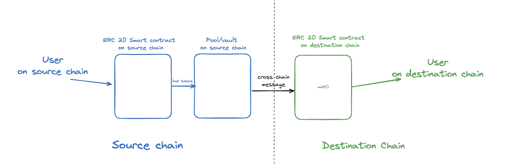

2. **Burn and mint**:

    - **Source chain**: Tokens are permanently destroyed (burned).
    - **Destination chain**: Equivalent tokens are newly minted.
    - This process is the same for the return journey.
    - This approach is particularly suitable for native tokens with minting authority.

    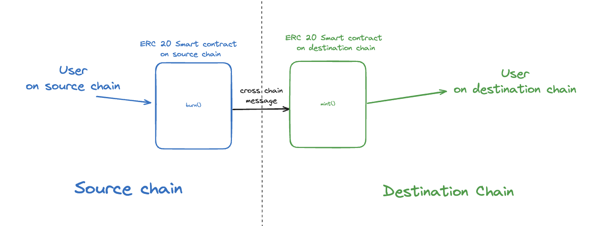

3. **Lock and unlock**:

    - **Source chain**: Tokens are locked in a smart contract.
    - **Destination chain**: Equivalent tokens are released from an existing liquidity pool
    - This process is the same for the return journey.
    - This mechanism requires sufficient liquidity on both sides; typically, liquidity providers are incentivized through revenue sharing or yield opportunities.

    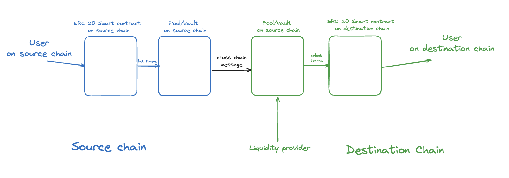

4. **Burn and Unlock**:

    - **Source chain**: Tokens are permanently burned
    - **Destination chain**: Equivalent tokens are unlocked from a reserve pool, requiring liquidity providers.
    - This approach combines the finality of burning with the need for pre-existing liquidity on the destination chain.

    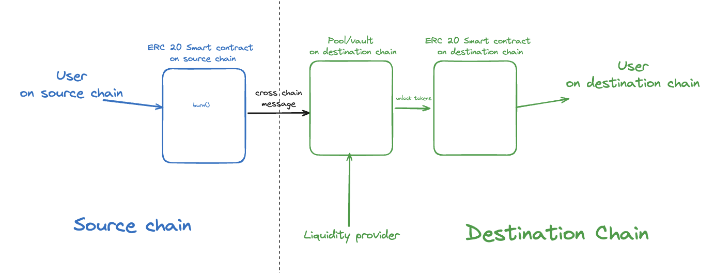

### Cross-chain Messaging

Cross-chain messaging allows blockchains to communicate by sending data between chains. This enables more complex interactions beyond simple token transfers, such as:

-   Synchronizing protocol states (like interest rates or governance decisions).
-   Triggering functions on destination chains based on source chain events.

Cross-chain messaging protocols typically handle message verification, delivery confirmation, and proper execution on destination chains. This infrastructure is essential for building truly interconnected blockchain applications that can leverage the unique strengths of different networks while maintaining coherent application logic.

### Security Considerations

Cross-chain operations introduce fundamental security challenges not present in single-chain environments. Cross-chain systems must make tradeoffs between three critical properties:

-   **Security**: Resistance to attacks and manipulation.
-   **Trust assumptions**: The degree of trust required in external validators or oracles (when using Chainlink, this is minimized).
-   **Configuration flexibility**: Adaptability to different blockchain architectures.

Unlike single-chain systems, cross-chain systems must carefully navigate these tradeoffs. This means that security models for cross-chain applications require more rigorous design considerations and often involve different assumptions than their single-chain counterparts.

## Chainlink Cross-Chain Interoperability Protocol (CCIP)

Chainlink CCIP is a cross-chain messaging solution that enables developers to build secure cross-chain applications capable of transferring tokens, sending arbitrary messages (data), or executing programmable token transfers between different blockchains.
Given the inherent security challenges of cross-chain operations, CCIP implements a [defense-in-depth security](https://blog.chain.link/ccip-risk-management-network/) approach powered by Chainlink's industry-leading decentralized oracle networks (DONs), which have securely facilitated over $15 trillion in transaction value.

### Core Capabilities

CCIP offers three primary capabilities that form the foundation of cross-chain development:

-   **Arbitrary messaging**: Send any data to smart contracts on different blockchains. For example:
    -   Encode custom instructions or parameters as needed.
    -   Trigger specific actions on receiving contracts (rebalancing indices, minting NFTs, etc.)
    -   Bundle multiple instructions within a single message to orchestrate complex multi-chain tasks.
-   **Token transfers**: Move tokens securely across blockchain networks:
    -   Transfer to smart contracts or directly to user wallets (EOAs).
    -   Benefit from configurable rate-limiting for enhanced risk management.
    -   Improve token composability with dApps and bridges using CCIP's standardized interface.
-   **Programmable token transfers (data and tokens)**: Combine token transfers with execution instructions in a single transaction:
    -   Send tokens with specific instructions on how they should be used.
    -   Create cross-chain DeFi interactions (lending, swapping, staking).
    -   Execute complex financial operations in a unified transaction.

### Core Security Features

CCIP's security features include:

-   **Multiple independent nodes** run by independent key holders.
-   **Three decentralized oracle networks (DONs)** commit, execute, and verify cross-chain transactions.
-   **Separation of responsibilities** via a distinct set of Chainlink node operators, wherein nodes are not shared between the transactional DONs and the [Risk Management Network (RMN)](https://docs.chain.link/ccip/concepts#risk-management-network).
-   **Increased decentralization**, with two separate codebases across two different implementations written in different languages to create a diversity of software clients.
-   **Novel risk management system**, with [level-5 security](https://blog.chain.link/five-levels-cross-chain-security/#level_5__defense-in-depth) that can adapt to emergent risks or attacks in cross-chain messaging.

### CCIP Architecture

CCIP enables a sender on a source blockchain to send a message to a receiver on a destination blockchain.

CCIP consists of the following components to facilitate cross-chain communication:

-   **Router**: The primary user-facing smart contract deployed on each blockchain. The Router:

    -   Initiates cross-chain interactions.
    -   Manages token approvals for transfers.
    -   Routes instructions to the appropriate destination-specific [OnRamp](https://docs.chain.link/ccip/architecture#onramp).
    -   Delivers tokens to user accounts or messages to the receiver contracts on destination chains.

-   **Sender**: An EOA (externally owned account) or smart contract that initiates the CCIP transaction. Both initiators can send tokens, messages, or tokens and messages.

-   **Receiver**: An EOA or smart contract that receives the cross-chain transaction. The receiver may differ from the sender depending on the specific use case, such as sending assets to another user on a different chain. Only smart contracts can receive data.


### Fee-Handling

When using CCIP, there is an associated fee when sending a cross-chain message (either data, tokens, or both). The CCIP billing model uses a `feeToken` specified in the cross-chain message that users will send. This fee token can be either the blockchain's native token (including wrapped versions) or LINK. This fee is a **single fee on the source chain**, where CCIP takes care of the execution on the destination chain.

The fee is calculated using the following formula:

```
fee = blockchain fee + network fee
```

#### Fee

The `fee` is the total CCIP fee for sending the message. This fee amount is accessible on the Router contract via the `getFee` function.

#### Blockchain Fee

The `blockchain fee` represents an estimation of the gas cost the Chainlink node operators will pay to deliver the CCIP message to the destination blockchain. It is calculated using the following formula:

```
blockchain fee = execution cost + data availability cost
```

**Execution Cost**: The `execution cost` directly correlates with the estimated gas usage to execute the transaction on the destination blockchain. It is calculated using the following formula:

```
execution cost = gas price * gas usage * gas multiplier
```

Where:

-   `gas price`: This is the gas on the destination chain.
-   `gas usage`: This is calculated using the following formula:

```
gas usage = gas limit + destination gas overhead + destination gas per payload + gas for token transfers
```

Where:

-   `gas limit`: The maximum amount of gas CCIP can consume to execute `ccipReceive` on the receiver contract, located on the destination blockchain. Users set the gas limit in the extra argument field of the CCIP message. Any unspent gas from this user-set limit is _not_ refunded. - **Warning**: unspent gas is NOT refunded, so be sure to carefully estimate the `gasLimit` that you set for your destination contract so CCIP can have sufficient gas to execute `ccipReceive`.
-   `destination gas overhead`: Fixed gas cost incurred on the destination blockchain by CCIP DONs.
-   `destination gas per payload`: This depends on the length of the data being sent cross-chain in the CCIP message. If there is no payload (CCIP is used to transfer tokens and no data), the value is `0`.
    `gas for token transfers`: Cost for transferring tokens to the destination blockchain. If there are no token transfers, the value is `0`.
-   `gas multiplier`: Scaling factor for _Smart Execution_. _Smart Execution_ is a multiplier that ensures the reliable execution of transactions regardless of gas spikes on the destination chain. This means you can simply pay on the source blockchain and CCIP will take care of execution on the destination blockchain.

**Data Availability Cost**: Relevant if the destination chain is an L2 rollup. Some L2s charge fees for data availability. This is because many rollups process the transactions off-chain and post the transaction data to the L1 as `calldata`, which costs additional gas.

### Network Fee

The `network fee` is the fee for CCIP service providers such as the DON nodes (e.g., Committing DON, Executing DON, or the RMN nodes).

The `network fee` depends on the bridging mechanism (mint and burn, lock and unlock, etc.) and whether the cross-chain message sends tokens, data, or both. The Chainlink CCIP documentation includes a calculator for calculating the [`network fee`](https://docs.chain.link/ccip/billing#network-fee).

### CCIP transaction lifecycle

**Message Initiation**: A sender, either a smart contract or an Externally Owned Account (EOA), initiates a CCIP message on the source blockchain. This message can include arbitrary data, tokens, or both.​ For token transfers, the corresponding token pool contracts handle the burning or locking of tokens on the source chain. ​

**Source Chain Finality**: The transaction must achieve finality on the source blockchain after initiation. Finality refers to the point at which a transaction is considered irreversible and permanently on the blockchain. The time to reach finality varies among blockchains; for instance, some may have deterministic finality, while others might require waiting for a certain number of block confirmations to mitigate the risk of reorganization. ​

**Committing DON Actions**: Once finality is achieved, the Decentralized Oracle Network (DON) responsible for committing transactions (Committing DON) observes the finalized transaction. It then aggregates multiple finalized CCIP transactions into a batch, computes a Merkle root for this batch, and records it onto the `CommitStore` contract on the destination blockchain. ​

**Risk Management Network Blessing**: The Risk Management Network reviews the committed Merkle root to ensure the integrity and security of the batched transactions. It "blesses" the Merkle root upon verification, signaling that the transactions are authenticated and can proceed. ​

**Execution on Destination Chain**: Following the blessing, the Executing DON initiates the transaction's execution on the destination blockchain. This involves delivering the message to the intended receiver. For token transfers, the corresponding token pool contracts handle the minting or unlocking of tokens on the destination chain. ​

**Smart Execution and Gas Management**: CCIP incorporates a Smart Execution mechanism to ensure reliable transaction delivery. This system monitors network conditions and adjusts gas prices as needed to facilitate successful execution within a specified time window, typically around 8 hours. [Manual execution](https://docs.chain.link/ccip/concepts/manual-execution) may be required to complete the process if the transaction cannot be executed within this window due to network congestion or insufficient gas limits. ​

Visit the [Chainlink Documentation](https://docs.chain.link/ccip/concepts/ccip-execution-latency#overview) for more information on the CCIP transaction lifecycle and how the DON determines finality.

#### The Token Pool Contracts

Chainlink CCIP introduces the concept of a **Token Pool** contract. We'll revisit this later when discussing Chainlink's Cross-Chain Token standard, but for now, here’s the core idea:

-   In the context of CCIP, Token Pool contracts are responsible for **managing token supply** across the source and destination chains. Token Pool is the term used by Chainlink to refer to the smart contract responsible for controlling the transfer of tokens, regardless of the bridging mechanism.

-   Each token on each chain has its own associated Token Pool contract, regardless of whether the bridging mechanism involves **minting and burning** or **locking and unlocking**.

-   Traditionally, token pools serve as vaults—used to lock tokens from liquidity providers or to store tokens that have been bridged.

-   In Chainlink’s terminology, a Token Pool is the contract that either calls `mint`/`burn` on the token contract or manages token custody for lock/unlock-style bridging.

#### Importance of Finality in CCIP

Finality is a critical aspect of the CCIP transaction lifecycle, as it determines the point at which a transaction is considered irreversible and permanently recorded on the blockchain. Different blockchains have varying notions of finality. For instance, some blockchains achieve deterministic finality quickly, while others may require waiting for multiple block confirmations to ensure the transaction is unlikely to be reverted. CCIP considers these differences by waiting for the appropriate finality on the source blockchain before proceeding with cross-chain transactions, thereby ensuring the integrity and reliability of the protocol. ​View the [Chainlink Documentation](https://docs.chain.link/ccip/concepts/ccip-execution-latency#finality-on-l2s) to see the finality times on different blockchains.

## Transporter

In this lesson, we will use Transporter to bridge USDC cross-chain from Sepolia to Base Sepolia.

### What is Transporter?

Transporter is an application designed to facilitate bridging tokens and messages across blockchains. Transporter is powered by Chainlink’s Cross-Chain Interoperability Protocol (CCIP). Transporter was built in association with the Chainlink Foundation and with support from Chainlink Labs to simplify access to the cross-chain economy. Features include an intuitive UI, 24/7 global support, and a [visual tracker](https://ccip.chain.link/) that allows users to continuously monitor the state of their assets and messages through every step of a transaction.

CCIP achieves the [highest level of cross-chain security](https://blog.chain.link/five-levels-cross-chain-security/) by utilizing Chainlink’s time-tested decentralized oracle networks, which has [enabled over $15 trillion in transaction value](https://chain.link/), and a separate Risk Management Network. Leveraging CCIP’s [defense-in-depth](https://blog.chain.link/ccip-risk-management-network/) security model, Transporter enables secure and decentralized token transfers across a wide range of blockchains.

### Using Transporter

In this lesson, we will use Transported to bridge USDC from Sepolia to Base Sepolia. Note that when bridging USDC using CCIP, CCIP will also leverage Circle's Cross-chain transfer protocol (CCTP) under the hood. To understand more about how CCIP uses CCTP, visit the [CCIP documentation](https://docs.chain.link/ccip/tutorials/usdc).

#### Prerequisites

-   You have LINK funds on Sepolia.
-   You've added the LINK token to MetaMask on Sepolia and Base Sepolia.
-   You've added the USDC token to MetaMask on Sepolia and Base Sepolia. A list of the addresses on different chains can be found in the [Circle documentation](https://developers.circle.com/stablecoins/usdc-on-test-networks).
-   You have test USDC on Sepolia., Use the [Circle USDC faucet](https://faucet.circle.com/) to do this.

Visit Section 2 if you need a reminder of how to do this.

#### Bridging Using Transporter

1. Open the Transporter testnet app and click on one of the **Connect Wallet** buttons.
   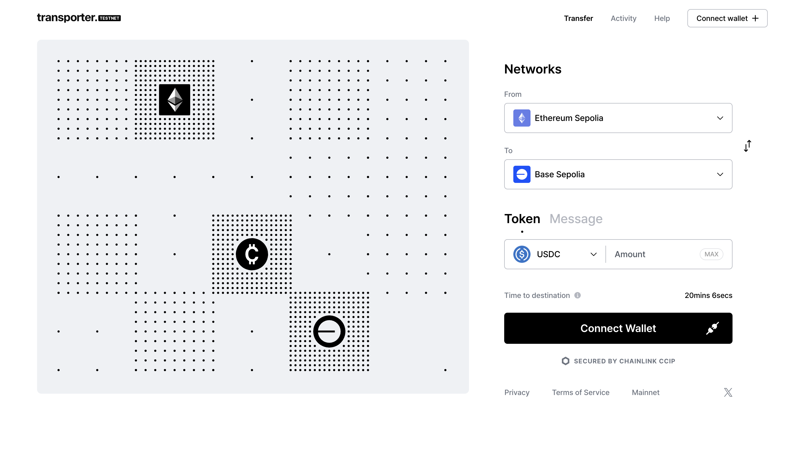

2. Check the Box to accept the Terms of Service and select your wallet option (e.g., MetaMask). Click **Connect** when prompted in MetaMask to connect your wallet to Transporter.
   

3. We must now define the source and destination chains and the token we want to transfer.

    - Select Ethereum Sepolia as **From** (the source chain).
    - Select Base Sepolia as **To** (the destination chain).
    - Select USDC as the **Token**.
    - Input the **Amount** as `1` USDC.

    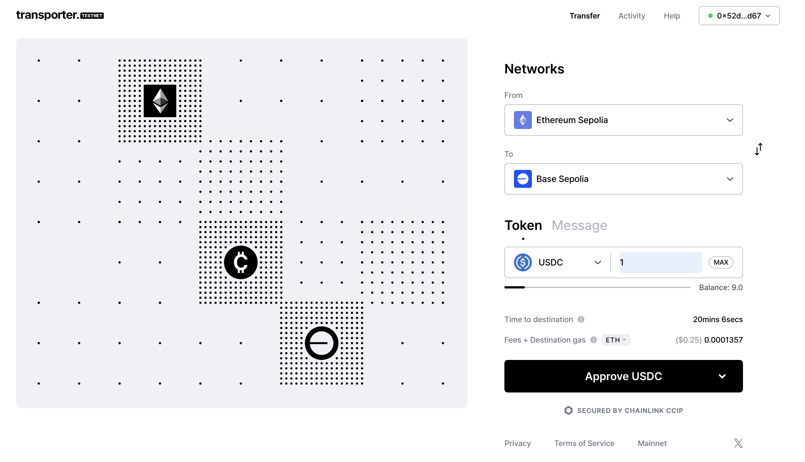

4. Click **Approve USDC**

    - Select the **Approve one-time only** option.

    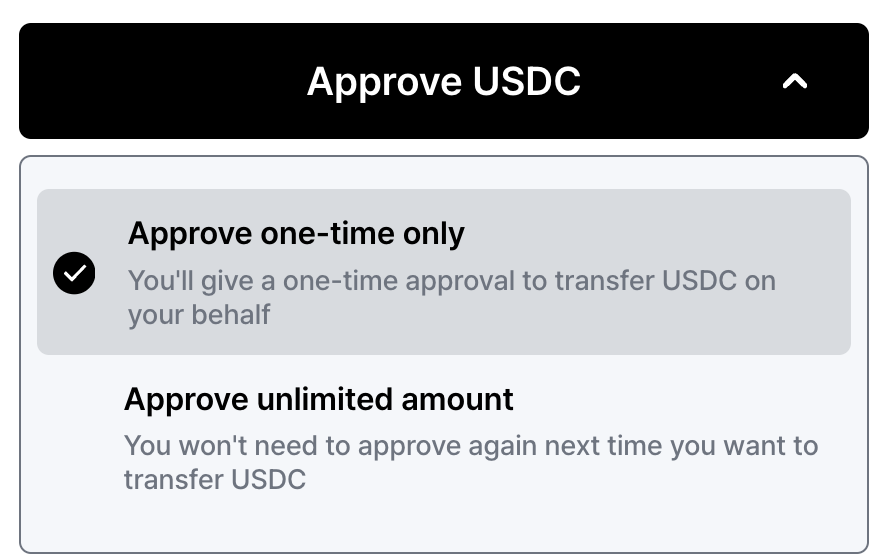

5. In the MetaMask pop-up, check the Spending cap is `1` as the amount to approve. Click **Confirm** to send the approval transaction.
   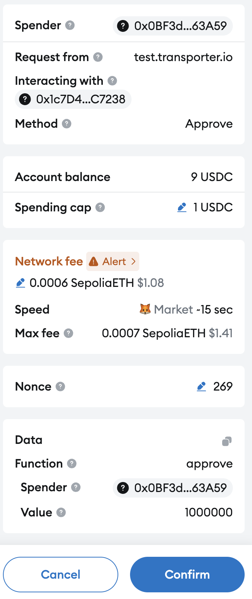

6. Once the approval transaction is confirmed, click **Send** in Transporter to bridge the tokens.

7. Sign the transaction in MetaMask to burn the tokens on Sepolia and send the cross-chain message. This will trigger USDC tokens to be minted on Base Sepolia once finality is reached on Ethereum Sepolia and the message has been received.
   
   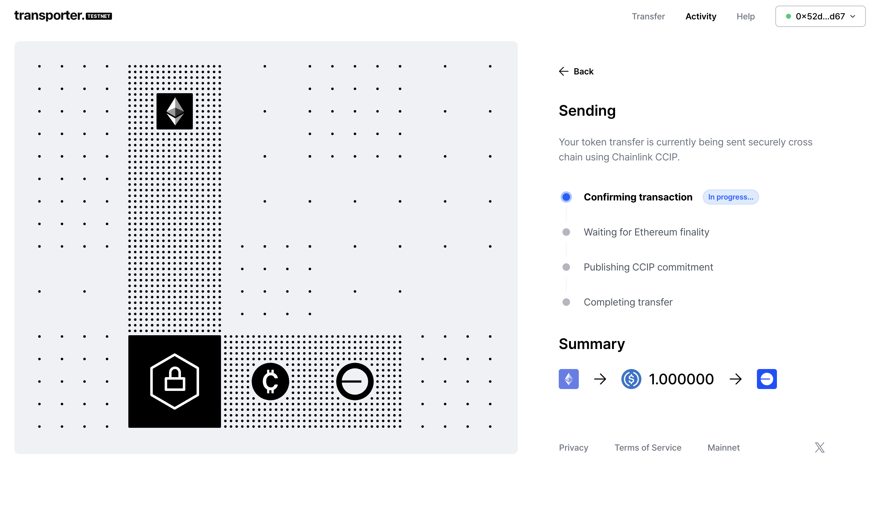

Click **View transaction** to open the CCIP explorer and see the cross-chain message details, including the status of the message, the source and destination chain transactions hashes, the amount, fees, sender and receiver addresses:

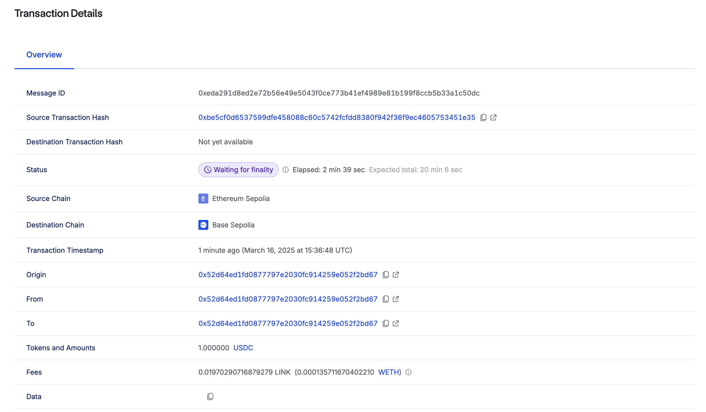

Once the status moves to **Success**, you will have completed your cross-chain transfer using CCIP! This should take around 20 minutes for Ethereum Sepolia finality.

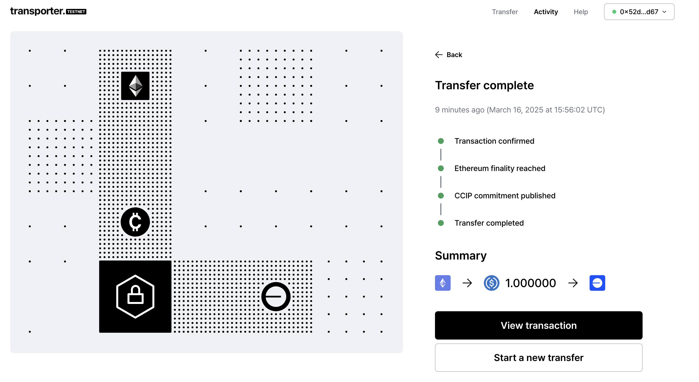

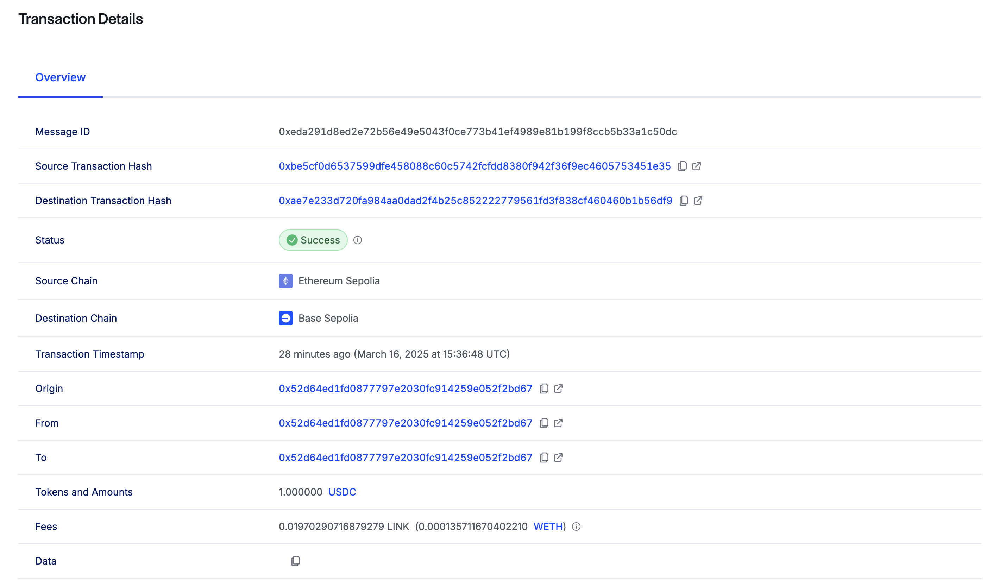

You can now check your USDC balance on Base Sepolia to see if your balance of USDC has increased by `1` and the cross-chain transfer was successful.

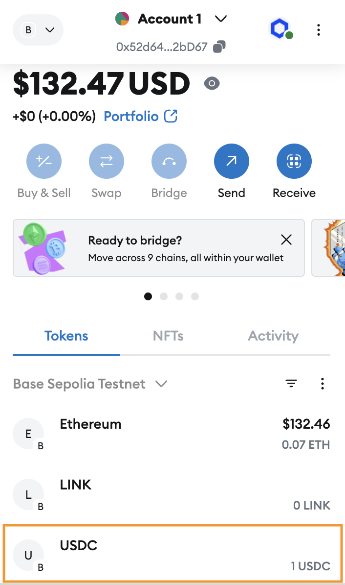

## Transferring Tokens Cross-chain in a Smart Contract Part 1

In this lesson, we will learn how to transfer USDC tokens cross-chain from Sepolia to Base Sepolia using Chainlink CCIP.

### Prerequisites

-   You have added the Base Sepolia testnet chain to MetaMask (if you need a reminder of how to add a chain to MetaMask, check out [this lesson in Blockchain Basics](https://updraft.cyfrin.io/courses/blockchain-basics/basics/making-your-first-transaction-on-zksync))

-   You have testnet Sepolia ETH and Base Sepolia ETH.
-   You have testnet LINK on Sepolia.
-   You have added the LINK token to MetaMask on Sepolia and Base Sepolia.
-   You have testnet USDC. You can obtain USDC on Sepolia from a Circle faucet.

Section 2 contains the instructions for the above prerequisites if you need a reminder.

### Writing the Smart Contract

#### Setting up the project

1. Open [Remix](https://remix.ethereum.org/).
2. Create a new workspace named "CCIP". If you need a reminder of how to do this, visit the Introduction to Remix lesson in Section 2.
3. Create a folder named `contracts`.
4. Inside this folder, create a file named `CCIPTokenSender.sol`.
5. Paste the provided contract code. The code can be found in the [course code GitHub repo](https://github.com/Cyfrin/chainlink-fundamentals-cu/blob/main/chainlink-course-code/ccip/CCIPTokenSender.sol).

#### Project workflow

This is the workflow for sending a cross-chain transfer using the `CCIPTokenSender` contract that implements CCIP:

1. The `CCIPTokenSender` contract is deployed on the source blockchain (Sepolia in our case).
2. The `CCIPTokenSender` contract is funded with LINK to pay the CCIP fees.
3. The user creates an approval for `CCIPTokenSender` to spend their USDC (the amount equal to the amount to transfer cross-chain).
4. The user calls the `transferTokens` function on `CCIPTokenSender` to send the cross-chain message. This function will:
    - Check the users' USDC balance is sufficient.
    - Send the USDC from the user to the `CCIPTokenSender` contract. For this, we will use the `safeTransferFrom` function from the `SafeERC20` library, which is "safer" to use since it reverts if a transfer fails (e.g., if the receiver cannot be sent tokens for some reason).
    - Approve a Chainlink `Router` contract to be able to spend `CCIPTokenSender`'s tokens and transfer them cross-chain.
    - Get the fees for the message via the `getFees` function on the `Router` contract and approve the `Router` to spend the fees.
    - Sends the message via the `ccipSend` function on the `Router` contract.

**Note**: This tutorial aims to help you understand how CCIP works conceptually. If you are not interested in learning how to implement CCIP in a smart contract, you can skip to the deployment section.

#### Understanding the code

##### 1. Contract declaration and constructor

First, we create a smart contract called `CCIPTokenSender` that inherits OpenZeppelin's `Ownable` smart contract, which we used in previous Sections. Remember, this contract sets the `_owner` as the address passed in the `Ownable` constructor. We can access this owner address externally by calling the `owner` function. Let's import and inherit the `Ownable` smart contract and invoke its constructor.

```solidity
// SPDX-License-Identifier: MIT
pragma solidity ^0.8.19;

import { Ownable } from "@openzeppelin/contracts@4.6.0/access/Ownable.sol";

contract CCIPTokenSender is Ownable {
    constructor() Ownable(msg.sender) {}
}
```

##### 2. Importing dependencies

Let's import the required interfaces and libraries:

```solidity
// SPDX-License-Identifier: MIT
pragma solidity ^0.8.19;

import { IRouterClient } from "@chainlink/contracts-ccip/src/v0.8/ccip/interfaces/IRouterClient.sol";
import { IERC20 } from "@chainlink/contracts-ccip/src/v0.8/vendor/openzeppelin-solidity/v4.8.0/token/ERC20/IERC20.sol";
import { SafeERC20 } from "@chainlink/contracts-ccip/src/v0.8/vendor/openzeppelin-solidity/v4.8.0/token/ERC20/utils/SafeERC20.sol";
import { Ownable } from "@openzeppelin/contracts@4.6.0/access/Ownable.sol";
```

These imports provide:

-   `IRouterClient`: Interface for the CCIP Router that handles cross-chain messaging
-   `Client`: Library with data structures for CCIP messages
-   `IERC20`: Standard interface for interacting with ERC20 tokens (USDC and LINK)
-   `SafeERC20`: Enhanced functions for safer ERC20 token handling

We also need to use the `SafeERC20` library with our `IERC20` tokens:

```solidity
contract CCIPTokenSender is Ownable {
    using SafeERC20 for IERC20;

    constructor() Ownable(msg.sender) {}
}
```

##### 3. Defining state variables

We define the following constant variables (that have been hard-coded for clarity):

-   The `Router` on the source chain routes the CCIP transfer requests to the DON.
-   The LINK token on the source chain is used to pay the fees.
-   The USDC token on the source chain is the token we are transferring cross-chain.
-   The destination chain selector: This is the identifier so Chainlink knows what chain you want to send your tokens to. This selector can be found in the [CCIP Directory](https://docs.chain.link/ccip/directory/testnet).

```solidity
// https://docs.chain.link/ccip/supported-networks/v1_2_0/testnet#ethereum-testnet-sepolia
IRouterClient private constant CCIP_ROUTER = IRouterClient(0x0BF3dE8c5D3e8A2B34D2BEeB17ABfCeBaf363A59);
// https://docs.chain.link/resources/link-token-contracts#ethereum-testnet-sepolia
IERC20 private constant LINK_TOKEN = IERC20(0x779877A7B0D9E8603169DdbD7836e478b4624789);
// https://developers.circle.com/stablecoins/docs/usdc-on-test-networks
IERC20 private constant USDC_TOKEN = IERC20(0x1c7D4B196Cb0C7B01d743Fbc6116a902379C7238);
// https://docs.chain.link/ccip/directory/testnet/chain/ethereum-testnet-sepolia-base-1
uint64 private constant DESTINATION_CHAIN_SELECTOR = 10344971235874465080;
```

##### 4. The main transfer function

Now, let's build our `transferTokens` function that will handle the cross-chain transfer:

```solidity
function transferTokens(
    address _receiver,
    uint256 _amount
)
    external
    returns (bytes32 messageId)
{
    // Function implementation will go here
}
```

This function takes:

-   `_receiver`: The address that will receive tokens on Base Sepolia
-   `_amount`: How many USDC tokens to transfer
-   It returns `messageId`: A unique identifier for tracking the cross-chain transfer

##### 5. The transfer logic

The function transferTokens allows us to send tokens cross-chain. Let's implement it:

1. **Balance verification**: Check whether the address calling the function has a USDC balance of at least the amount they are trying to bridge.

    ```solidity
    if (_amount > USDC_TOKEN.balanceOf(msg.sender)) {
        revert CCIPTokenSender__InsufficientBalance(USDC_TOKEN, USDC_TOKEN.balanceOf(msg.sender), _amount);
    }
    ```

2. **Prepare the token information**: To send a token cross-chain we need to create a message object of type `Client::EVM2AnyMessage`. This struct has the following members:

    ```solidity
    // If extraArgs is empty bytes, the default is 200k gas limit.
    struct EVM2AnyMessage {
        bytes receiver; // abi.encode(receiver address) for dest EVM chains
        bytes data; // Data that is being sent cross-chain with the tokens. (For this example, we won't be sending any data)
        EVMTokenAmount[] tokenAmounts; // Token transfers
        address feeToken; // Address of feeToken. address(0) means you will send msg.value.
        bytes extraArgs; // Populate this with _argsToBytes(EVMExtraArgsV2)
    }
    ```

    CCIP requires a specific format for specifying tokens to transfer. As above, the token information must be a `Client.EVMTokenAmount` struct array. This struct has the following members:

    ```solidity
    struct EVMTokenAmount {
        address token; // token address on the local chain.
        uint256 amount; // Amount of tokens.
    }
    ```

    To create this array:

    - We first create an empty `Client.EVMTokenAmount` array with a single element.
    - Then, we create a `Client.EVMTokenAmount` variable and pass the USDC token address and the amount to send. This tells Chainlink what token and how much is being sent cross-chain.
    - Finally, we initialize the first element with the `Client.EVMTokenAmount` variable.

        ```solidity
        // Create an array with one element
        Client.EVMTokenAmount[]
            memory tokenAmounts = new Client.EVMTokenAmount[](1);
        // Create a single Client.EVMTokenAmount variable with the details for the token and the amount to send cross-chain
        Client.EVMTokenAmount memory tokenAmount = Client.EVMTokenAmount({
            token: address(USDC_TOKEN),
            amount: _amount
        });
        // Set the first element of the array to the Client.EVMTokenAmount variable
        tokenAmounts[0] = tokenAmount;
        ```

3. **Building the CCIP message** create a message `Client.EVM2AnyMessage` struct with the relevant values:

    ```solidity
    Client.EVM2AnyMessage memory message = Client.EVM2AnyMessage({
        receiver: abi.encode(_receiver),
        data: "", // no data
        tokenAmounts: tokenAmounts,
        extraArgs: Client._argsToBytes(
            Client.EVMExtraArgsV1({gasLimit: 0}) // Setting gasLimit to 0 because:
            // 1. This is a token-only transfer to an EOA (external owned account)
            // 2. No contract execution is happening on the receiving end
            // 3. gasLimit is only needed when the receiver is a contract that needs
            //    to execute code upon receiving the message
        ),
        feeToken: address(LINK_TOKEN)
    });
    ```

4. **Handling fees**: Get the fees for the message via the `Router` contract, check if the contract has a sufficient LINK balance to pay the fees, and approve the `Router` to spend some of the `CCIPTokenSender`'s LINK as fees:

    ```solidity
    uint256 ccipFee = CCIP_ROUTER.getFee(
        DESTINATION_CHAIN_SELECTOR,
        message
    );

    if (ccipFee > LINK_TOKEN.balanceOf(address(this))) {
        revert CCIPTokenSender__InsufficientBalance(LINK_TOKEN, LINK_TOKEN.balanceOf(address(this)), ccipFee);
    }

    LINK_TOKEN.approve(address(CCIP_ROUTER), ccipFee);
    ```

5. **Transferring and approving USDC**: Send the `_amount` to bridge to the `CCIPTokenSender` contract and approve the `Router` to be able to spend `_amount` of USDC from the `CCIPTokenSender` contract:

    ```solidity
    USDC_TOKEN.safeTransferFrom(msg.sender, address(this), _amount);
    USDC_TOKEN.approve(address(CCIP_ROUTER), _amount);
    ```

6. **Sending the CCIP message**: Finally, send the cross-chain message by calling the `ccipSend` function on the `Router` contract and emit an event:

    ```solidity
    // Send CCIP Message
    messageId = CCIP_ROUTER.ccipSend(DESTINATION_CHAIN_SELECTOR, message);

    emit USDCTransferred(
        messageId,
        DESTINATION_CHAIN_SELECTOR,
        _receiver,
        _amount,
        ccipFee
    );
    ```

##### 5. Withdrawal function

Finally, the function `withdrawToken` allows the owner to be able to withdraw any USDC sent to the contract to a specified address `_beneficiary`:

```solidity
function withdrawToken(
    address _beneficiary
) public onlyOwner {
    uint256 amount = IERC20(USDC_TOKEN).balanceOf(address(this));
    if (amount == 0) revert CCIPTokenSender__NothingToWithdraw();
    IERC20(USDC_TOKEN).transfer(_beneficiary, amount);
}
```

#### Important Notes

-   **Token Approvals**: Before users can call `transferTokens`, they must approve `CCIPTokenSender` to spend their USDC tokens. We will be doing this in the _next lesson_.
-   **Contract Funding**: `CCIPTokenSender` must be funded with LINK tokens to pay the CCIP fees. Again, we will be doing this in the _next lesson_.
-   **Chain Selectors**: The destination chain selector is a unique identifier for Base Sepolia. Different destinations require different selectors. Visit the CCIP directory to find the chain selector for [the available chains](https://docs.chain.link/ccip/directory/testnet).
-   **Fee Management**: CCIP fees are paid in LINK tokens (or native tokens) and vary based on the destination chain and current network conditions.

### Compiling & Deploying the Contract

Now that you have the code written, deploy the `CCIPTokenSender` contract to the source chain (Sepolia) using the steps detailed in the previous lessons:

-   **Compile**: Open the `CCIPTokenSender.sol` file and head to the **Solidity Compiler** tab. Click **Compile CCIPTokenSender.sol**
-   **Connect to MetaMask**: Head to the **Deploy & Run Transactions** tab and change the **Environment** to **Injected Provider - MetaMask** to connect to MetaMask. Make sure that you are connected to Sepolia testnet in MetaMask.
-   **Deploy the Contract**: Ensure you've selected `CCIPTokenSender.sol` in the **Contract** dropdown menu. Click **Deploy**, and this will pop up MetaMask. Click **Confirm** to send the transaction and deploy the contract.
-   Upon a successful deployment in Remix, you will see:
    1. The green checkmark at the bottom.
    2. Your deployed contract and address.

You have now successfully written and deployed a smart contract that uses CCIP to transfer USDC cross-chain! In the next lesson, we will use this contract to perform a cross-chain transfer from Sepolia to Base Sepolia!

## Transferring Tokens Cross-chain in a Smart Contract Part 2

In the previous lesson, we wrote and deployed a smart contract to send USDC from Sepolia to Base Sepolia. In this lesson, we will perform that cross-chain transfer using Chainlink CCIP.

### Funding the contract with LINK

To send tokens cross-chain, we need to fund our `CCIPTokenSender` function with LINK tokens to pay for the cross-chain transfer.

This is a recap of what you learned in Section 2, Lesson 3, so we are going to go pretty quickly. Revisit that lesson if you'd like a more detailed breakdown.

-   In MetaMask, click on the **Tokens** tab and click the **LINK** token:
    

-   Click the **Send** button:
    

-   For the **Send to** address, paste the address of the `CCIPTokenSender` contract we deployed in the previous lesson:
    

-   Enter the **Amount** of LINK to send to the contract. `3` LINK will be sufficient.

-   Click **Continue**:
    

-   Click **Confirm** to sign the transaction and send the LINK tokens to the `CCIPTokenSender` contract:
    

#### Check the contract balance

Let's check the LINK tokens successfully transferred to the `CCIPTokenSender` contract by checking its LINK balance. This tutorial uses Etherscan, but you can also use Blockscout or other block explorers.

-   Navigate to [Etherscan Sepolia](https://sepolia.etherscan.io/) and search the LINK token address on Sepolia: `0x779877A7B0D9E8603169DdbD7836e478b4624789`.
-   Clic **Connect to Web3** and connect MetaMask to Etherscan.
-   Click on the **Contract** tabs and then **Read Contract** and find the `balanceOf` function
-   For the `account`, enter the `CCIPTokenSender` address:

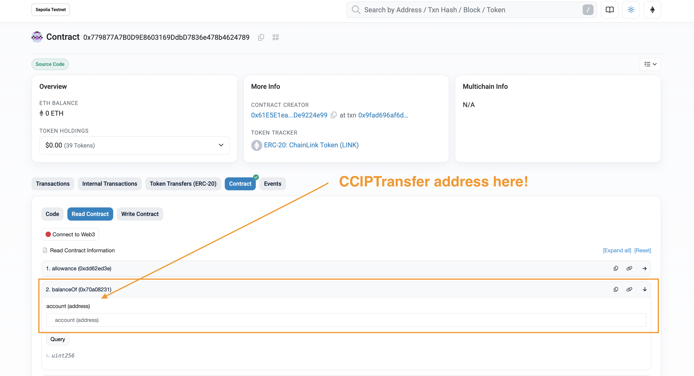

If the transfer is successful, it will produce an output of `300000000000000`, which is 3 LINK in WEI.

### Approve CCIPTokenSender to spend USDC

When calling `transferTokens`, the function transfers tokens from the user (represented by `msg.sender`) to the `CCIPTokenSender` contract using the `safeTransferFrom` function, enabling those tokens to be sent cross-chain.

Before this can work, the user must first grant permission to the `CCIPTokenSender` contract to transfer their USDC tokens. This permission is given through an "approval" transaction on the USDC contract, which authorizes the `CCIPTokenSender` contract to spend a specific amount of the user's tokens on their behalf.

To do this token approval, we are going to interact with the USDC contract on Etherscan Sepolia, as we did the LINK token.

-   Navigate to [Etherscan Sepolia](https://sepolia.etherscan.io/) and search the USDC token address on Sepolia: `0x1c7D4B196Cb0C7B01d743Fbc6116a902379C7238`
-   Click on the **Contract** tabs and then **Write as Proxy**, (**Write** since we want to send a transaction that modifies state and **as Proxy** since we want to be calling functions on the implementation contract, and this is a proxy. Don't worry about what this means - it's pretty advanced stuff).
-   Connect your wallet by clicking the **Connect to Web3** button.
-   Find the `approve` function and click on it to expand it.
-   For the `spender`, enter the `CCIPTokenSender` address; for the `value`, enter the number of tokens you want to send cross-chain; we will be sending `1 USDC` or `1000000` since USDC has 6 decimal places:
    

-   Click **Write** to initiate the transaction.
-   Sign the transaction in MetaMask to send the transaction.
-   To confirm the approval was successful, click the **Read as Proxy** tab and click the `allowance` function. Enter your address as the `owner` and the `CCIPTokenSender` contract address as the `spender`. Then, click **Query**:
    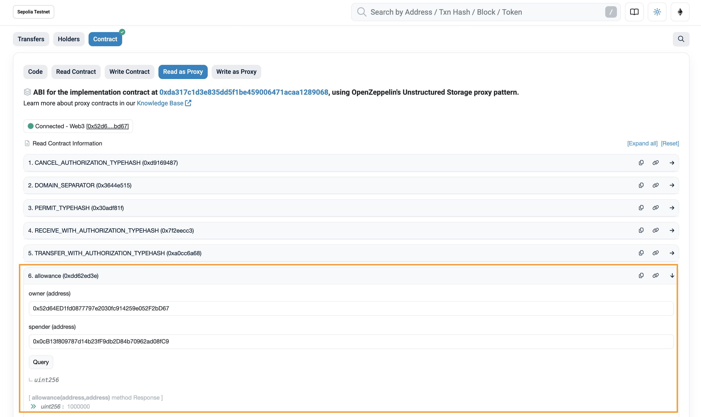

-   If the approval was successful, you will see an output of `1000000`.

### Executing the Cross-chain Transfer of USDC

Let's FINALLY send some USDC from Sepolia to Base Sepolia using CCIP!

-   Return to Remix and click the **Deploy and run transactions** tab.
-   Click on the `transferTokens` function and fill out the following inputs:

    -   `_receiver`: paste your wallet address since you will send yourself USDC on the destination chain. Note that, on some blockchains, you are not guaranteed to have the same address.
    -   `_amount`: we are sending `1` USDC cross-chain, so put `1000000`(USDC has 6 decimal places).
        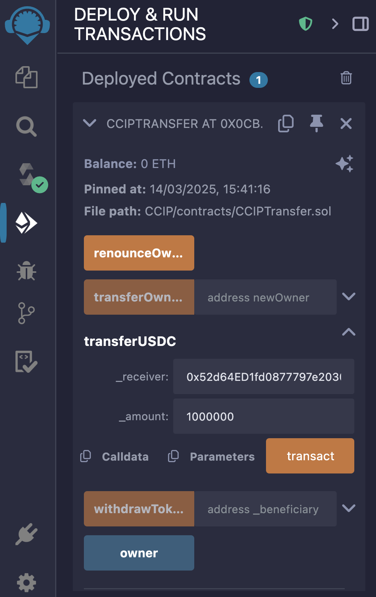

-   Click **transact** to initiate the transaction.
-   Sign the message in MetaMask by clicking **Confirm**.
    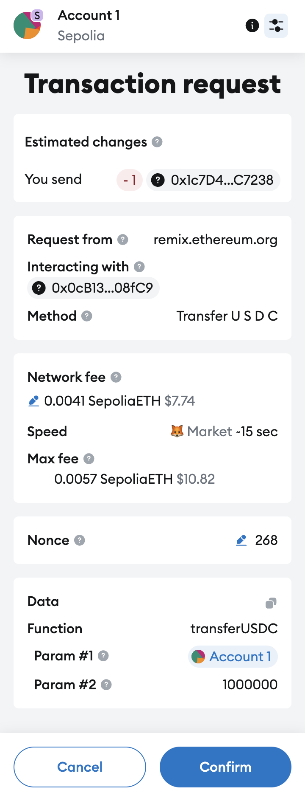

-   In Remix, we will see a log in the terminal confirming the transfer has been initiated on Sepolia.
    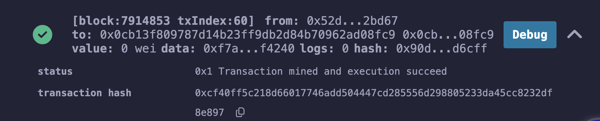

-   Copy the transaction hash! We will be using this shortly.

You have now successfully initiated a cross-chain transfer from Sepolia to Base Sepolia!
Now, we want to track the cross-chain message, see if the minting transaction has occurred on the destination chain, and when we received our bridged tokens. To do this, we will use the CCIP explorer.

### Using the CCIP Explorer

After sending a transaction, you can access the [CCIP Explorer](https://ccip.chain.link/) to check the progression of the coss-chain message.

Paste the Sepolia transaction hash into the CCIP Explorer search bar:

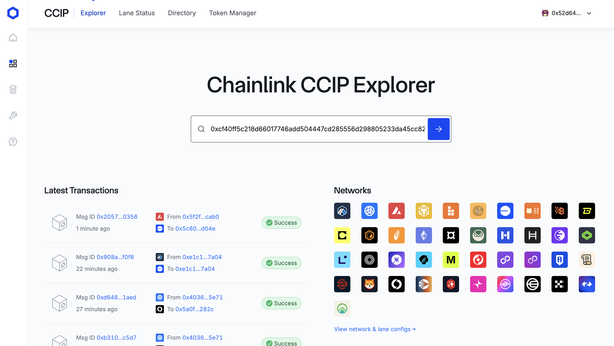

This will bring up the transaction details for your cross-chain transfer. Here, you will be able to see an overview of the transaction, including the source and destination transactions to burn and mint the tokens, respectively.

It will also show the **Status** of the cross-chain message. The tokens are only received on the destination chain after full finality is reached on the source chain. For Ethereum Sepolia, this is approximately 20 minutes, but the times for different chains can be found in the Chainlink documentation.

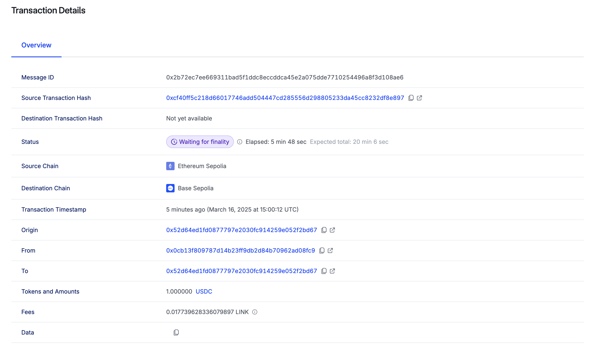

When the message's status changes from **Waiting for finality** to **Success**, you will have received your tokens on the destination chain:

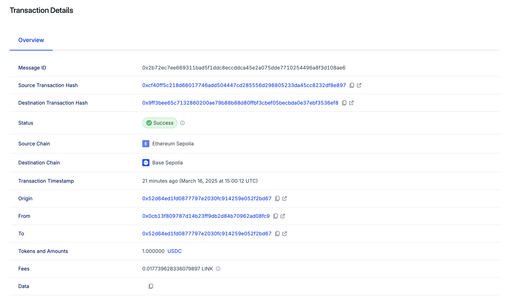

To check your USDC balance, switch your network inside MetaMask to Base Sepolia and then check your USDC balance in the **Tokens** tab (assuming you have imported the USDC token on Base Sepolia).


Awesome! You successfully sent your first cross-chain message to bridge tokens from Sepolia to Base Sepolia using CCIP integrated into a smart contract!

### Challenge!

So now you know how to write a smart contract to bridge USDC tokens from Sepolia to Base Sepolia, the next challenge is to use this same smart contract to transfer [CCIP-BnM](https://sepolia.etherscan.io/token/0xfd57b4ddbf88a4e07ff4e34c487b99af2fe82a05#writeContract) tokens to ZKsync Sepolia!

To do this you will need to:

1. Add the ZKsync Sepolia chain to MetaMask.
2. Add the CCIP-BnM token on Sepolia and ZKsync Sepolia to Metamask.
3. Modify and re-deploy the smart contract to Sepolia:
    - `DESTINATION_CHAIN_SELECTOR` to be the [selector for ZKsync Sepolia](https://docs.chain.link/ccip/directory/testnet/chain/ethereum-testnet-sepolia-zksync-1).
    - Change the token to be CCIP-BnM rather than USDC.
    - (devs-only): Can you moify the smart contracts to be adaptable for multiple chains by allowing the function caller to specify the token and destination chain?
4. Get some test CCIP tokens (CCIP-BnM) by [calling `drip()` on the token contract using Etherscan](https://sepolia.etherscan.io/token/0xfd57b4ddbf88a4e07ff4e34c487b99af2fe82a05#writeContract).
5. Call `transferTokens` as before and check the CCIP explorer to check the status of your cross-chain transfer.
6. Check your balance of ZKsync Sepolia CCIP-BnM tokens has now increased!

If you do this, make sure to let us know on Twitter/X using [this link](https://twitter.com/intent/post?text=I%20just%20transferred%20tokens%20cross-chain%20using%20%40chainlink%20CCIP%20to%20%40zksync%20testnet!%20Thanks%20%40ciaranightingal%20and%20%40cyfrinupdraft!) to send the following message:

"I just transferred tokens cross-chain using @chainlink CCIP to @zksync testnet! Thanks @ciaranightingal and @cyfrinupdraft!"

See how easy it is to transfer your tokens cross-chain to ZKsync? Cool right!

## CCIP v1.5: The Cross-Chain Token Standard

Chainlink's Cross-Chain Interoperability Protocol (CCIP) version 1.5 introduces the Cross-Chain Token (CCT) standard, enabling a streamlined and decentralized approach to **enabling tokens** for CCIP. This allows developers to independently deploy and manage their own cross-chain tokens using CCIP without requiring Chainlink to manually integrate each token. Projects can now create composable cross-chain tokens with full autonomy and ownership, significantly accelerating the development of multi-chain applications.

### CCT Standard Motivations

The CCT standard addresses two primary challenges in the blockchain ecosystem:

1. **Liquidity Fragmentation**: With numerous blockchains operating independently, liquidity becomes siloed, making it difficult for users and developers to access assets across different ecosystems. This fragmentation poses challenges for token developers in choosing the optimal blockchain for deployment without compromising liquidity or facing trust issues on newer chains.

2. **Developer Autonomy**: Previously, enabling tokens for cross-chain required manual processes and reliance on third parties, leading to inefficiencies. The CCT standard empowers token developers with a **self-service model**, allowing them to autonomously deploy, configure, and manage their token pools within CCIP.

### CCT Benefits

-   **Self-service**: The CCT standard enables token developers to launch a cross-chain token or enable an existing token for CCIP in a self-service manner within minutes.
-   **Developer control**: Token developers retain full control and ownership of their contracts, including the tokens, pools and implementation logic, including configurable rate limits,
-   **Defense-in-depth security**: The CCT standard leverages Chainlink's industry-standard Oracle networks. Additional layers of protection, such as the Risk Management Network and configurable transfer rate limits, further enhance security.
-   **Programmable token transfers**: Cross-Chain Token (CCT) supports the simultaneous transfer of tokens and messages in a single transaction automatically on every transfer. This is enabled through custom token pools that can pass data directly.
-   **Audited token pools**: Chainlink provides a fully audited `TokenPool` contracts, which simplifies cross-chain management. For mint/burn approaches, these contracts eliminate the need for traditional liquidity pools by burning tokens on the source chain and minting them on the destination chain. For lock/unlock approaches, the `TokenPool` contracts still require existing liquidity on the destination chain. The advantage is that these pre-built contracts handle the complex cross-chain operations securely, whether they're managing token locking, burning, minting, or unlocking operations.
-   **Zero-slippage**: The exact amount of tokens sent to the CCIP OnRamp on the source chain is always the exact amount of tokens received on the CCIP OffRamp on the destination chain
-   **Integrate existing ERC20s**: The CCT standard enables token developers to enable existing ERC-20 tokens for CCIP, avoiding the complexities associated with traditional bridging solutions.

### How the CCT Standard Works

The CCT standard facilitates cross-chain token transfers through the following components:

#### Token Owner

The entity (contract or EOA) that owns the token contract. The token owner has the authority to manage the token contract, including upgrading the contract, changing the token administrator, or transferring ownership to another address.

#### CCIP Admin

Like a token owner, the CCIP admin is the entity (contract or EOA) that can change the token administrator or transfer ownership to another address.

ERC-20 contracts are required to have _either_ a token owner or CCIP admin.

#### Token Administrator

A role assigned to manage cross-chain operations of a token. The token administrator is responsible for mapping a token to a token pool in the `TokenAdminRegistry`. The token administrator can be the token owner, the CCIP amin (depending on the function implemented on the token contract), or another designated entity assigned by a token owner.

#### Token Pools

Token pools are smart contracts that manage the minting, burning, locking, and releasing (depending on the implemented mechanism) of tokens across different blockchains. **They do not necessarily hold tokens** but ensure that the token supply remains consistent and prevent liquidity fragmentation. The CCT standard offers pre-audited token pool contracts, enabling zero-slippage cross-chain transfers. Developers can deploy these contracts to make any ERC20-compatible token cross-chain transferable or create custom token pool contracts for specific use cases.

**Note**: In Chainlink CCIP, the term "Token Pool" might be slightly confusing. Unlike traditional liquidity pools that hold tokens, a CCIP `TokenPool` is actually more like a coordinator contract that manages cross-chain token operations (minting, burning, locking, or unlocking). Even in mint/burn scenarios where no actual pooling of assets occurs, CCIP still requires a `TokenPool` contract for each token on each chain. This contract doesn't store tokens itself but instead orchestrates the token's cross-chain behavior.

##### CCIP Token Pool Mechanisms

The CCIP CCT Standard supports the following types of bridging mechanisms (remember, when using CCIP, all tokens need an associated Token Pool contract that is responsible for managing the token supply, regardless of the mechanism being used):

-   Mint and burn
    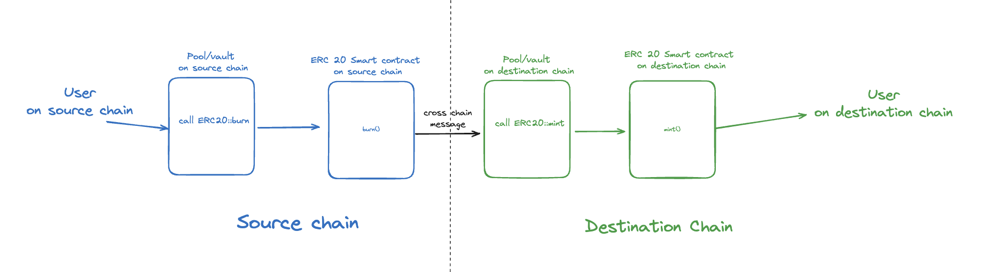

-   Mint and unlock
    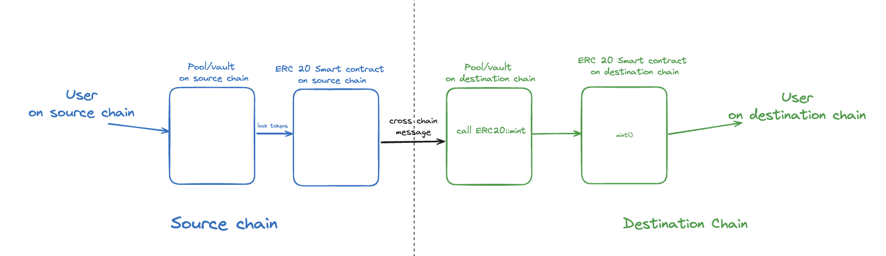

-   Burn and unlock
    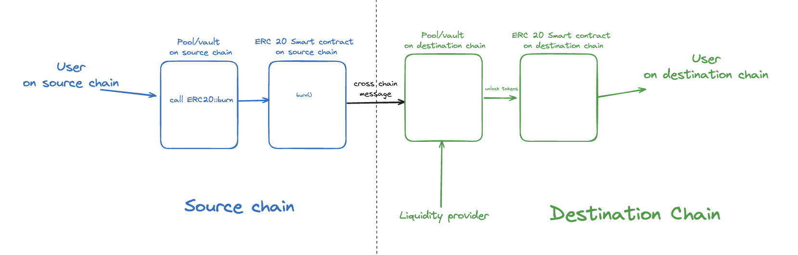

-   Lock and unlock
    

### How to Use the CCT Standard

To implement the CCT standard:

1. **Deploy the tokens**: Token developers either take an existing token or deploy one on every chain they want to enable their token. This token must implement with an `owner` function or `getCCIPAdmin` to return either the contract owner or CCIP admin respectively.
2. **Deploy Token Pools**: A token pool must be deployed on all enabled chains. These pools can be custom or Chainlink-written and audited.
3. **Configure Token Pools**: Set parameters such as rate limits to manage cross-chain token transfers.
4. **Register Tokens**: Register the token administrator (either a CCIP admin or owner, depending on which function the ERC-20 token implemented) using the `RegistryOwnerModuleCustom`. Link the deployed token pools with the token contracts on the `TokenAdminRegistry`.

Refer to the [Chainlink documentation](https://docs.chain.link/ccip/concepts/cross-chain-tokens) for detailed tutorials on deploying and registering cross-chain tokens.

# Chainlink CCIP Messages

## Chainlink Local: Develop and Test Chainlink Services

Chainlink Local is a development package that allows you to run Chainlink services directly in your local environment. This tool enables developers to explore Chainlink services before deploying to testnets or mainnet.

### What is Chainlink Local?

Chainlink Local is an installable package that integrates with popular development environments like [Foundry](https://getfoundry.sh/), [Hardhat](https://hardhat.org/), and [Remix](https://remix.ethereum.org/). It allows you to run Chainlink services locally for rapid development and testing. For example, you can use Chainlink Local to execute CCIP cross-chain messages on a local node.

### Key Features

-   **Local Simulation**: Test Chainlink services on local blockchain nodes.
-   **Forked Networks**: Work with deployed Chainlink contracts using forked networks for realistic testing.
-   **Seamless Integration**: Compatible with [Foundry](https://getfoundry.sh/), [Hardhat](https://hardhat.org/), and [Remix](https://remix.ethereum.org/) development environments.
-   **Testnet-Ready Code**: Contracts tested locally can be deployed to testnets without modifications.

### Development Modes

Chainlink Local supports two primary testing approaches:

#### 1. Local Testing Without Forking

In this mode, you work with mock Chainlink contracts on a locally running node (such as HardHat, Anvil, or Remix VM):

-   Deploy mock Chainlink smart contracts to a blank EVM state.
-   Deploy your smart contracts and test them with these local implementations.
-   Ideal for initial development and basic functionality testing.

**Note**: We will use this in the subsequent lesson.

#### 2. Local Testing With Forking

This more advanced mode uses forked blockchains:

-   Fork one or more live blockchains to create a realistic testing environment.
-   Interact with deployed Chainlink contracts through the provided interfaces.
-   Switch between different forked chains (e.g., source and destination chains for CCIP testing).
-   Not supported in [Remix](https://remix.ethereum.org/), only on [Hardhat](https://hardhat.org/) and [Foundry](https://getfoundry.sh/).

### Developer benefits

Chainlink Local enables developers to:

-   Execute CCIP token transfers and arbitrary messages on local nodes.
-   Test cross-chain functionality between multiple local forks.
-   Rapidly test Chainlink-dependent smart contracts.
-   Verify contract behavior in a controlled environment before testnet deployment.

## Using Chainlink Local

In this lesson, instead of using CCIP on a live testnet, we will use Chainlink Local to test sending a cross-chain message with CCIP.

We will test CCIP using Chainlink Local in Remix. We will send a simple string message cross-chain, e.g., `"Hey There!"`

Let's get started!

### The MessageSender and MessageReceiver contracts

In this lesson, we will write and test, using Chainlink local, two contracts:

1. `MessageSender`: This contract would be deployed to the source chain. It will contain the logic to send the CCIP message, similar to the contract we wrote in Section 5.
2. `MessageReceiver`: This contract will receive the cross-chain message. It will inherit the `CCIPReceiver` abstract contract needed to receive CCIP messages. This means it must implement the required `_ccipReceive` function to process the cross-chain message.

Note: The imports in these contracts require you to use a compiler version of `0.8.20` or higher.

### The MessageSender contract

In Remix, inside the "CCIP" workspace you created in Section 5, create a new folder called `chainlink-local` and inside the folder, create a new file called `MessageSender.sol`. Copy and paste the code from the [course code repo](https://github.com/Cyfrin/chainlink-fundamentals-cu/blob/main/chainlink-course-code/ccip/chainlink-local/MessageSender.sol) into the `MessageSender.sol` file.

As always, feel free to skip the code explainer and jump straight to deploying if you aren't interested in learning how to implement CCIP.

#### Code explainer

The logic of this contract is very similar to that of Section 5, so we will keep things high level. The main things to note are:

-   The LINK token and Router are set **dynamically** in the constructor rather than hard-coded. This is because we need to pass these through from Chainlink Local, which we will do shortly.
-   `sendMessage` sends the CCIP message. This contains the same logic as before, except no tokens are added to the tokens array, and a string, `"Hey there!"` is abi encoded and passed to the `data` part of the `Any2EVMMessage` struct:

```solidity
Client.EVM2AnyMessage memory evm2AnyMessage = Client.EVM2AnyMessage({
    receiver: abi.encode(receiver),
    data: abi.encode("Hey there!"), // ABI-encoded string
    tokenAmounts: new Client.EVMTokenAmount[](0), // Empty array indicating no tokens are being sent
    extraArgs: Client._argsToBytes(
        Client.EVMExtraArgsV2({
            gasLimit: 200_000, // Gas limit for the callback on the destination chain
            allowOutOfOrderExecution: true // Allows the message to be executed out of order relative to other messages from the same sender
        })
    ),
    // Set the feeToken  address, indicating LINK will be used for fees
    feeToken: address(s_linkToken)
});
```

You'll also notice that we now have a non-zero `gasLimit`. This is because this `gasLimit` is used to execute `_ccipReceive`, which will be implemented on the `MessageReceiver` contract.

### The Message Receiver contract

In Remix still, still inside the "CCIP" workspace you created in Section 5, create a new file called `MessageReceiver.sol` inside the `chainlink-local` folder from before, copy and paste the code from the [course code repo](https://github.com/Cyfrin/chainlink-fundamentals-cu/blob/main/chainlink-course-code/ccip/chainlink-local/MessageReceiver.sol) into the `MessageReceiver.sol` file.

#### Code explainer

##### Imports

```solidity
import {Client} from "@chainlink/contracts-ccip@1.5.0/src/v0.8/ccip/libraries/Client.sol";
import {CCIPReceiver} from "@chainlink/contracts-ccip@1.5.0/src/v0.8/ccip/applications/CCIPReceiver.sol";
```

-   `Client`: Library providing the struct for CCIP messages.
-   `CCIPReceiver`: Abstract contract that handles CCIP message receiving logic. The contract inherits this contract.

##### State variables

```solidity
bytes32 private s_lastReceivedMessageId;
string private s_lastReceivedText;
```

-   `s_lastReceivedMessageId`: stores the ID of the last received message.
-   `s_lastReceivedText`: stores the content (text) of the last received message.

##### Constructor

```solidity
constructor(address router) CCIPReceiver(router) {}
```

-   Takes a router address as a parameter.
-   Passes this address to the parent `CCIPReceiver` contract constructor.
-   Remember from the previous section that the Router is the Chainlink CCIP contract that routes messages between chains.

##### Message receiving logic

```solidity
function _ccipReceive(
    Client.Any2EVMMessage memory any2EvmMessage
) internal override {
    s_lastReceivedMessageId = any2EvmMessage.messageId;
    s_lastReceivedText = abi.decode(any2EvmMessage.data, (string));

    emit MessageReceived(
        any2EvmMessage.messageId,
        any2EvmMessage.sourceChainSelector,
        abi.decode(any2EvmMessage.sender, (address)),
        abi.decode(any2EvmMessage.data, (string))
    );
}
```

-   This funciton is defined on `CCIPReceiver` but not implemented.
-   Called automatically when a CCIP message is received.
-   Updates state variables with the message details.
-   Decodes the message data into a string using `abi.decode`.
-   Emits a `MessageReceived` event with the message details.

##### Message getter function

```solidity
function getLastReceivedMessageDetails()
    external
    view
    returns (bytes32 messageId, string memory text)
{
    return (s_lastReceivedMessageId, s_lastReceivedText);
}
```

-   Public function to retrieve the last received message details.
-   Returns both the message ID and its text content.

### Create the CCIP Local Simulator contract

To use Chainlink Local in Remix, we need to use the `CCIPLocalSimulator` helper contract.

Create a file called `CCIPLocalSimulator.sol` in the `contracts` folder and paste the following code:

```solidity
// SPDX-License-Identifier: MIT
pragma solidity 0.8.24;

// solhint-disable no-unused-import
import {CCIPLocalSimulator} from "@chainlink/local/src/ccip/CCIPLocalSimulator.sol";
```

Here, we have just imported the `CCIPLocalSimulator` contract so we can deploy it locally and use it in our testing.

### Deploy the contracts

Let's now test sending a cross-chain message from the `MessageSender` contract to the `MessageReceiver` contract using Chainlink Local.

#### Deploy the CCIPLocalSimulator

Let's deploy the `CCIPLocalSimulator` contract. Behind the scenes, this contract will deploy some mock contracts for us so that we can simulate the cross-chain message transfer. These contracts from the on-chain CCIP intra.

So far, in this course, we have exclusively deployed to a live testnet by connecting MetaMask using the **Injected provider—MetaMask** **Environment** option.

This time, we want to deploy to Remix's local node - **Rexmix VM (Cancun)**.

1. In the **Deploy & run transactions** tab click the **Environments** dropdown and select **Remix VM (Cancun)**.

2. Make sure you have the `CCIPLocalSimulator.sol` file open in the main window. In the **Contract** dropdown, select `CCIPLocalSimulator`. Click **Deploy**.
   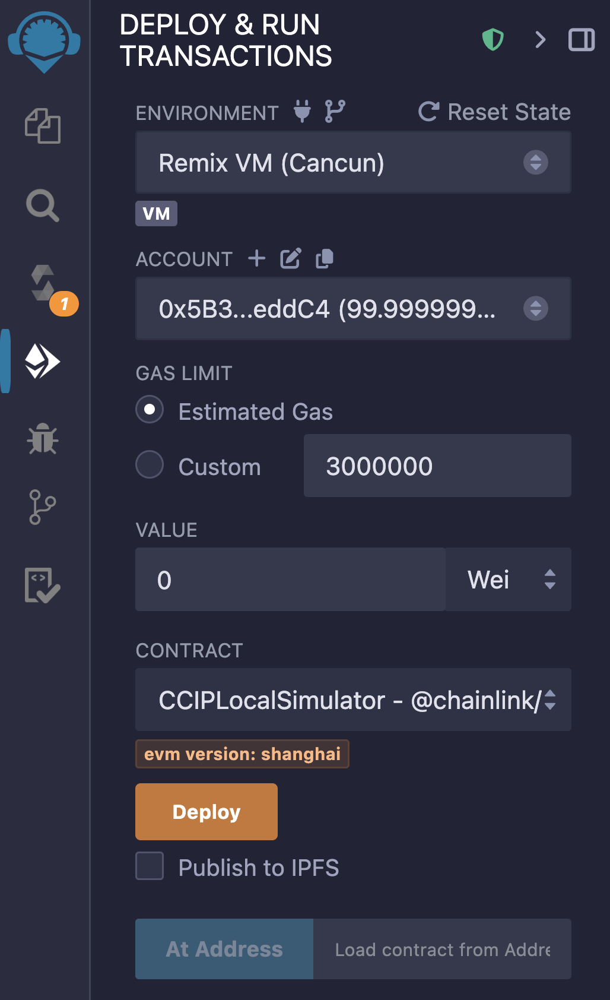

3. The `CCIPLocalSimulator` contract will now be visible in the **Deployed Contracts** section.

4. In the list of functions, click the `configuration` function to retrieve the configuration details for the pre-deployed contracts and services needed for local CCIP simulations. This data forms that on-chain infra we talked about earlier and you will be using the values returned by this function throughout this lesson (these are the values and addresses we would have looked up these values in the [Chainlink directory](https://docs.chain.link/ccip/directory/testnet) if we were working on a live blockchain).

5. Copy the **linkToken\_** address.
   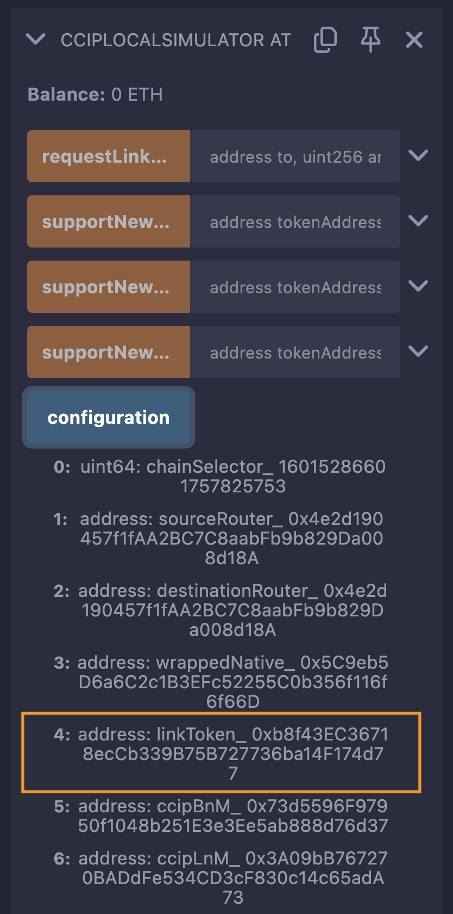

#### Deploy the LINK token

We need to, as before, fund our `Sender` contract with LINK tokens to pay for CCIP. The LINK token contract is pre-deployed in the local simulator configuration, so you can simply load the LINK token contract instance: - Back up in the **Contracts** dropdown, select the `LinkToken` contract. - Paste the **linkToken\_** address in the **At Address** box. - Click the **At Address** button.

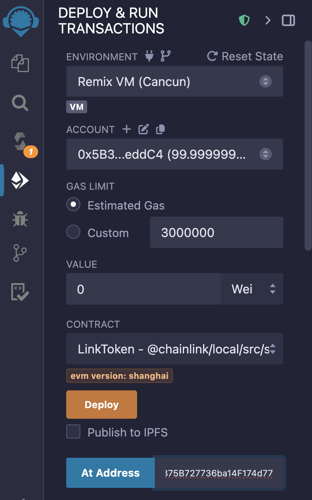

Now, the `LinkToken` contract will show in the **Deployed Contracts** section. We will be able to fund contracts with LINK.

#### Deploy the MessageSender and MessageReceiver

Now, we need to deploy the `MessageSender` and `MessageReceiver` contracts on the Remix VM (rather than on a live testnet):

1. Click on and compile the `MessageSender` contract. Use the following constructor parameters:
    - `_router`: copy and paste the `sourceRouter_` from the `configuration` call on the `CCIPLocalSimulator` contract.
    - `_LINK`: copy and paste the LINK token contract address you just deployed.
    - Click **transact** to deploy the contract.

-   Click on and compile the `MessageReceiver` contract. Use the following constructor parameter:
    -   `router`: copy and paste the `destinationRouter_` from the `configuration` call on the `CCIPLocalSimulator` contract.
    -   Click **transact** to deploy the contract.

### Send a cross-chain message using Chainlink Local

Expand the `MessageSender` contract in the **Deployed Contracts** section and expand the `sendMessage` function. Use the following parameters:

-   `destinationChainSelector`: copy-paste the `chainSelector_` from the `configuration` call on the `CCIPLocalSimulator` contract.
-   `receiver`: copy the address of the `MessageReceiver` contract you just deployed.
-   `text`: some string message e.g. `"Hey there!"`

**Note**: Remix will fail to estimate the gas properly for the `sendMessage` function.

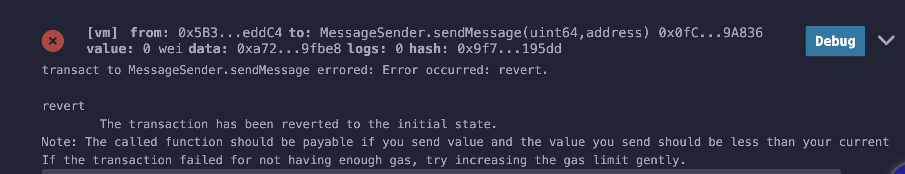

To work around this, we need to set the gas limit manually to `3000000` by clicking the radio button at the top of the **Deploy and run transactions** tab:

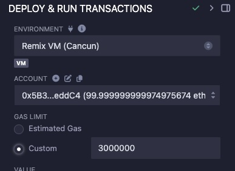

Click **transact** to call the function and test sending the CCIP message.

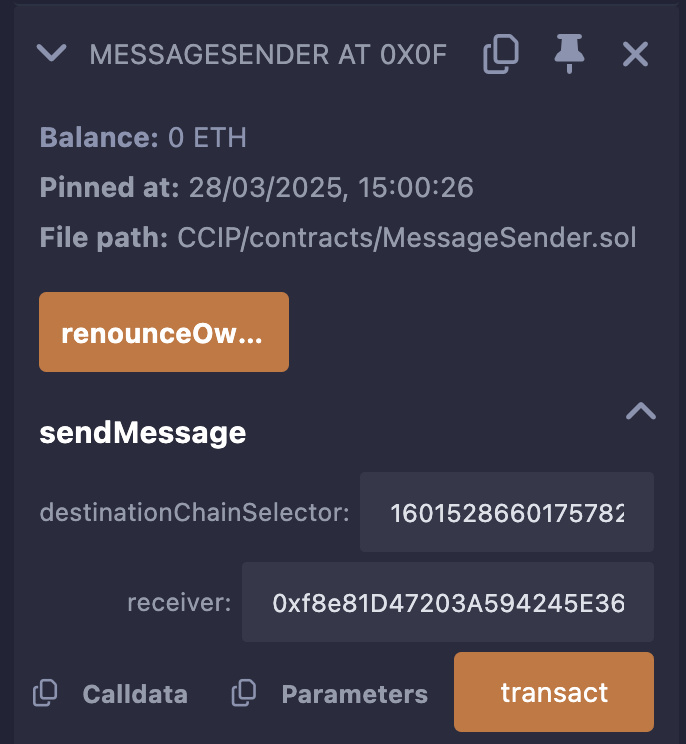

You'll notice this is near instant! No need to wait for finality - cool right!

To check if the message was received by `MessageReceiver`, call the `getLastReceivedMessageDetails` function. You'll see the message ID and the message we sent using Chainlink Local!


we have successfully used Chainlink Local in Remix to test sending a cross-chain message with CCIP.

## Use Chainlink CCIP to Interact with Smart Contracts on Other Blockchains

In the previous section, we learned how to bridge (or cross-chain transfer) tokens using CCIP. But what if, once we receive those tokens on the destination chain, we want to do something with them such as:

-   Staking the tokens
-   Buying an asset (another token, NFT, etc.)

In this section, we will learn how to send arbitrary messages cross-chain using Chainlink CCIP _along with_ the tokens. In this message, we will encode an action to perform with the tokens upon transfer.

### What are cross-chain messages?

Cross-chain messages are arbitrary data sent cross-chain as `bytes`. For example:

-   A string message, e.g., `"Hey there"`
-   An encoded function to call on a target contract on the detination chain, e.g., `abi.encodeWithSelector("mint(uint256)", 25)`.
-   A `uint256` representing a balance or exchange rate.

### Architecture and the Vault

Let's create a cross-chain message that:

1. Sends USDC cross-chain from Sepolia to Base Sepolia.
2. Sends data cross-chain with the token. This data will be the encoded function call to deposit the tokens into a vault upon receiving them.

For this, we will need three smart contracts:

1. A `Sender` contract that will
    - Encode a function call
    - Send the cross-chain message
2. A `Receiver` contract that will
    - Receive the tokens.
    - Call the function and contract encoded in the data.
3. A `Vault` contract for the `Receiver` to call to deposit the tokens. In reality, this will probably be some protocol you are interacting with.

#### The Vault contract

For this demo project, we need a simple `Vault` contract to deposit our tokens into once we receive them cross-chain. This contract is a placeholder for any application you want to interact with. This could be a staking protocol contract or something similar. For this reason, we will not walk through this contract and how it works since we will instead focus on code specific to implementing CCIP. All you need to know is that two functions exist:

-   `deposit`: to send USDC to the contract.
-   `withdraw`: to send the USDC back to your wallet.

-   Whilst still in your "CCIP" workspace, create a new folder in your `contracts` folder called `interfaces` and create a file called `IVault.sol` here. Paste the following code [from the course code repo](https://github.com/Cyfrin/chainlink-fundamentals-cu/blob/main/chainlink-course-code/ccip/interfaces/IVault.sol) into this file.

The `Sender` contract will use this interface to know the `Vault` ABI, and we can construct the data to send cross-chain to include a call to `deposit`.

-   Create a new file in the `contracts` folder in your "CCIP" workspace called `Vault.sol` and copy-paste the `Vault.sol` contract code from the [course code repo](https://github.com/Cyfrin/chainlink-fundamentals-cu/blob/main/chainlink-course-code/ccip/Vault.sol).

**Note**: this contract has been hard-coded to be deployed to Base Sepolia.

##### Deploying the vault

Compile and deploy this contract on the **destination chain** - Base Sepolia.
Once it has been deployed, pin the contract to your workspace.

Let's now create a `Sender` contract to send a cross-chain message with tokens.

### Sender contract

The code for this contract is extremely similar to the contract in Section 5, Lesson 4.

Create a new file in the `contracts` folder in your "CCIP" workspace called `Sender.sol`. In this file, add the code from the `Sender.sol` contract in the [course code repo](https://github.com/Cyfrin/chainlink-fundamentals-cu/blob/main/chainlink-course-code/ccip/Sender.sol).

#### Code explainer

We are not going to re-explain the code repeated from Section 5, only the changes or additions.

#### The Cross-chain message

The first thing that has changed is the contents of the cross-chain `Any2EVMMessage` struct. Let's go through these changes one by one.

##### Message receiver and target

**`tranferUSDC` arguments**:

-   `receiver`: Rather than hard-coding the `receiver` to be the `msg.sender`, we have made it dynamic. We need the `receiver` to be a `Receiver` contract deployed on the destination chain. This is because cross-chain messages that include `data` need to be a smart contract as **EOAs can only receive tokens**. We want to perform a function call using the data therefore, we need the `receiver` to be a smart contract.
-   `_amount`: As before, this is the number fo tokens to transfer cross-chain.
-   `_target`: This is the contract that the we will encode in the data, that is sent cross-chain, to call a function on. Our `_target` contract will be the `Vault` contract which has a function called `deposit` that the `Receiver` contract will call using the data.

```solidity
function transferTokens(
    address _receiver,
    uint256 _amount,
    address _target
)
    external
    returns (bytes32 messageId)
{}
```

Then, we pass this `_receiver` as the `receiver` in the message struct:

```solidity
Client.EVM2AnyMessage memory message = Client.EVM2AnyMessage({
        receiver: abi.encode(_receiver), // Address of the Receiver contract (abi encoded since the receiver is of type bytes)
        data: abi.encode(
            _target,
            depositFunctionCalldata
        ),
        tokenAmounts: tokenAmounts,
        extraArgs: Client._argsToBytes(
            Client.EVMExtraArgsV1({gasLimit: 200000})
        ),
        feeToken: address(LINK_TOKEN)
    });
```

##### Message data

In the `data` we send cross-chain, we need to encode:

1. `_depositFunctionCalldata`The function selector for the function we are going to be calling using the data. A function selector is just a hash of the function signature (the function name and arguments). We want to call `deposit` so we encode its signature and parameters, so the `Receiver` can call the function.
2. `_target`: The `Vault` address is on which to call `deposit`.

First, we create the encoded function call using `abi.encodeWithSelector`:

```solidity
bytes memory depositFunctionCalldata = abi.encodeWithSelector(
    IVault.deposit.selector,
    msg.sender,
    _amount
);
```

This allows us to call `deposit` on a contract that implements the `IVault` interface and passes `_amount` as a parameter to the function call.

**Note**: We have hard-coded this to deposit from the EOA associated with the `msg.sender` address on the destination chain. Make sure that whatever address is calling `transferTokens` on the source chain has an associated address on the destination chain. Alternatively, pass a `_depositor` address as a parameter to the function to make this dynamic.

Then, when we initialize the message struct, we encode this `depositFunctionCalldata` with the target contract address `_target` we passed as a function argument.

```solidity
Client.EVM2AnyMessage memory message = Client.EVM2AnyMessage({
    receiver: abi.encode(_receiver),
    data: abi.encode(
        _target, // Address of the target contract
        depositFunctionCalldata
    ),// Encode the function selector and the arguments of the stake function
    tokenAmounts: tokenAmounts,
    extraArgs: Client._argsToBytes(
        Client.EVMExtraArgsV1({gasLimit: 200000})
    ),
    feeToken: address(LINK_TOKEN)
});
```

##### Gas fees

The final thing that has been modified is the `gasLimit`. This gas limit is used when executing the receiving function on the `Receiver` contract. This will make more sense when we write the `Receiver` contract, but essentially, when CCIP executes the cross-chain transfer, it calls a function implemented on the `receiver` contract called `_ccipReceive`. This function needs gas to be executed by CCIP. This is where we are specifying this gas limit. Remeber, the `gasLimit` is always referring to the maximum gas you’re authorising to be used on the destination chain.

```solidity
Client.EVM2AnyMessage memory message = Client.EVM2AnyMessage({
    receiver: abi.encode(_receiver),
    data: abi.encode(
        _target,
        depositFunctionCalldata
    ),
    tokenAmounts: tokenAmounts,
    extraArgs: Client._argsToBytes(
        Client.EVMExtraArgsV1({gasLimit: 200000}) // we need a gas limit to call the receive function
    ),
    feeToken: address(LINK_TOKEN)
});
```

The [Chainlink CCIP documentation](https://docs.chain.link/ccip/best-practices#setting-gaslimit) provides more information on estimating the `gasLimit`.

### Compile and Deploy the contract

Make sure you are connected to Sepolia inside MetaMask, compile the `Sender` contract, and deploy it to Sepolia.

Remember to pin it to your workspace! This is crucial since we will be switching back and forth between networks.

Once the `Sender` contract has been successfully deployed AND pinned, note down this address. You'll be switching back and forth between chains, so it'll be useful to be able to easily copy it.

Switch the connected network to Base Sepolia inside MetaMask by clicking the network dropdown on the top left:

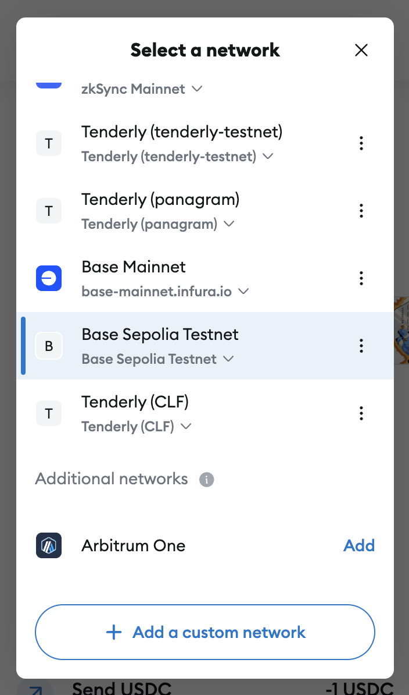

Verify in Remix that you are connected to Base Sepolia by checking that the network has a chain ID of `84532`.

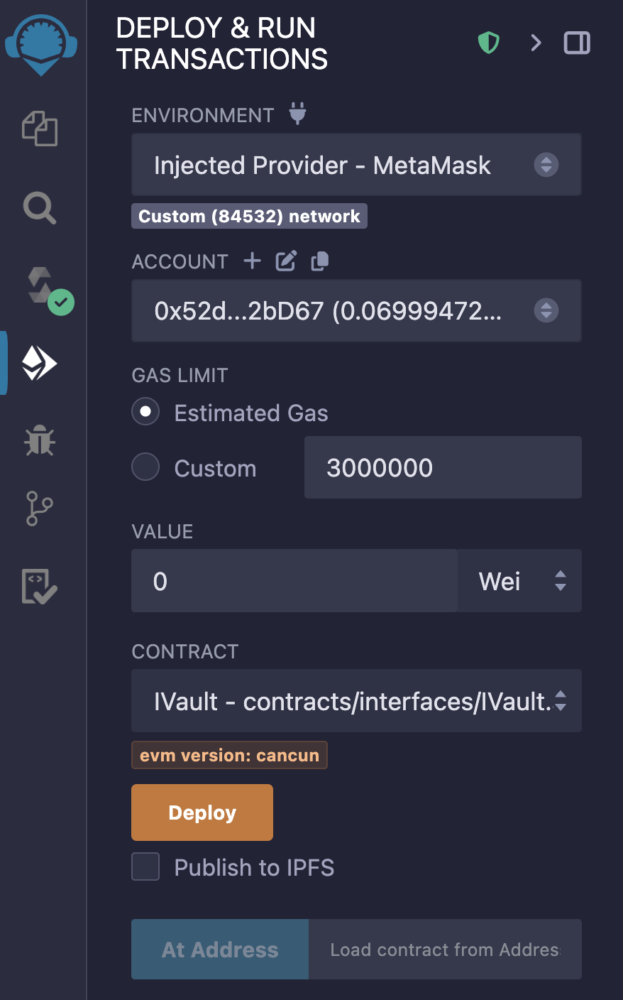

Now, deploy the `Vault` to Base Sepolia AND pin it to your workspace once it has deployed. Again, note down this address so you can easily copy it without having to switch back to Base Sepolia.

Now, we are ready to write and deploy the `Receiver` contract before sending our cross-chain message!

## Receiving cross-chain messages

In the previous lesson:

-   We created and deployed a `Sender` contract to send a CCIP message on Sepolia.
-   We created and deployed a `Vault` contract on Base Sepolia. This contract will be called using the data in the cross-chain message.

Now, we need to create the `Receiver` contract and deploy it to the destination chain (Base Sepolia, in our case). This contract address will be passed in the cross-chain message on the source chain (Speolia, in our case) to receive the cross-chain message.

### Receiver contract

For contracts to be able to receive CCIP messages, they need to inherit the [`CCIPReceiver`](https://github.com/smartcontractkit/chainlink/blob/develop/contracts/src/v0.8/ccip/applications/CCIPReceiver.sol) contract. This is an abstract contract and enforces inheriting contracts to implement a function called `_ccipReceive`. This function is called by CCIP when sending the cross-chain message and will contain the logic to handle the data sent cross-chain.

In our example, we encoded a target contract and function call. This was the `deposit` function on the `Vault` contract, which automatically deposits our USDC into a vault after sending the tokens cross-chain.

Create a file inside the `contracts` folder called `Receiver.sol` and paste the `Receiver.sol` code from the [course code repo](https://github.com/Cyfrin/chainlink-fundamentals-cu/blob/main/chainlink-course-code/ccip/Receiver.sol).

#### Code explainer

As always, let's walk through this code. If you are not a developer or aspiring developer and are not interested in the technical details of implementing receiving CCIP messages, feel free to skip to the deployment section.

##### Imports

The contract imports several Chainlink CCIP-related dependencies:

-   `IRouterClient`: Interface for the CCIP router.
-   `Client`: Library containing CCIP message struct.
-   `CCIPReceiver`: Abstract contract that needs to be inherited to receive cross-chain messages.
-   `IERC20` & `SafeERC20`: For handling token transfers safely.
-   `Ownable`: To implement ownership.

```solidity
import {IRouterClient} from "@chainlink/contracts-ccip@1.5.0/src/v0.8/ccip/interfaces/IRouterClient.sol";
import {Client} from "@chainlink/contracts-ccip@1.5.0/src/v0.8/ccip/libraries/Client.sol";
import {CCIPReceiver} from "@chainlink/contracts-ccip@1.5.0/src/v0.8/ccip/applications/CCIPReceiver.sol";
import {IERC20} from "@chainlink/contracts-ccip@1.5.0/src/v0.8/vendor/openzeppelin-solidity/v4.8.3/contracts/token/ERC20/IERC20.sol";
import {SafeERC20} from "@chainlink/contracts-ccip@1.5.0/src/v0.8/vendor/openzeppelin-solidity/v4.8.3/contracts/token/ERC20/utils/SafeERC20.sol";
import {Ownable} from "@openzeppelin/contracts@5.2.0/access/Ownable.sol";
```

##### Safe Transfers

This line implements the SafeERC20 library for all IERC20 interactions. This library adds protection against failed token transfers by requiring success confirmation.

```solidity
using SafeERC20 for IERC20;
```

##### State variables, events, and errors

-   `MessageReceived`: Event emitted when a cross-chain message is received.
-   `s_sender`: State variable for the allowed sender address.
-   `SOURCE_CHAIN_SELECTOR`: Hardcoded chain ID for Sepolia testnet. This has been hard-coded for clarity.
-   Custom errors for various failure conditions.

```solidity
event MessageReceived(
    bytes32 indexed messageId,
    uint64 indexed sourceChainSelector,
    address sender,
    bytes data,
    address token,
    uint256 tokenAmount
);

address private s_sender;
uint64 private constant SOURCE_CHAIN_SELECTOR = 16015286601757825753; // only allow messages from Sepolia

error Receiver__NothingToWithdraw();
error Receiver__NotAllowedForSourceChainOrSenderAddress(uint64 sourceChainSelector, address sender);
error Receiver__FunctionCallFail();
error Receiver__SenderNotSet();
```

##### Constructor

The constructor:

-   Initializes the `CCIPReceiver` with the Base Sepolia router address (`0xD3b06cEbF099CE7DA4AcCf578aaebFDBd6e88a93`)
-   Initializes the `Ownable` constructor with the deployer as the initial owner.

```solidity
constructor() CCIPReceiver(0xD3b06cEbF099CE7DA4AcCf578aaebFDBd6e88a93) Ownable(msg.sender) {}
```

##### onlyAllowlisted modifier

This modifier restricts message processing to:

1. Verify the sender address has been set.
2. Only allow messages from the configured source chain (Sepolia) and the allowlisted sender address.

```solidity
modifier onlyAllowlisted(uint64 _sourceChainSelector, address _sender) {
    if (s_sender == address(0)) {
        revert Receiver__SenderNotSet();
    }
    if (_sourceChainSelector != SOURCE_CHAIN_SELECTOR || _sender != s_sender) {
        revert Receiver__NotAllowedForSourceChainOrSenderAddress(_sourceChainSelector, _sender);
    }
    _;
}
```

##### Setting the sender address

Only the contract owner can set the trusted sender address that can send CCIP messages to this contract.

```solidity
function setSender(address _sender) external onlyOwner {
    s_sender = _sender;
}
```

##### \_ccipReceive

This is the core function that processes incoming CCIP messages:

-   It implements the `_ccipReceive` function from the `CCIPReceiver` abstract contract and uses the `onlyAllowlisted` modifier.
-   Decodes the message data to extract a target address (the `Vault` contract) and function calldata (the `deposit` function signature and arguments).
-   Makes a low-level call to the target contract with the function data.
-   Reverts if the call fails.
-   Emits a `MessageReceived` event with details about the message.

```solidity
function _ccipReceive(
    Client.Any2EVMMessage memory any2EvmMessage
)
    internal
    override
    onlyAllowlisted(
        any2EvmMessage.sourceChainSelector,
        abi.decode(any2EvmMessage.sender, (address))
    )
{
    (address target, bytes memory functionCallData) = abi.decode(any2EvmMessage.data, (address, bytes));
    (bool success, ) = target.call(functionCallData);

    if (!success) {
        revert Receiver__FunctionCallFail();
    }

    emit MessageReceived(
        any2EvmMessage.messageId,
        any2EvmMessage.sourceChainSelector,
        abi.decode(any2EvmMessage.sender, (address)),
        any2EvmMessage.data,
        any2EvmMessage.destTokenAmounts[0].token,
        any2EvmMessage.destTokenAmounts[0].amount
    );
}
```

##### withdrawToken

This function allows the contract owner to withdraw any ERC-20 tokens in the contract:

-   Checks the contract's balance of the specified token.
-   Reverts if there are no tokens to withdraw.
-   Uses `SafeERC20`'s `safeTransfer` function to safely send all tokens to the owner.

```solidity
function withdrawToken(address _token) public onlyOwner {
    uint256 amount = IERC20(_token).balanceOf(address(this));
    if (amount == 0) revert Receiver__NothingToWithdraw();
    IERC20(_token).safeTransfer(msg.sender, amount);
}
```

The contract is designed to receive cross-chain messages from a specific chain (Sepolia) and a specifically allowed-sender address, providing security.

#### Compile and deploy the contract

Compile the `Receiver` contract and deploy it to Base Sepolia. Make sure you are still connected to Base Sepolia in MetaMask.

Click **Deploy**:

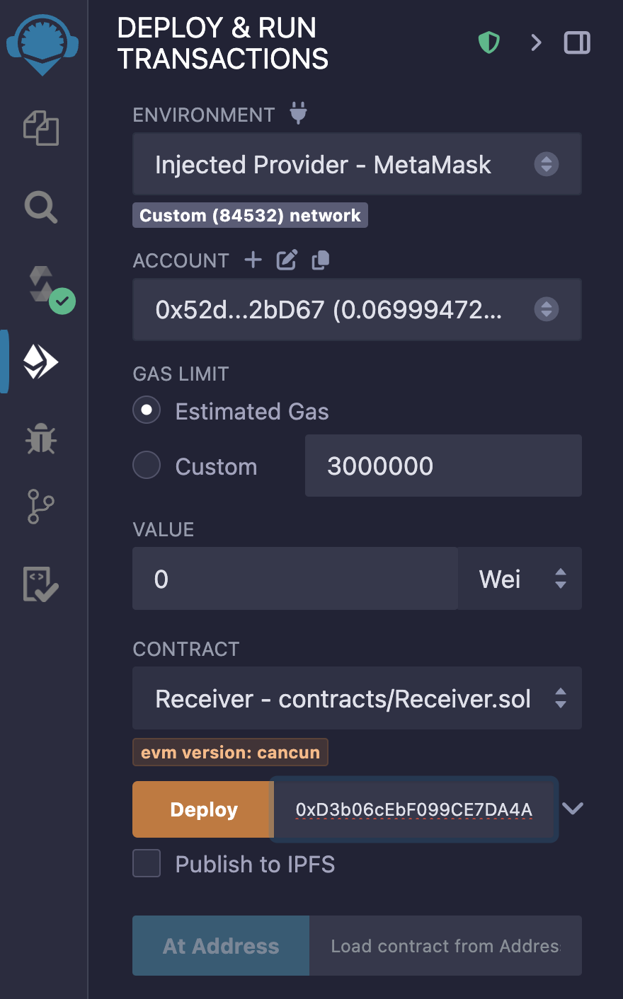

Once it has been deployed, remember to pin it to your workspace! Also, note down the address again, as you did with the `Sender` and `Vault` addresses, so you can copy it without having to connect to Base Sepolia.

#### Setting the sender

Before we move on, let's set the `s_sender` address.

-   In the **Deployed Contracts** section, expand the `Receiver` contract instance.
-   Next to the `setSender` function, paste the `Sender` address (from Sepolia that we noted in the previous lesson), click **setSender**, and confirm the transaction in MetaMask to allowlist the `Sender` contract to send the `Receiver` cross-chain messages.

You are now ready to send your cross-chain message to bridge USDC and automatically deposit it into a vault!

## Sending CCIP messages

In the previous two lessons, we deployed three smart contracts.

On the source chain (Sepolia):

1. `Sender`: To send the cross-chain message.

On the destination chain (base Sepolia):

2. `Receiver`: to receive the cross-chain message.
3. `Vault`: into which we call `deposit` to deposit the USDC we sent from the `Sender` .contract to the `Receiver` contract using CCIP.

Let's use these contracts to perform a token and data transfer cross-chain using CCIP.

### Fund the Sender with LINK

We first need to fund our `Sender` contract with some LINK on Sepolia to pay the fees.

Switch your network back to Sepolia in MetaMask.

For this, we will follow the same steps as in Section 5 Lesson 5, so revisit that lesson if you need a recap of how to do this.

From MetaMask, send `3` LINK to the `Sender` contract address:

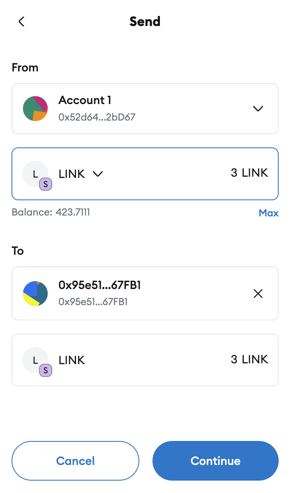

### Approve the Sender and Receiver contracts

We need to approve both `Sender` and `Receiver` contracts to spend USDC:

-   `Sender`: so this contract can transfer the USDC from your wallet to itself, ready for the cross-chain transfer.
-   `Vault`: so it can send USDC from your EOA to itself when calling `deposit`.

Let's do a quick recap on how to do this.

#### Approving the Sender

The `Sender` has been deployed to Sepolia, so we will use [Etherscan](https://sepolia.etherscan.io/) to perform this approval.

1. Head to the [USDC contract on Sepolia Etherscan](https://sepolia.etherscan.io/address/0x1c7D4B196Cb0C7B01d743Fbc6116a902379C7238)
2. Click on the **Contract** and then the **Write as Proxy** tabs.
3. Click **Connect to Web3** and connect your wallet:

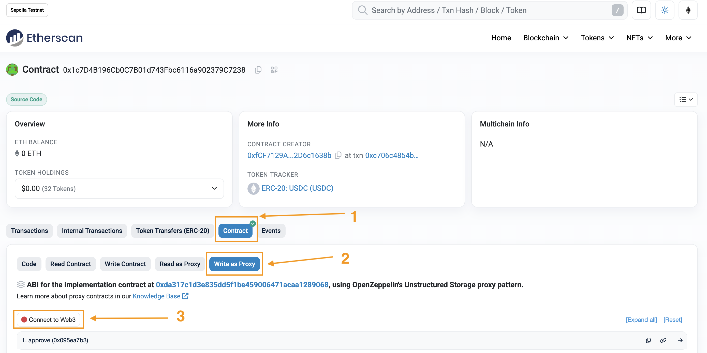

4. Click on the `approve` function:

    - Paste the `Sender` address as the `spender`
    - Set the `value` as `1000000` - 1 USDC
    - Click **Write**
    - Confirm the transaction in MetaMask

    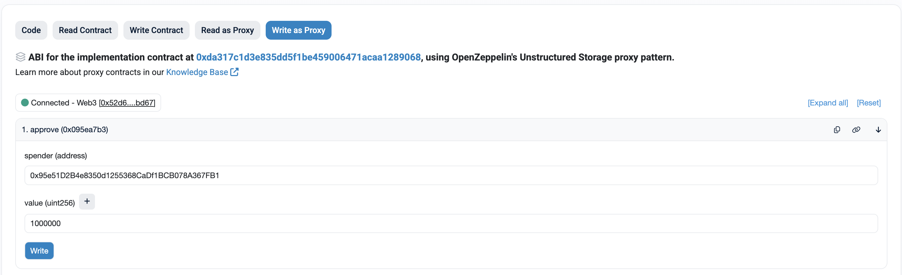

5. Confirm the `Sender` has been added as a spender by:

    - Clicking the **Read as Proxy** tab.
    - Clicking **Connect to Web3** and connecting your wallet.
    - Clicking the `allowance` function .
    - Pasting your MetaMask address as the `owner`.
    - Pasting the `Sender` address as the `spender`.
    - Clicking **Query**.
    - `1000000` will be returned if the `Sender` was successfully added as a spender.

    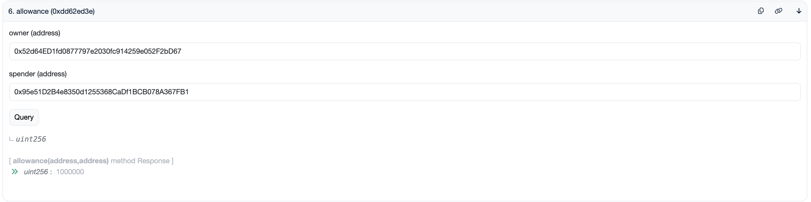

#### Approving the Vault

The `Vault` has been deployed to Base Sepolia. So we will use [Basescan](https://sepolia.basescan.org/) to approve this contract.

1. Head to the [USDC contract on Base Sepolia](https://sepolia.basescan.org/address/0x036CbD53842c5426634e7929541eC2318f3dCF7e)
2. Click on the **Contract** and then the **Write as Proxy** tabs.
3. Click **Connect to Web3** and connect your wallet.
4. Click on the `approve` function:

    - Paste the `Vault` address as the `spender`.
    - Set the `value` as `1000000` - `1` USDC.
    - Click **Write**.
    - Confirm the transaction in MetaMask.

    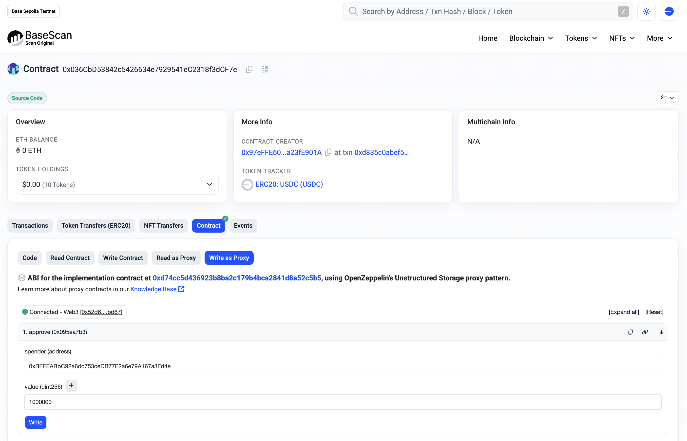

5. Confirm the `Vault` has been added as a spender by:

    - Clicking the **Read as Proxy** tab.
    - Clicking **Connect to Web3** and connecting your wallet.
    - Clicking the `allowance` function .
    - Paste your MetaMask address as the `owner` .
    - Pasting the `Vault` address as the `spender`.
    - Clicking **Query**.
    - `1000000` will be returned if the `Vault` was successfully added as a spender.

    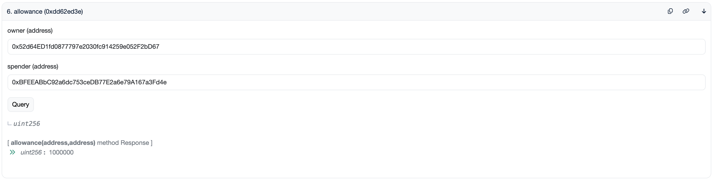

### Sending the cross-chain message

FINALLY! We are ready to send the cross-chain message!

-   Head back to Remix.
-   Switch back to Sepolia in MetaMask.
-   Expand the `Sender` contract dropdown, click on the `transferTokens` function, and enter the following function parameters:
    -   `_receiver`: the `Receiver` contract address.
    -   `_amount`: `1000000`.
    -   `_target`: the `Vault` contract address.
-   Click **transact** and sign the transaction in MetaMask to send the message cross-chain:

    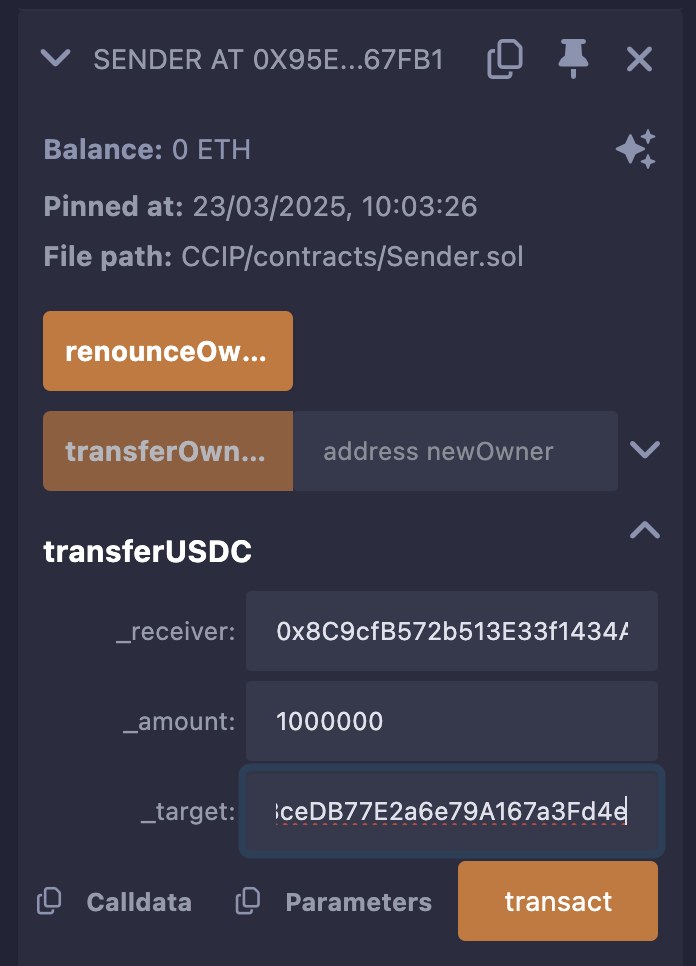

-   Once your transaction has confirmed on Sepolia, copy the transaction hash:

    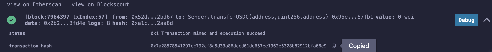

-   Head to the [CCIP Explorer](https://ccip.chain.link/) and paste the transaction hash to see the status of your CCIP message:

    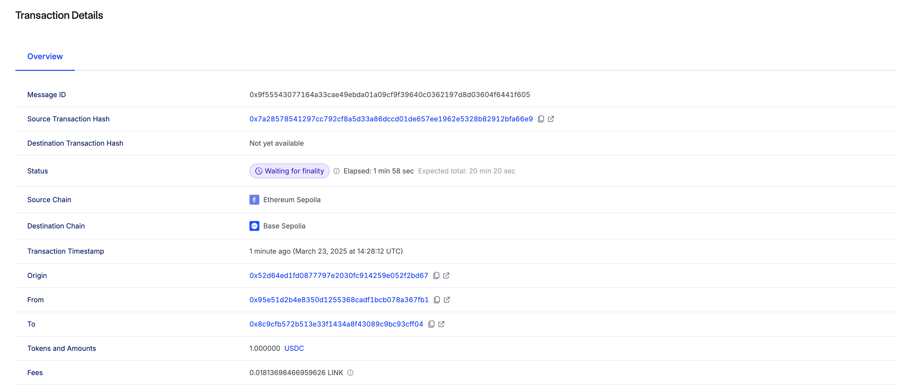

-   Once finality has been reached, you will see the status in the CCIP explorer:

    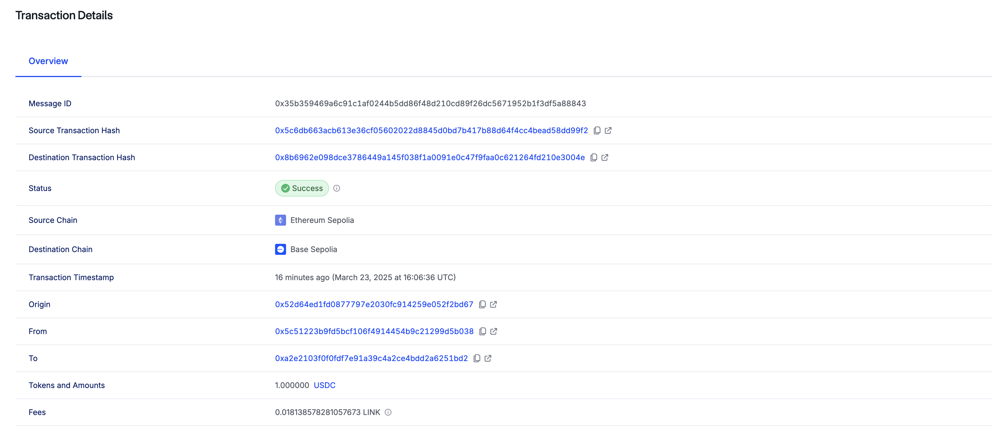

### Checking the data was executed

Let's check that the USDC was successfully automatically deposited into the vault.

-   In MetaMask, connect to Base Sepolia.
-   Expand the `Vault` contract dropdown in the **Deployed Contracts** section and find the `balances` function.
-   Paste your MetaMask address as the `address` and click **balances**.
-   If the data has been successfully executed, `1000000` will be returned:

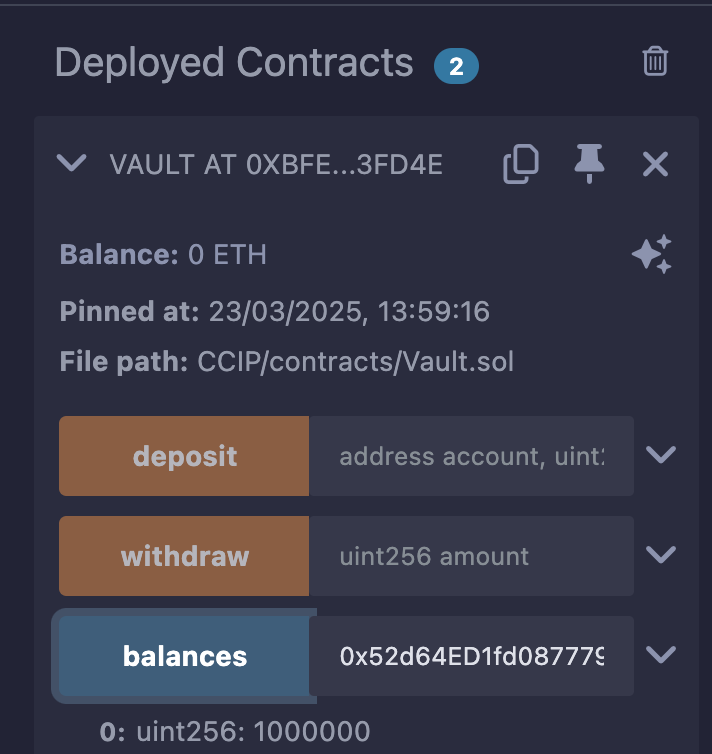

This was a very challenging lesson so great job at getting to the end! I recommend you take a break here to digest all of that information before moving onto the next section.

### Challenge!

So now you know how to write a smart contract to bridge USDC tokens from Sepolia to Base Sepolia, the next challenge is to use this same smart contract to transfer [CCIP-BnM](https://sepolia.etherscan.io/token/0xfd57b4ddbf88a4e07ff4e34c487b99af2fe82a05#writeContract) tokens to ZKsync Sepolia and automatically send the tokens to a vault!

To do this you will need to:

1. Add the ZKsync Sepolia chain to MetaMask.
2. Add the CCIP-BnM token on Sepolia and ZKsync Sepolia to Metamask.
3. Modify and re-deploy the `Sender` smart contract:
    - `DESTINATION_CHAIN_SELECTOR` to be the [selector for ZKsync Sepolia](https://docs.chain.link/ccip/directory/testnet/chain/ethereum-testnet-sepolia-zksync-1).
    - Change the token to be [CCIP-BnM](https://sepolia.etherscan.io/token/0xfd57b4ddbf88a4e07ff4e34c487b99af2fe82a05#writeContract) rather than USDC.
    - (dev-only challenge): Can you modify the smart contracts to allow the function caller to specify the token and destination chain?
4. Modify the `Vault` smart contract
    - Change the token to be [CCIP-BnM](https://sepolia.etherscan.io/token/0xfd57b4ddbf88a4e07ff4e34c487b99af2fe82a05#writeContract) rather than USDC.
    - (dev-only challenge): Can you modify the `Vault` to allow an owner to be able to add allowed tokens?
5. Re-deploy the `Receiver` and `Vault` smart contracts:

    - To do this, you will need to use the Remix ZKsync plugin to compile and deploy your smart contract!
    - Simply click on the plugins tab on the bottom of the left sodebar, type "zksync" into the search bar and then click **Activate** on the plugin. It will now be available in the sidebar.
    - If you get stuck, [this lesson on Updraft](https://updraft.cyfrin.io/courses/solidity/simple-storage/zksync-plugin) will take you through using the ZKsync plugin step-by step.
    - You will also need to get some Zksync Sepolia ETH to pay for the gas. Watch [this Updraft lesson](https://updraft.devcyfrin.com/courses/blockchain-basics/basics/making-your-first-transaction-on-zksync) if you need a refresher of how to do this.

    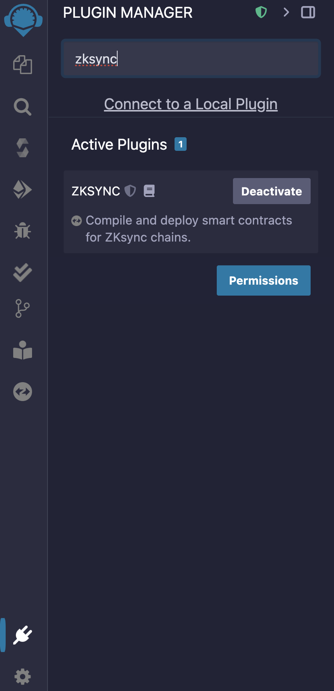

6. Get some test CCIP tokens (CCIP-BnM for Burn and Mint) by [calling `drip()` on the token contract using Etherscan](https://sepolia.etherscan.io/token/0xfd57b4ddbf88a4e07ff4e34c487b99af2fe82a05#writeContract).
7. Call `transferTokens` as before and check the CCIP explorer to check the status of your cross-chain transfer.
8. Check your balance of ZKsync Sepolia CCIP-BnM tokens has now increased in the Vault!

See how awesome it is to deploy contracts and transfer your tokens cross-chain to ZKsync Speolia and automatically perform actions!

Extra cookies for you if you managed the extra challenge:)

# Chainlink Functions

## Introduction to Chainlink Functions

### What is Chainlink Functions?

Chainlink Functions provides smart contracts access to trust-minimized off-chain compute infrastructure, enabling them to fetch data from external APIs and perform custom computation off-chain.

This service bridges the gap between blockchain applications and external data sources, expanding the capabilities of smart contracts beyond the blockchain environment.

### Chainlink Functions Benefits

**API Connectivity**: Chainlink Functions enables smart contracts to connect with any traditional Internet-based public API, aggregate and transform the data fetched from APIs, and then return values on-chain. Without Chainlink Functions, smart contracts are effectively incapable of accessing any data that exists outside of the blockchain. Not being able to access the broader world of data severely limits the functionality of smart contracts.

**Custom Computation**: Users can run custom JavaScript code to supplement the computations done by their smart contract. With this feature, code that would otherwise be costly or slow to run on the blockchain can be “moved” to an off-chain “serverless” compute environment. The result: decentralized applications are more economical and efficient. Developers can focus on application logic rather than infrastructure management.

**Decentralized Infrastructure**: Chainlink Functions are supported and executed on the Chainlink-powered [decentralized oracle networks (DONs)](https://chain.link/education/blockchain-oracles). DONs are a [decentralized network](https://chain.link/education/blockchain-oracles#decentralized-oracles) of nodes that perform computations securely by retaining the cryptographic benefits of blockchain technology. Decentralization reduces the dependence on and vulnerability to centralized infrastructure that defines traditional web-based services. This setup enables smart contracts to access off-chain data and perform complex calculations without the vulnerability of relying on a single source of computation.

**Off-chain Computation**: Chainlink Functions operates through the DON, where each node executes user-provided JavaScript code in a serverless environment. The results from these executions are aggregated using Chainlink’s [Offchain Reporting (OCR) Protocol](https://docs.chain.link/architecture-overview/off-chain-reporting). This consensus step ensures the final result is secure, trust-minimized, and consensus-driven. In other words, DONs provide blockchain benefits without the blockchain costs.

### How Chainlink Functions Works

The process follows a request-and-receive pattern:

1. **Request Initiation**: Your smart contract sends JavaScript source code (either computation or an API request) in a request.
2. **Distributed Execution**: Each node in the DON independently executes the code in a secure serverless environment.
3. **Result Aggregation**: The DON aggregates all the independent return values from each execution.
4. **Response Delivery**: The final consensus result is returned to your smart contract.

This decentralized approach ensures that a minority of nodes cannot manipulate the response, providing robust security for your applications.

### Key Features

#### Decentralized Computation

The service provides decentralized off-chain computation and consensus, securing the integrity of returned data using the DON.

#### Threshold Encryption for Secrets

The service allows you to include secret values (such as API keys) in your request using threshold encryption. These secrets can only be decrypted through a multi-party computation decryption process requiring participation from multiple DON nodes, protecting sensitive information while enabling access to authenticated APIs.

#### Subscription-Based Payment Model

You fund a Chainlink Functions subscription with LINK tokens to pay for Chainlink Functions requests. Your subscription is billed only when the DON fulfills your requests, providing a straightforward payment mechanism.

### When to Use Chainlink Functions

Chainlink Functions enables a variety of use cases:

-   **Public Data Access**: Connect smart contracts to external public data, e.g., weather statistics for parametric insurance or real-time sports results for dynamic NFTs.
-   **Data Transformation**: Perform calculations on data, e.g., to calculate sentiment analysis from social media data or derive asset prices from Chainlink Price Feeds.
-   **Authenticated API Access**: Connect to password-protected data sources, from IoT devices like smartwatches to enterprise resource planning systems.
-   **Decentralized Storage Integration**: Access data from IPFS or other decentralized databases for off-chain processes or low-cost governance systems.
-   **Web2-Web3 Integration**: Build complex hybrid smart contracts that interface with traditional web applications.
-   **Cloud Services Connection**: Fetch data from Web2 systems like AWS S3, Firebase, or Google Cloud Storage.

### Important Considerations

-   **Self-Service Solution**: Users are responsible for independently reviewing any code and API dependencies submitted in requests.
-   **User Responsibility**: Neither Chainlink Labs, the Chainlink Foundation, nor Chainlink node operators are responsible for unintended outputs due to issues in your code or API dependencies.
-   **Data Quality**: Users must ensure that data sources specified in requests are of sufficient quality and are available for their use case.
-   **Licensing Compliance**: Users are responsible for complying with licensing agreements for all data providers accessed through Chainlink Functions.

## Chainlink Functions Playground

Chainlink Functions allows us to run JavaScript code off-chain and bring the result on-chain in a decentralized and secure way. In this lesson, we will learn about the Chainlink Functions Playground, a tool that helps you learn how to use Chainlink Functions and test your JavaScript code.

### What is the Chainlink Functions Playground?

[The Chainlink Functions Playground](https://functions.chain.link/playground/60f46de7-d42a-45d6-aade-e41a15160dbe) is an easy, overhead-free way to test the custom JavaScript code you want Chainlink Functions to execute. With the Functions Playground, you can even call third-party public APIs! This sandbox environment is the best way to experiment with Chainlink Functions without deploying a smart contract to a test network.

Key features of the Chainlink Functions Playground include:

-   **Simulating Chainlink Functions**: Execute custom JavaScript code using Chainlink Functions directly in your web browser.
-   **Real-Time Execution**: Run JavaScript source code and its provided arguments and see the output within seconds.
-   **Calling APIs**: Quickly test API integrations, including HTTP requests to external data sources, and inspect the returned data.
-   **Output Visualization**: Get results from your Chainlink Functions request in real-time, with a user-friendly interface showcasing both console logs and the final returned output.

The Chainlink Functions Playground is a useful tool for developers to get hands-on experience with Chainlink Functions and test out different use cases before going on-chain. This significantly lowers the barrier to testing externally connected smart contracts.

### How to use the Chainlink Functions Playground

Navigate to the [Chainlink Functions Playground](https://functions.chain.link/playground) where you will see an **Input** window:


The playground has the following fields:

-   **Source code**: This is where you put the JavaScript source code you want to test to send in your Chainlink Functions request.
-   **Argument(s)**: Argument(s) to your JavaScript code. Arguments are variables in your JavaScript code, the values in your code you want to change, e.g., the city to retrieve a temperature for or some on-chain data.
-   **Secret(s)**: private arguments, e.g., API keys, credentials, etc. This is the sensitive data you don't want to be publicly visible. Chainlink Functions "injects" these values into your JavaScript at "runtime" (when the JavaScript is run).

To run the code:

-   Click the **Run code** button
-   The **Output** window will be populated with the returned data.
-   If there are any logs, they will be visible in the **Console log** section.

### Using an external API in the Chainlink Functions Playground

Let's use the Chainlink Functions Playground to call an API to get a Star Wars character associated with a character ID.

Click the **Fill with example code** dropdown button and click the **Star Wars characters** example:

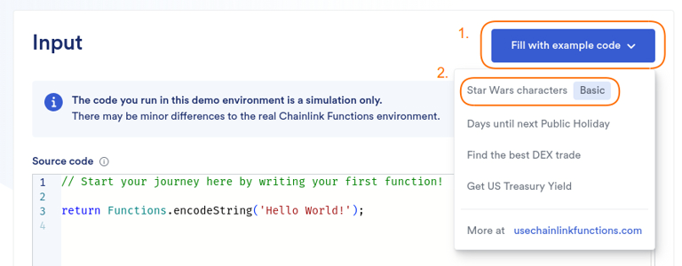

The following JavaScript source code will populate the **Source code** window:


#### Arguments

```javascript
const charactedId = args[0];
```

`args` is the array of variables that get injected into your JavaScript code at runtime.

This code has one argument–`characterId`: a unique ID to identify a Star Wars character.

#### Calling the API

```javascript
const apiResponse = await Functions.makeHttpRequest({
	url: `https://swapi.info/api/people/${characterId}/`,
});
```

A HTTP request is made to the URL: https://swapi.info/api/people/${characterId} using the Chainlink `Functions` library that is also injected into the source code at runtime.

Let’s assume that your first argument (which gets assigned to `characterId`) is `1`. If you go to the link in a new browser tab, the swapi.info API server will send you back the following information:

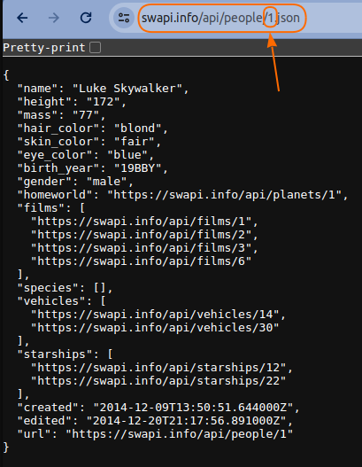

This has all the data about the Star Wars character with ID `1`: Luke Skywalker in Swapi’s database. If you change the `characterId` argument to `2` (and so on), you will get information on other Star Wars characters assigned to that specific ID.

#### Running the code

To run the code:

-   Type `1` in the **Argument** input box to get the information for the character with ID `1`.
-   We do not need any Secrets. Leave this input blank.
-   Click the **Run Code** button.

You will see the **Console log** and **Output** populate on the right with all the information about Luke Skywalker:

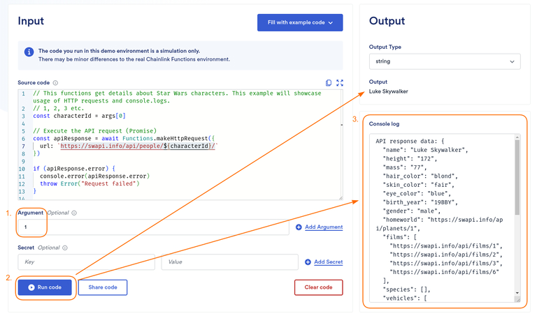

By utilizing the Chainlink Functions Playground, you verified your JavaScript code works without needing to deploy a smart contract, interact with Chainlink Functions, or make a subscription (more on this shortly).

Let's now use Chainlink Functions in a smart contract.

## Building a Chainlink Functions Consumer Smart Contract

In this lesson, we will write a smart contract that requests data from an external API using Chainlink Functions.

**Note**: the code for this section is advanced. While we will be doing a code walkthrough, I do not expect you to understand everything perfectly. If you prefer to copy-paste the code and get a feel for using Chainlink Functions without understanding the Soldity, go ahead. If you're a developer wanting to understand how to integrate Chainlink Functions into a smart contract, then we have added a code breakdown.

### Prerequisites

-   You have Sepolia ETH and LINK testnet funds.
-   You have imported the LINK token on Sepolia to MetaMask.

### Writing a Chainlink Functions Consumer contract

Let's write a Chainlink Functions consumer smart contract that fetches the weather for a specific city.

In Remix, create a new workspace named "Functions," create a folder called `contracts` and a file called `FunctionsConsumer.sol`. Paste the `FunctionsConsumer.sol` code from the [course code repo](https://github.com/ciaranightingale/chainlink-fundamentals-code/blob/main/functions/FunctionsConsumer.sol).

If you need a reminder of how to create workspaces, files etc., visit the Introduction to Remix lesson in Section 2.

### Code explainer

#### Imports

We import the following dependencies:

```solidity
import {FunctionsClient} from "@chainlink/contracts@1.3.0/src/v0.8/functions/v1_0_0/FunctionsClient.sol";
import {FunctionsRequest} from "@chainlink/contracts@1.3.0/src/v0.8/functions/v1_0_0/libraries/FunctionsRequest.sol";
```

Chainlink Functions consumer contracts need to inherit the `FunctionsClient` contract. The `FunctionsClient` constructor requires the Chainlink `Router` contract address (on the chain the contract is being deployed to) as a constructor parameter:

```solidity
constructor() FunctionsClient(ROUTER) {}
```

`FunctionsRequest` is the library we use to create Functions `Request` structs. We use the `using` keyword to make functions from the `FunctionsRequest` library callable on the `Request` struct variables:

```solidity
using FunctionsRequest for FunctionsRequest.Request;
```

#### State Variables

We define the following storage variables:

```solidity
string public s_lastCity; // The latest city a Chainlink Functions got a temperature for
string public s_requestedCity; // The city for the latest pending Chainlink Functions request
string public s_lastTemperature; // The temperature of the latest city Chainlink Functions got a temperature for

bytes32 public s_lastRequestId; // The ID of the latest request
bytes public s_lastResponse; // The response for the latest request
bytes public s_lastError; // The errors for the latest request
```

And the following constant variables:

```solidity
// Hardcoded for Sepolia
// Supported networks https://docs.chain.link/chainlink-functions/supported-networks
address constant ROUTER = 0xb83E47C2bC239B3bf370bc41e1459A34b41238D0;
bytes32 constant DON_ID =
    0x66756e2d657468657265756d2d7365706f6c69612d3100000000000000000000;

//Callback gas limit
uint32 constant GAS_LIMIT = 300000;

// JavaScript source code
string public  constant SOURCE =
    "const city = args[0];"
    "const apiResponse = await Functions.makeHttpRequest({"
    "url: `https://wttr.in/${city}?format=3&m`,"
    "responseType: 'text'"
    "});"
    "if (apiResponse.error) {"
    "throw Error('Request failed');"
    "}"
    "const { data } = apiResponse;"
    "return Functions.encodeString(data);";
```

We also define some errors and events we will use in our contract:

```solidity
// Event to log responses
event Response(
    bytes32 indexed requestId,
    string temperature,
    bytes response,
    bytes err
);

error UnexpectedRequestID(bytes32 requestId);
```

### getTemperature

`getTemperature` is the function we will call to get the temperature for a specific city. It takes:

-   `city`: the city to get the temperature using Chainlink Functions.
-   `subscriptionId`: The Chainlink Functions subscription you want to use to fund your Chainlink Functions request.

It returns:

-   `requestId`: The ID for the request so you can track the response.

```solidity
function getTemperature(
        string memory city,
        uint64 subscriptionId
    ) external returns (bytes32 requestId) {}
```

Remember that, in the `SOURCE` variable, we had the Javascript code that would be run. We need to initialize a request using this code.

-   First, we create a `FunctionsRequest.Request` struct, called `req`, which, remember, we can call functions from the `FunctionsRequest` library on.
-   Then, we call `initializeRequestForInlineJavaScript` on the `req` and pass the `SOURCE` to initialize the request.

```solidity
function getTemperature(
    string memory _city,
    uint64 subscriptionId
) external returns (bytes32 requestId) {
    FunctionsRequest.Request memory req;
    req.initializeRequestForInlineJavaScript(SOURCE); // Initialize the request with JS code
}
```

The first line of the `SOURCE` code took an argument, which it then passed into the API URL:

```solidity
"const city = args[0];"
```

We need to create an argument in our `getTemperature` function. To do this, we:

-   Create a string array, with one element, that'll contain the arguments, called `args`.
-   Set the first element to `city`, since this is the argument in the JavaScript source code.
-   Call the `setArgs` function from the `FunctionsRequest` library on the `req` struct and pass the newly created `args` variable.

Altogether, this function so far is:

```solidity
function getTemperature(
    string memory _city,
    uint64 subscriptionId
) external returns (bytes32 requestId) {
    FunctionsRequest.Request memory req;
    req.initializeRequestForInlineJavaScript(SOURCE); // Initialize the request with JS code

    string[] memory args = new string[](1);
    args[0] = _city;
    req.setArgs(args); // Set the arguments for the request
}
```

Then, we send the request using the `_sendRequest` function implemented on the `FunctionsClient` contract we inherited. Here, we pass:

-   The encoded request.
-   The subscription ID funding the request.
-   The gas limit for the callback function (which we will go through shortly).
-   The DON ID the request will be sent to.

```solidity
// Send the request and store the request ID
s_lastRequestId = _sendRequest(
    req.encodeCBOR(),
    subscriptionId,
    GAS_LIMIT,
    DON_ID
);
```

Finally, set `s_requestedCity` as the `city` we requested the temperature for and then return the `s_lastRequestId` so that we can later check our request.

```solidity
// set the city for which we are obtaining the temperature
s_requestedCity = _city;
return s_lastRequestId;
```

### fulfillRequest

`fulfillRequest` is the callback function that Chainlink Functions consumer contracts must implement. The DON will call this function after the JavaScript code has been run and the request has been fulfilled. The function is expected to have the following definition:

```solidity
function fulfillRequest(
        bytes32 requestId,
        bytes memory response,
        bytes memory err
    ) internal override {}
```

In this function, we initially check whether the `requestId` was, in fact, the latest request we made, or `s_lastRequestId`.

```solidity
if (s_lastRequestId != requestId) {
    revert UnexpectedRequestID(requestId); // Check if request IDs match
}
```

Then we take the response and set the state variables corresponding to the error and response for the latest request.

```solidity
s_lastError = err;
s_lastResponse = response;
```

And finally, we set the `s_lastTemperature` and `s_lastCity` using the request reponse and emit an event to say that we have received the response.

```solidity
s_lastTemperature = string(response);
s_lastCity = s_requestedCity;

// Emit an event to log the response
emit Response(requestId, s_lastTemperature, s_lastResponse, s_lastError);
```

Remember the `GAS_LIMIT` we defined earlier? This is the maximum gas rquired to execute the `fulfillRequests` function adn therefore fulfill your request.

### Deploy the Chainlink Functions consumer contracts

Using the steps detailed in Section 2, compile and deploy your `FunctionsConsumer` contract to Sepolia, and remember to pin it to the workspace!

Now, we are ready to create a subscription and add our consumer contract to that subscription.
